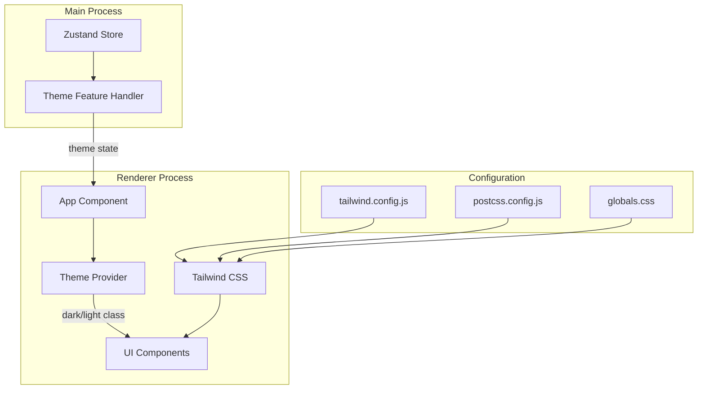
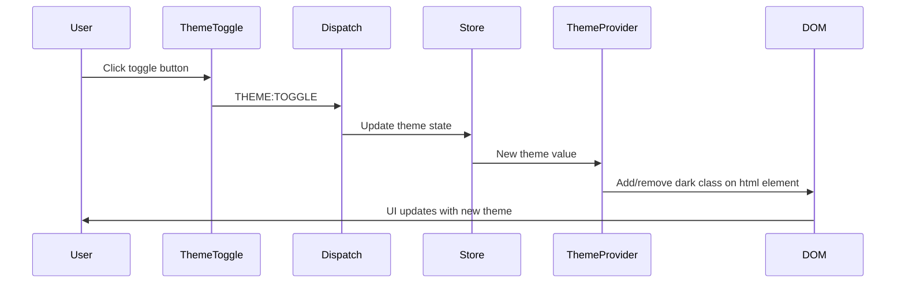

# CSS Styling Implementation Plan

This document outlines the plan for adding comprehensive CSS styling to the P4Client application using Tailwind CSS with dark and light theme support.

## Overview

The P4Client is an Electron + React + TypeScript application that currently has:

- A theme toggle feature that switches between 'dark' and 'light' modes
- Components using Tailwind-like utility classes (but Tailwind is not installed)
- CSS variables referenced in components
- The `clsx` library for conditional class names

This plan will implement a proper Tailwind CSS setup with a modern design system supporting both dark and light themes.

---

## Recommended Libraries

### Primary Dependencies

| Library        | Version | Purpose                                        |
| -------------- | ------- | ---------------------------------------------- |
| `tailwindcss`  | ^3.4.x  | Utility-first CSS framework                    |
| `postcss`      | ^8.4.x  | CSS transformation tool (required by Tailwind) |
| `autoprefixer` | ^10.4.x | Adds vendor prefixes automatically             |

### Already Installed (Keep)

| Library | Purpose                                                  |
| ------- | -------------------------------------------------------- |
| `clsx`  | Conditional class name utility (already in package.json) |

### Optional Enhancements (Future)

| Library                   | Purpose                                  |
| ------------------------- | ---------------------------------------- |
| `@tailwindcss/forms`      | Better form element styling              |
| `@tailwindcss/typography` | Prose styling for rich text              |
| `tailwind-merge`          | Merge Tailwind classes without conflicts |

---

## Design System

### Color Palette

The design system uses semantic color naming with CSS custom properties for theme switching.

#### Light Theme Colors

```
Background:
- Primary: #ffffff (white)
- Secondary: #f8fafc (slate-50)
- Tertiary: #f1f5f9 (slate-100)

Text:
- Primary: #0f172a (slate-900)
- Secondary: #475569 (slate-600)
- Muted: #94a3b8 (slate-400)

Accent:
- Primary: #3b82f6 (blue-500)
- Primary Hover: #2563eb (blue-600)
- Primary Active: #1d4ed8 (blue-700)

Semantic:
- Success: #22c55e (green-500)
- Warning: #f59e0b (amber-500)
- Error: #ef4444 (red-500)
- Info: #06b6d4 (cyan-500)

Border:
- Default: #e2e8f0 (slate-200)
- Focus: #3b82f6 (blue-500)
```

#### Dark Theme Colors

```
Background:
- Primary: #0f172a (slate-900)
- Secondary: #1e293b (slate-800)
- Tertiary: #334155 (slate-700)

Text:
- Primary: #f8fafc (slate-50)
- Secondary: #cbd5e1 (slate-300)
- Muted: #64748b (slate-500)

Accent:
- Primary: #60a5fa (blue-400)
- Primary Hover: #3b82f6 (blue-500)
- Primary Active: #2563eb (blue-600)

Semantic:
- Success: #4ade80 (green-400)
- Warning: #fbbf24 (amber-400)
- Error: #f87171 (red-400)
- Info: #22d3ee (cyan-400)

Border:
- Default: #334155 (slate-700)
- Focus: #60a5fa (blue-400)
```

### Typography Scale

```
Font Family: Inter, system-ui, -apple-system, sans-serif
Font Family Mono: JetBrains Mono, Fira Code, monospace

Sizes:
- xs: 0.75rem (12px)
- sm: 0.875rem (14px)
- base: 1rem (16px)
- lg: 1.125rem (18px)
- xl: 1.25rem (20px)
- 2xl: 1.5rem (24px)
- 3xl: 1.875rem (30px)

Line Heights:
- tight: 1.25
- normal: 1.5
- relaxed: 1.75

Font Weights:
- normal: 400
- medium: 500
- semibold: 600
- bold: 700
```

### Spacing Scale

Using Tailwind's default 4px base unit:

- 0: 0px
- 1: 4px
- 2: 8px
- 3: 12px
- 4: 16px
- 5: 20px
- 6: 24px
- 8: 32px
- 10: 40px
- 12: 48px
- 16: 64px

### Border Radius

- none: 0
- sm: 2px
- default: 4px
- md: 6px
- lg: 8px
- xl: 12px
- 2xl: 16px
- full: 9999px

### Shadows

```
Light Theme:
- sm: 0 1px 2px rgba(0, 0, 0, 0.05)
- default: 0 1px 3px rgba(0, 0, 0, 0.1), 0 1px 2px rgba(0, 0, 0, 0.06)
- md: 0 4px 6px rgba(0, 0, 0, 0.1), 0 2px 4px rgba(0, 0, 0, 0.06)
- lg: 0 10px 15px rgba(0, 0, 0, 0.1), 0 4px 6px rgba(0, 0, 0, 0.05)

Dark Theme:
- sm: 0 1px 2px rgba(0, 0, 0, 0.3)
- default: 0 1px 3px rgba(0, 0, 0, 0.4), 0 1px 2px rgba(0, 0, 0, 0.3)
- md: 0 4px 6px rgba(0, 0, 0, 0.4), 0 2px 4px rgba(0, 0, 0, 0.3)
- lg: 0 10px 15px rgba(0, 0, 0, 0.4), 0 4px 6px rgba(0, 0, 0, 0.3)
```

---

## Architecture Diagram



## Theme Switching Flow



---

## Implementation Steps

### Step 1: Install Dependencies

Run the following command to install Tailwind CSS and its peer dependencies:

```bash
npm install -D tailwindcss postcss autoprefixer
```

### Step 2: Create PostCSS Configuration

Create `postcss.config.js` in the project root:

```javascript
module.exports = {
  plugins: {
    tailwindcss: {},
    autoprefixer: {},
  },
};
```

### Step 3: Create Tailwind Configuration

Create `tailwind.config.js` in the project root:

```javascript
/** @type {import('tailwindcss').Config} */
module.exports = {
  content: ["./index.html", "./src/**/*.{js,ts,jsx,tsx}"],
  darkMode: "class",
  theme: {
    extend: {
      colors: {
        // Semantic color tokens that change with theme
        background: {
          primary: "var(--color-bg-primary)",
          secondary: "var(--color-bg-secondary)",
          tertiary: "var(--color-bg-tertiary)",
        },
        foreground: {
          primary: "var(--color-text-primary)",
          secondary: "var(--color-text-secondary)",
          muted: "var(--color-text-muted)",
        },
        accent: {
          DEFAULT: "var(--color-accent)",
          hover: "var(--color-accent-hover)",
          active: "var(--color-accent-active)",
        },
        border: {
          DEFAULT: "var(--color-border)",
          focus: "var(--color-border-focus)",
        },
        success: "var(--color-success)",
        warning: "var(--color-warning)",
        error: "var(--color-error)",
        info: "var(--color-info)",
      },
      fontFamily: {
        sans: ["Inter", "system-ui", "-apple-system", "sans-serif"],
        mono: ["JetBrains Mono", "Fira Code", "monospace"],
      },
      spacing: {
        container: "var(--container-width)",
      },
      minWidth: {
        button: "var(--button-width)",
      },
    },
  },
  plugins: [],
};
```

### Step 4: Create Global CSS File

Replace the contents of `src/Render/index.css` with:

```css
@tailwind base;
@tailwind components;
@tailwind utilities;

/* CSS Custom Properties for theming */
:root {
  /* Light theme (default) */
  --color-bg-primary: #ffffff;
  --color-bg-secondary: #f8fafc;
  --color-bg-tertiary: #f1f5f9;

  --color-text-primary: #0f172a;
  --color-text-secondary: #475569;
  --color-text-muted: #94a3b8;

  --color-accent: #3b82f6;
  --color-accent-hover: #2563eb;
  --color-accent-active: #1d4ed8;

  --color-success: #22c55e;
  --color-warning: #f59e0b;
  --color-error: #ef4444;
  --color-info: #06b6d4;

  --color-border: #e2e8f0;
  --color-border-focus: #3b82f6;

  /* Layout */
  --container-width: 600px;
  --button-width: 100px;

  /* Shadows */
  --shadow-sm: 0 1px 2px rgba(0, 0, 0, 0.05);
  --shadow-md: 0 4px 6px rgba(0, 0, 0, 0.1);
  --shadow-lg: 0 10px 15px rgba(0, 0, 0, 0.1);
}

/* Dark theme */
.dark {
  --color-bg-primary: #0f172a;
  --color-bg-secondary: #1e293b;
  --color-bg-tertiary: #334155;

  --color-text-primary: #f8fafc;
  --color-text-secondary: #cbd5e1;
  --color-text-muted: #64748b;

  --color-accent: #60a5fa;
  --color-accent-hover: #3b82f6;
  --color-accent-active: #2563eb;

  --color-success: #4ade80;
  --color-warning: #fbbf24;
  --color-error: #f87171;
  --color-info: #22d3ee;

  --color-border: #334155;
  --color-border-focus: #60a5fa;

  /* Shadows for dark mode */
  --shadow-sm: 0 1px 2px rgba(0, 0, 0, 0.3);
  --shadow-md: 0 4px 6px rgba(0, 0, 0, 0.4);
  --shadow-lg: 0 10px 15px rgba(0, 0, 0, 0.4);
}

/* Base styles */
@layer base {
  html {
    @apply antialiased;
  }

  body {
    @apply bg-background-primary text-foreground-primary;
    @apply transition-colors duration-200;
    font-family: theme("fontFamily.sans");
  }
}

/* Component layer for reusable styles */
@layer components {
  .btn {
    @apply px-4 py-2 rounded-lg font-medium;
    @apply transition-all duration-200;
    @apply focus:outline-none focus:ring-2 focus:ring-accent focus:ring-offset-2;
  }

  .btn-primary {
    @apply bg-accent text-white;
    @apply hover:bg-accent-hover active:bg-accent-active;
  }

  .btn-secondary {
    @apply bg-background-tertiary text-foreground-primary;
    @apply hover:bg-background-secondary;
    @apply border border-border;
  }

  .card {
    @apply bg-background-secondary rounded-xl p-6;
    @apply border border-border;
    @apply shadow-[var(--shadow-md)];
  }

  .input {
    @apply w-full px-3 py-2 rounded-lg;
    @apply bg-background-primary text-foreground-primary;
    @apply border border-border;
    @apply focus:outline-none focus:ring-2 focus:ring-accent focus:border-transparent;
    @apply placeholder:text-foreground-muted;
  }
}
```

### Step 5: Create Theme Provider Component

Create `src/Render/Components/ThemeProvider.tsx`:

```tsx
import { useEffect, type ReactNode } from "react";

interface ThemeProviderProps {
  theme: "light" | "dark";
  children: ReactNode;
}

/**
 * ThemeProvider component that applies the theme class to the document
 * This enables Tailwind's dark mode class strategy
 */
export const ThemeProvider: React.FC<ThemeProviderProps> = ({
  theme,
  children,
}) => {
  useEffect(() => {
    const root = document.documentElement;

    if (theme === "dark") {
      root.classList.add("dark");
    } else {
      root.classList.remove("dark");
    }
  }, [theme]);

  return <>{children}</>;
};

export default ThemeProvider;
```

### Step 6: Update App Component

Update `src/Render/app.tsx` to use the ThemeProvider:

```tsx
import { createUseStore, useDispatch } from "@zubridge/electron";
import React from "react";
import { createRoot } from "react-dom/client";
import "./index.css";

// UI components
import { Button } from "./Components/button";
import { ThemeToggle } from "./Components/themeToggle";
import { ThemeProvider } from "./Components/ThemeProvider";

// Create the store hook
const useStore = createUseStore();

function App() {
  const store = useStore();
  const dispatch = useDispatch();

  // Get state values
  const counter = (store?.counter || 0) as number;
  const theme = (store?.theme || "dark") as "dark" | "light";

  // Action handlers
  const handleIncrement = async () => {
    await dispatch("COUNTER:INCREMENT");
  };

  const handleDecrement = async () => {
    await dispatch("COUNTER:DECREMENT");
  };

  const handleThemeToggle = async () => {
    await dispatch("THEME:TOGGLE");
  };

  return (
    <ThemeProvider theme={theme}>
      <div className="min-h-screen bg-background-primary transition-colors duration-200">
        <div className="max-w-[var(--container-width)] mx-auto py-16 px-4">
          {/* Counter Display */}
          <div className="card mb-8">
            <h2 className="text-2xl font-bold text-center text-foreground-primary">
              Counter: {counter}
            </h2>
          </div>

          {/* Counter Actions */}
          <div className="flex gap-4 mb-8">
            <Button onClick={handleDecrement} className="flex-1">
              -
            </Button>
            <Button onClick={handleIncrement} className="flex-1">
              +
            </Button>
          </div>

          <ThemeToggle theme={theme} onToggle={handleThemeToggle} />
        </div>
      </div>
    </ThemeProvider>
  );
}

// Get the DOM container element
const container = document.getElementById("root");
if (!container) throw new Error("Root container not found");
const root = createRoot(container);

root.render(
  <React.StrictMode>
    <App />
  </React.StrictMode>
);
```

### Step 7: Update Button Component

Update `src/Render/Components/button.tsx` to use the new design system:

```tsx
import clsx from "clsx";
import type React from "react";
import type { ButtonHTMLAttributes } from "react";

export interface ButtonProps extends ButtonHTMLAttributes<HTMLButtonElement> {
  variant?: "primary" | "secondary" | "success" | "danger" | "ghost";
  size?: "sm" | "md" | "lg";
  loading?: boolean;
}

/**
 * Button component using Tailwind CSS with theme support
 */
export const Button: React.FC<ButtonProps> = ({
  variant = "primary",
  size = "md",
  loading = false,
  className = "",
  disabled = false,
  children,
  ...props
}) => {
  const baseStyles = clsx(
    "inline-flex items-center justify-center font-medium rounded-lg",
    "transition-all duration-200",
    "focus:outline-none focus:ring-2 focus:ring-offset-2",
    "disabled:opacity-50 disabled:cursor-not-allowed disabled:transform-none"
  );

  const variantStyles = {
    primary: clsx(
      "bg-accent text-white",
      "hover:bg-accent-hover active:bg-accent-active",
      "focus:ring-accent"
    ),
    secondary: clsx(
      "bg-background-tertiary text-foreground-primary",
      "border border-border",
      "hover:bg-background-secondary",
      "focus:ring-accent"
    ),
    success: clsx(
      "bg-success text-white",
      "hover:opacity-90 active:opacity-80",
      "focus:ring-success"
    ),
    danger: clsx(
      "bg-error text-white",
      "hover:opacity-90 active:opacity-80",
      "focus:ring-error"
    ),
    ghost: clsx(
      "bg-transparent text-foreground-primary",
      "hover:bg-background-tertiary",
      "focus:ring-accent"
    ),
  };

  const sizeStyles = {
    sm: "px-3 py-1.5 text-sm min-w-[80px]",
    md: "px-4 py-2 text-base min-w-[100px]",
    lg: "px-6 py-3 text-lg min-w-[120px]",
  };

  const buttonClasses = clsx(
    baseStyles,
    variantStyles[variant],
    sizeStyles[size],
    !disabled && !loading && "hover:-translate-y-0.5 active:translate-y-0",
    className
  );

  return (
    <button className={buttonClasses} disabled={disabled || loading} {...props}>
      {loading ? (
        <span className="inline-flex items-center gap-2">
          <svg className="animate-spin h-4 w-4" fill="none" viewBox="0 0 24 24">
            <circle
              className="opacity-25"
              cx="12"
              cy="12"
              r="10"
              stroke="currentColor"
              strokeWidth="4"
            />
            <path
              className="opacity-75"
              fill="currentColor"
              d="M4 12a8 8 0 018-8V0C5.373 0 0 5.373 0 12h4z"
            />
          </svg>
          Loading...
        </span>
      ) : (
        children
      )}
    </button>
  );
};

export default Button;
```

### Step 8: Update ThemeToggle Component

Update `src/Render/Components/themeToggle.tsx`:

```tsx
import clsx from "clsx";
import type React from "react";
import Button from "./button";

interface ThemeToggleProps {
  theme: "light" | "dark";
  onToggle: () => void;
  className?: string;
}

/**
 * Theme toggle button component that switches between light and dark themes
 */
export const ThemeToggle: React.FC<ThemeToggleProps> = ({
  theme,
  onToggle,
  className = "",
}) => {
  const icon = theme === "light" ? "🌙" : "☀️";
  const label =
    theme === "light" ? "Switch to Dark Mode" : "Switch to Light Mode";

  return (
    <div className={clsx("w-full", className)}>
      <Button
        variant="secondary"
        onClick={onToggle}
        className="w-full"
        aria-label={label}
      >
        <span className="mr-2">{icon}</span>
        {label}
      </Button>
    </div>
  );
};

export default ThemeToggle;
```

### Step 9: Update HTML File

Update `index.html` to support theme class on html element:

```html
<!doctype html>
<html lang="en">
  <head>
    <meta charset="UTF-8" />
    <meta name="viewport" content="width=device-width, initial-scale=1.0" />
    <title>P4Client</title>
  </head>
  <body class="bg-background-primary">
    <div id="root"></div>
    <script type="module" src="src/Render/app.tsx"></script>
  </body>
</html>
```

---

## File Structure After Implementation

```
src/
├── Render/
│   ├── index.css              # Global styles with Tailwind directives
│   ├── app.tsx                # Updated with ThemeProvider
│   ├── Components/
│   │   ├── button.tsx         # Updated button component
│   │   ├── themeToggle.tsx    # Updated theme toggle
│   │   └── ThemeProvider.tsx  # NEW: Theme provider component
│   ├── Hooks/
│   │   └── UseStore.ts
│   └── Styles/                # Optional: Additional style modules
│
├── Main/
│   └── Features/
│       └── Theme/
│           └── index.ts       # Existing theme handler (no changes needed)
│
tailwind.config.js             # NEW: Tailwind configuration
postcss.config.js              # NEW: PostCSS configuration
```

---

## Testing Checklist

After implementation, verify the following:

- [ ] Application starts without CSS errors
- [ ] Light theme displays correctly with light backgrounds and dark text
- [ ] Dark theme displays correctly with dark backgrounds and light text
- [ ] Theme toggle button switches between themes
- [ ] Transitions are smooth when switching themes
- [ ] All buttons display correctly in both themes
- [ ] Focus states are visible and accessible
- [ ] Hover states work correctly
- [ ] No flash of unstyled content on app load

---

## Future Enhancements

1. **Theme Persistence**: Save theme preference to electron-store for persistence across sessions
2. **System Theme Detection**: Detect OS theme preference and use as default
3. **Additional Components**: Create more themed components (inputs, cards, modals, etc.)
4. **Animation Library**: Consider adding Framer Motion for advanced animations
5. **CSS-in-JS Alternative**: If needed, consider Tailwind + CSS Modules hybrid approach

---

## Troubleshooting

### Tailwind classes not applying

1. Ensure `postcss.config.js` is in the project root
2. Verify `tailwind.config.js` content paths include all source files
3. Check that `@tailwind` directives are in the CSS file
4. Restart the Vite dev server after configuration changes

### Theme not switching

1. Verify the `dark` class is being added/removed from `<html>` element
2. Check that CSS custom properties are defined for both `:root` and `.dark`
3. Ensure ThemeProvider is wrapping the app content

### Build errors

1. Run `npm install` to ensure all dependencies are installed
2. Check for TypeScript errors in component files
3. Verify import paths are correct

---

## Summary

This plan provides a complete implementation for adding Tailwind CSS with dark/light theme support to the P4Client application. The implementation:

1. Uses Tailwind CSS v3.4+ with the class-based dark mode strategy
2. Defines a comprehensive design system with semantic color tokens
3. Leverages CSS custom properties for runtime theme switching
4. Maintains compatibility with the existing Zubridge state management
5. Provides accessible, well-styled components out of the box

Follow the steps in order, and the application will have a professional, modern appearance with seamless theme switching capabilities.
