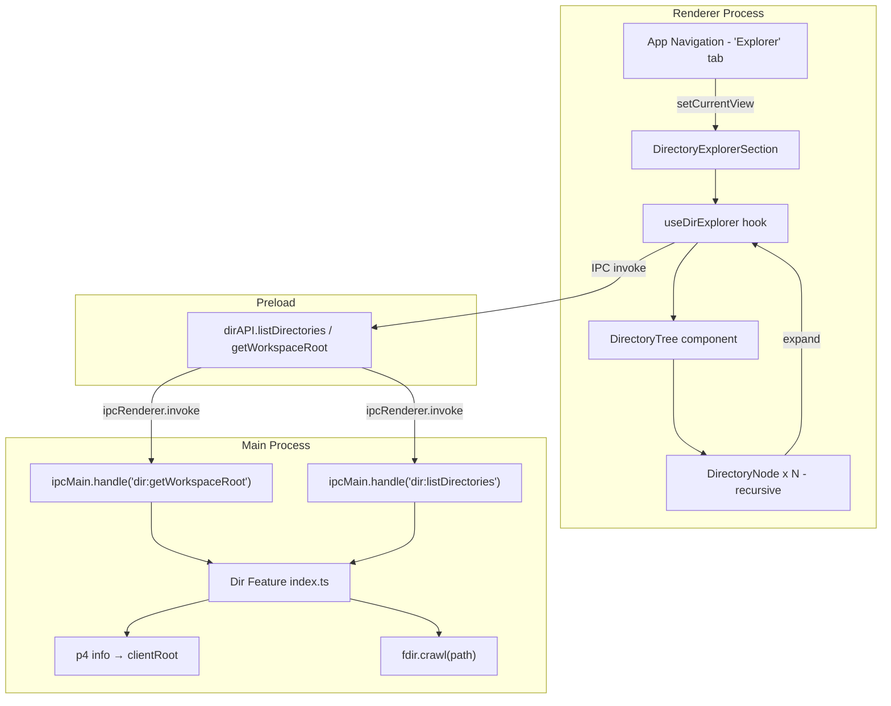
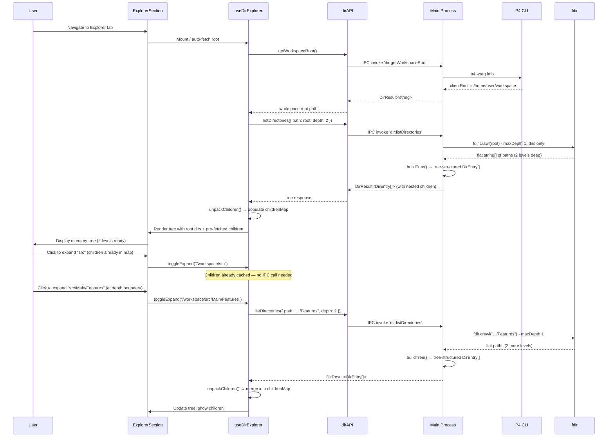
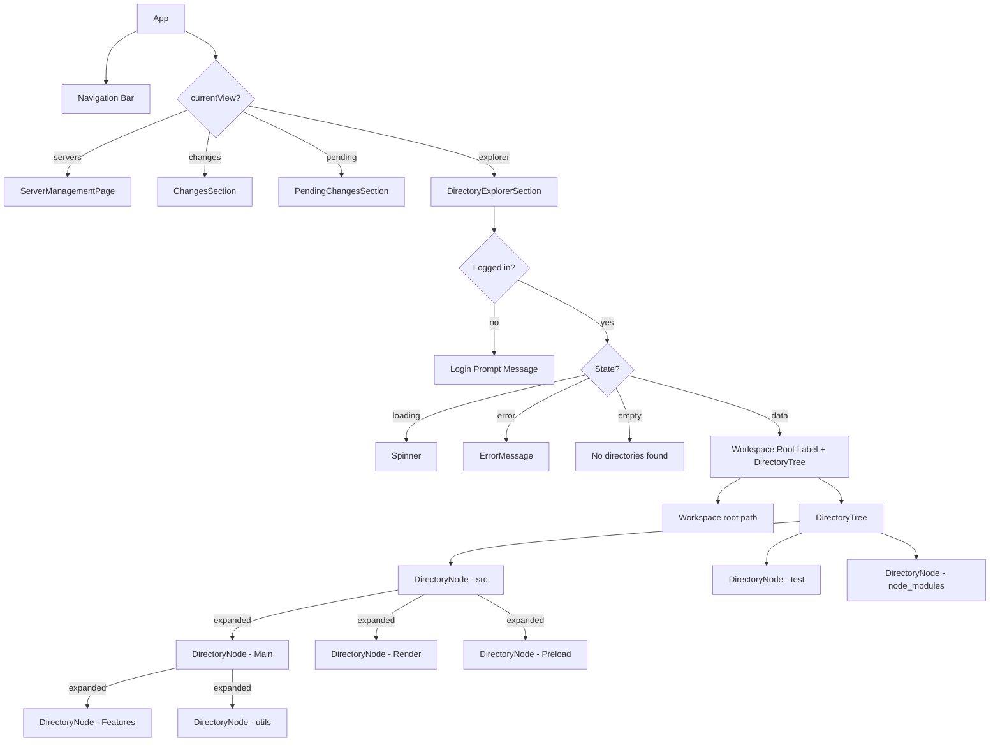

# Directory Explorer — Feature Plan

This document outlines the plan for implementing a "Directory Explorer" view within the P4Client application. This view displays the directory tree of the current P4 workspace, allowing users to expand and collapse directories by clicking on them.

## Overview

The user needs a way to browse the directory structure of their Perforce workspace. The initial version focuses solely on displaying directory names in a tree view, with expand/collapse interaction. Directory contents are loaded lazily (on expand) to handle large workspace trees efficiently.

Key behaviors:

1. Show a tree of directories starting from the P4 workspace root (`clientRoot` from `p4 info`)
2. Directories can be expanded/collapsed by clicking on them
3. Multiple levels of child directories are pre-fetched when a directory is expanded (configurable depth, default 2)
4. Only directory names are shown (no files in this version)
5. Only show data when the user is logged into a server (reuse session-aware pattern)

---

## Requirements Summary

| Requirement             | Description                                                                 |
| ----------------------- | --------------------------------------------------------------------------- |
| Workspace Root          | Automatically determine the P4 workspace root via `p4 info` (`clientRoot`) |
| Directory Tree Display  | Show directories in a hierarchical indented tree                            |
| Expand/Collapse         | Click a directory to expand (show children) or collapse (hide children)     |
| Lazy Loading            | Fetch N levels of child directories when expanded (configurable, default 2) |
| New Navigation Tab      | Add an "Explorer" tab to the main app nav alongside existing tabs           |
| Session Awareness       | Only fetch/display when logged in; show login prompt otherwise              |
| Loading & Error States  | Show loading spinner and error messages with retry, same as existing views  |
| Theme Support           | Light and dark theme support using existing CSS custom properties            |

---

## Feature Questions

### 1. What state needs to be tracked?

| State                 | Type                                     | Location         |
| --------------------- | ---------------------------------------- | ---------------- |
| Workspace root path   | `string \| null`                         | React hook state |
| Tree node map         | `Map<string, DirTreeNode>`               | React hook state |
| Fetch depth           | `number` (default 2)                     | Constant / config|
| Expanded directories  | `Set<string>`                            | React hook state |
| Loading directories   | `Set<string>`                            | React hook state |
| Root-level error      | `string \| null`                         | React hook state |
| Session status        | `SessionStatus`                          | Zubridge store   |
| Current view          | `AppView` (add `"explorer"`)             | React state      |

### 2. Where will that state come from?

- **Workspace root path**: Fetched from the main process via `p4 info` → `clientRoot` field (new P4 provider method or extend existing `runInfoCommand`)
- **Tree node map**: Built incrementally as directories are expanded, populated by IPC calls to main process using `fdir`
- **Session status**: Already exists in the Zubridge cross-process store
- **Current view**: Already exists as local React state in `app.tsx`

### 3. What user interactions will be needed?

| Interaction                | Action                                           |
| -------------------------- | ------------------------------------------------ |
| Click "Explorer" nav tab   | Switch view to directory explorer                |
| Click a collapsed directory| Expand it: fetch N levels of children (if not cached), show  |
| Click an expanded directory| Collapse it: hide children                       |
| Click "Refresh" button     | Re-fetch workspace root and clear tree cache     |

### 4. How will user interactions change the state?

| Interaction         | State Change                                                   |
| ------------------- | -------------------------------------------------------------- |
| Navigate to Explorer| Sets `currentView` to `"explorer"`, triggers root path fetch   |
| Expand directory    | Adds path to `expanded` set; fetches N levels of children via IPC if needed|
| Collapse directory  | Removes path from `expanded` set                               |
| Refresh             | Clears tree, re-fetches workspace root                         |

---

## Technology: fdir

The `fdir` package is used in the Main process to list directory contents. It provides fast, async directory crawling.

**Note**: `fdir` is currently only a transitive dependency (via `tinyglobby`). It must be installed as a direct dependency:

```bash
npm install fdir
```

### Usage Pattern

```typescript
import { fdir } from "fdir";

// Get subdirectories up to `depth` levels deep (depth=2 → children + grandchildren)
const api = new fdir()
  .withMaxDepth(depth - 1)  // fdir's maxDepth is 0-indexed: 0 = immediate, 1 = +grandchildren
  .onlyDirs()               // directories only
  .crawl(parentPath);

const directories: string[] = await api.withPromise();
```

`fdir` returns a flat list of full absolute paths at all discovered levels. We build a tree structure from this flat list, grouping entries by their parent directory. The `depth` parameter (default 2) controls how many levels are fetched in a single IPC call. This is configurable to tune the balance between fewer IPC round-trips (higher depth) and smaller response payloads (lower depth).

---

## New Types

Add `src/shared/types/dir.ts`:

```typescript
/**
 * Represents a directory entry returned from the main process.
 */
export interface DirEntry {
  name: string;       // Directory name (e.g., "src")
  path: string;       // Full absolute path (e.g., "C:/workspace/src")
}

/**
 * Options for listing directory contents.
 */
export interface DirListOptions {
  path: string;       // Absolute path to list children of
}

/**
 * Result wrapper for directory operations, matching P4Result pattern.
 */
export interface DirResult<T> {
  success: boolean;
  data?: T;
  error?: string;
}

/**
 * API exposed to renderer for directory operations.
 */
export interface DirAPI {
  getWorkspaceRoot: () => Promise<DirResult<string>>;
  listDirectories: (options: DirListOptions) => Promise<DirResult<DirEntry[]>>;
}

declare global {
  interface Window {
    dirAPI: DirAPI;
  }
}
```

---

## Architecture Diagram



## Data Flow Diagram



---

## UI Design

### Layout Structure

```
┌─────────────────────────────────────────────────────────────┐
│  P4Client     [Servers] [Changes] [Pending] [Explorer] [☀/🌙]│
├─────────────────────────────────────────────────────────────┤
│                                                             │
│  ┌─────────────────────────────────────────────────────┐   │
│  │  Workspace Explorer                     [ Refresh ]  │   │
│  │                                                      │   │
│  │  C:\workspace\myproject                              │   │
│  │                                                      │   │
│  │  v  src                                              │   │
│  │     v  Main                                          │   │
│  │        >  Features                                   │   │
│  │        >  utils                                      │   │
│  │     >  Render                                        │   │
│  │     >  Preload                                       │   │
│  │     >  shared                                        │   │
│  │  >  test                                             │   │
│  │  >  node_modules                                     │   │
│  │  >  .git                                             │   │
│  │  >  dist                                             │   │
│  │                                                      │   │
│  └─────────────────────────────────────────────────────┘   │
│                                                             │
└─────────────────────────────────────────────────────────────┘
```

- `v` = expanded directory (chevron down)
- `>` = collapsed directory (chevron right)
- Each level is indented by a consistent amount (e.g., 20px / `pl-5`)
- Clicking anywhere on a directory row toggles expand/collapse
- While loading children, show a small inline spinner next to the directory name

### Directory Node Design

| Element            | Styling                                                              |
| ------------------ | -------------------------------------------------------------------- |
| Chevron icon       | `>` or `v` character (or SVG), accent color, transitions on toggle   |
| Directory name     | Primary text color, cursor pointer                                   |
| Row hover          | Subtle bg highlight (`--color-bg-tertiary`)                          |
| Indent             | `padding-left` increases per depth level                             |
| Loading indicator  | Small spinner replacing chevron while children are being fetched     |
| Workspace root     | Shown as monospace muted text above the tree                         |

### States

| State          | Display                                                                 |
| -------------- | ----------------------------------------------------------------------- |
| Loading root   | Spinner + "Loading workspace..." text                                   |
| Not logged in  | "No active session. Please go to the Servers tab..." (existing pattern) |
| Error          | Error message with "Try Again" button (reuse `ErrorMessage`)           |
| Root not found | "Could not determine workspace root. Is a P4 client configured?"       |
| Empty root     | "No directories found in workspace root."                               |
| Data           | Tree of expandable/collapsible directories                              |

---

## File Structure

```
src/
├── shared/types/
│   └── dir.ts                                # DirEntry, DirListOptions, DirResult, DirAPI types
├── Main/Features/Dir/
│   └── index.ts                              # getWorkspaceRoot(), listDirectories() using fdir + p4 info
├── Main/
│   └── main.ts                               # Register dir:getWorkspaceRoot, dir:listDirectories IPC handlers
├── Preload/
│   └── preload.ts                            # Build dirAPI object, expose via contextBridge
├── Render/
│   ├── app.tsx                               # Add "explorer" to AppView and navigation
│   ├── Hooks/
│   │   └── useDirExplorer.ts                 # Hook managing tree state, expand/collapse, lazy loading
│   └── Components/Dir/
│       ├── DirectoryExplorerSection.tsx       # Container component (session checks, loading, etc.)
│       ├── DirectoryTree.tsx                  # Renders the tree from root entries
│       └── DirectoryNode.tsx                  # Single directory row — name, chevron, click handler, recursive children
```

---

## Implementation Steps

### Step 1: Install fdir

```bash
npm install fdir
```

`fdir` is already a transitive dependency but needs to be a direct dependency for us to import it.

### Step 2: Add Shared Types

**`src/shared/types/dir.ts`** — Create the new type file:

```typescript
/** Default number of directory levels to fetch per IPC call. */
export const DIR_FETCH_DEPTH = 2;

/**
 * Represents a directory entry returned from the main process.
 * When fetched with depth > 1, `children` contains pre-fetched subdirectories.
 */
export interface DirEntry {
  name: string;       // Directory name (e.g., "src")
  path: string;       // Full absolute path (e.g., "C:/workspace/src")
  children?: DirEntry[];  // Pre-fetched children (present when depth > 1 reached this level)
}

/**
 * Options for listing directory contents.
 */
export interface DirListOptions {
  path: string;       // Absolute path to list children of
  depth?: number;     // Number of levels to fetch (default: DIR_FETCH_DEPTH)
}

export interface DirResult<T> {
  success: boolean;
  data?: T;
  error?: string;
}

export interface DirAPI {
  getWorkspaceRoot: () => Promise<DirResult<string>>;
  listDirectories: (options: DirListOptions) => Promise<DirResult<DirEntry[]>>;
}

declare global {
  interface Window {
    dirAPI: DirAPI;
  }
}
```

### Step 3: Create Dir Feature (Main Process)

**`src/Main/Features/Dir/index.ts`** — Public API using `fdir` and `p4 info`:

```typescript
import { fdir } from "fdir";
import path from "path";
import { getProvider } from "../P4/factory";
import type { DirEntry, DirResult, DirListOptions } from "../../../shared/types/dir";
import { DIR_FETCH_DEPTH } from "../../../shared/types/dir";

/**
 * Gets the workspace root from the current P4 client configuration.
 * Uses `p4 info` to retrieve the clientRoot field.
 */
export async function getWorkspaceRoot(): Promise<DirResult<string>> {
  try {
    const provider = getProvider();
    // We need to run `p4 info` and extract clientRoot
    // The existing runInfoCommand requires a p4port — we'll use a raw info call instead
    const { executeP4Command } = await import("../P4/providers/cli/executor");
    const { parseZtagOutput } = await import("../P4/providers/cli/parser");

    const { stdout } = await executeP4Command("info");
    const records = parseZtagOutput(stdout);
    const clientRoot = records[0]?.clientRoot;

    if (!clientRoot) {
      return { success: false, error: "No workspace root found. Is a P4 client configured?" };
    }

    return { success: true, data: clientRoot };
  } catch (error) {
    return {
      success: false,
      error: error instanceof Error ? error.message : "Failed to get workspace root",
    };
  }
}

/**
 * Builds a tree of DirEntry objects from a flat list of absolute paths.
 * Groups each path under its parent directory, recursively.
 */
function buildTree(rootPath: string, flatPaths: string[]): DirEntry[] {
  // Normalize and filter out the root itself
  const resolved = flatPaths
    .map((p) => path.resolve(p))
    .filter((p) => p !== path.resolve(rootPath));

  // Group paths by their immediate parent
  const childrenByParent = new Map<string, string[]>();
  for (const p of resolved) {
    const parent = path.resolve(path.dirname(p));
    if (!childrenByParent.has(parent)) {
      childrenByParent.set(parent, []);
    }
    childrenByParent.get(parent)!.push(p);
  }

  // Recursively build DirEntry tree from a given parent
  function buildEntries(parentPath: string): DirEntry[] {
    const childPaths = childrenByParent.get(path.resolve(parentPath)) || [];
    return childPaths
      .map((p) => {
        const children = buildEntries(p);
        const entry: DirEntry = {
          name: path.basename(p),
          path: p,
        };
        // Attach children array if this dir had any discovered subdirectories,
        // or if it was within the fetch depth (empty array = confirmed leaf).
        // Omit `children` only for entries at the deepest fetched level
        // so the renderer knows it hasn't looked deeper yet.
        if (children.length > 0) {
          entry.children = children;
        } else if (childrenByParent.has(path.resolve(p))) {
          // fdir visited this dir and found nothing — confirmed empty
          entry.children = [];
        }
        // else: children is undefined → not yet fetched (at max depth boundary)
        return entry;
      })
      .sort((a, b) => a.name.localeCompare(b.name));
  }

  return buildEntries(rootPath);
}

/**
 * Lists child directories of the given path using fdir, up to `depth` levels deep.
 * Returns a tree-structured response: each DirEntry may contain pre-fetched `children`.
 *
 * @param options.path   - Absolute path to list children of
 * @param options.depth  - Number of levels to fetch (default: DIR_FETCH_DEPTH).
 *                         1 = immediate children only, 2 = children + grandchildren, etc.
 */
export async function listDirectories(options: DirListOptions): Promise<DirResult<DirEntry[]>> {
  const depth = options.depth ?? DIR_FETCH_DEPTH;

  try {
    const api = new fdir()
      .withMaxDepth(depth - 1)  // fdir is 0-indexed: 0 = immediate children
      .onlyDirs()
      .crawl(options.path);

    const dirPaths = await api.withPromise();

    // Build a tree from the flat path list
    const entries = buildTree(options.path, dirPaths);

    return { success: true, data: entries };
  } catch (error) {
    return {
      success: false,
      error: error instanceof Error ? error.message : "Failed to list directories",
    };
  }
}
```

### Step 4: Register IPC Handlers

**`src/Main/main.ts`** — Add alongside existing handlers:

```typescript
import { getWorkspaceRoot, listDirectories } from "./Features/Dir";

// Inside app.whenReady().then(...)
ipcMain.handle("dir:getWorkspaceRoot", async () => getWorkspaceRoot());
ipcMain.handle("dir:listDirectories", async (_event, options) => listDirectories(options));
```

### Step 5: Expose in Preload

**`src/Preload/preload.ts`** — Add `dirAPI` alongside existing APIs:

```typescript
import type { DirAPI } from "../shared/types/dir";

const dirAPI: DirAPI = {
  getWorkspaceRoot: () => ipcRenderer.invoke("dir:getWorkspaceRoot"),
  listDirectories: (options) => ipcRenderer.invoke("dir:listDirectories", options),
};

contextBridge.exposeInMainWorld("dirAPI", dirAPI);
```

### Step 6: Create `useDirExplorer` Hook

**`src/Render/Hooks/useDirExplorer.ts`** — Manages tree state with lazy loading:

```typescript
import { useState, useCallback } from "react";
import type { DirEntry } from "../../shared/types/dir";
import { DIR_FETCH_DEPTH } from "../../shared/types/dir";

interface UseDirExplorerReturn {
  workspaceRoot: string | null;
  rootEntries: DirEntry[];
  expanded: Set<string>;
  loading: Set<string>;
  childrenMap: Map<string, DirEntry[]>;
  rootLoading: boolean;
  error: string | null;
  initialize: () => Promise<void>;
  toggleExpand: (dirPath: string) => Promise<void>;
  refresh: () => Promise<void>;
}

/**
 * Recursively unpacks a tree-structured DirEntry[] response into the flat
 * childrenMap used by the renderer. For each entry that has pre-fetched
 * `children`, adds a childrenMap entry (parentPath → children) and recurses.
 *
 * Entries where `children` is undefined are at the fetch depth boundary —
 * they will trigger a new IPC call when expanded.
 */
function unpackChildren(
  entries: DirEntry[],
  map: Map<string, DirEntry[]>,
): void {
  for (const entry of entries) {
    if (entry.children !== undefined) {
      // Strip the `children` property for the flat DirEntry stored in the map
      const flatChildren = entry.children.map(({ name, path }) => ({ name, path }));
      map.set(entry.path, flatChildren);
      // Recurse into pre-fetched children
      unpackChildren(entry.children, map);
    }
    // else: children is undefined → at fetch depth boundary, will be fetched on expand
  }
}

export function useDirExplorer(): UseDirExplorerReturn {
  const [workspaceRoot, setWorkspaceRoot] = useState<string | null>(null);
  const [rootEntries, setRootEntries] = useState<DirEntry[]>([]);
  const [expanded, setExpanded] = useState<Set<string>>(new Set());
  const [loading, setLoading] = useState<Set<string>>(new Set());
  const [childrenMap, setChildrenMap] = useState<Map<string, DirEntry[]>>(new Map());
  const [rootLoading, setRootLoading] = useState(false);
  const [error, setError] = useState<string | null>(null);

  const initialize = useCallback(async () => {
    setRootLoading(true);
    setError(null);
    try {
      // 1. Get workspace root
      const rootResult = await window.dirAPI.getWorkspaceRoot();
      if (!rootResult.success || !rootResult.data) {
        setError(rootResult.error || "Failed to get workspace root");
        return;
      }
      setWorkspaceRoot(rootResult.data);

      // 2. Fetch root-level directories (with DIR_FETCH_DEPTH levels)
      const listResult = await window.dirAPI.listDirectories({
        path: rootResult.data,
        depth: DIR_FETCH_DEPTH,
      });
      if (!listResult.success || !listResult.data) {
        setError(listResult.error || "Failed to list directories");
        return;
      }

      // 3. Unpack pre-fetched children into the flat childrenMap
      const newMap = new Map<string, DirEntry[]>();
      unpackChildren(listResult.data, newMap);
      setChildrenMap(newMap);

      // Store root entries (stripped of nested children for display)
      setRootEntries(listResult.data.map(({ name, path }) => ({ name, path })));
    } catch (err) {
      setError(err instanceof Error ? err.message : "Unknown error");
    } finally {
      setRootLoading(false);
    }
  }, []);

  const toggleExpand = useCallback(async (dirPath: string) => {
    // If already expanded, collapse
    if (expanded.has(dirPath)) {
      setExpanded((prev) => {
        const next = new Set(prev);
        next.delete(dirPath);
        return next;
      });
      return;
    }

    // Expand
    setExpanded((prev) => new Set(prev).add(dirPath));

    // If children already fetched (from initial load or a previous expand), nothing more to do
    if (childrenMap.has(dirPath)) return;

    // Fetch children (with DIR_FETCH_DEPTH levels from this point)
    setLoading((prev) => new Set(prev).add(dirPath));
    try {
      const result = await window.dirAPI.listDirectories({
        path: dirPath,
        depth: DIR_FETCH_DEPTH,
      });
      if (result.success && result.data) {
        setChildrenMap((prev) => {
          const next = new Map(prev);
          // Add direct children
          next.set(dirPath, result.data!.map(({ name, path }) => ({ name, path })));
          // Unpack any pre-fetched deeper levels
          unpackChildren(result.data!, next);
          return next;
        });
      }
    } finally {
      setLoading((prev) => {
        const next = new Set(prev);
        next.delete(dirPath);
        return next;
      });
    }
  }, [expanded, childrenMap]);

  const refresh = useCallback(async () => {
    setExpanded(new Set());
    setChildrenMap(new Map());
    setRootEntries([]);
    setWorkspaceRoot(null);
    await initialize();
  }, [initialize]);

  return {
    workspaceRoot,
    rootEntries,
    expanded,
    loading,
    childrenMap,
    rootLoading,
    error,
    initialize,
    toggleExpand,
    refresh,
  };
}
```

### Step 7: Create Renderer Components

#### `DirectoryNode.tsx`

A single directory row that renders recursively for expanded children:

```typescript
import React from "react";
import type { DirEntry } from "../../../shared/types/dir";
import { Spinner } from "../Spinner";

interface DirectoryNodeProps {
  entry: DirEntry;
  depth: number;
  expanded: Set<string>;
  loading: Set<string>;
  childrenMap: Map<string, DirEntry[]>;
  onToggle: (path: string) => void;
}

export const DirectoryNode: React.FC<DirectoryNodeProps> = ({
  entry,
  depth,
  expanded,
  loading,
  childrenMap,
  onToggle,
}) => {
  const isExpanded = expanded.has(entry.path);
  const isLoading = loading.has(entry.path);
  const children = childrenMap.get(entry.path);

  return (
    <div>
      <div
        className="flex items-center py-1 px-2 cursor-pointer rounded
                   hover:bg-[var(--color-bg-tertiary)] transition-colors"
        style={{ paddingLeft: `${depth * 20 + 8}px` }}
        onClick={() => onToggle(entry.path)}
      >
        <span className="w-4 mr-1 text-[var(--color-accent)] text-xs flex-shrink-0">
          {isLoading ? (
            <Spinner size="sm" />
          ) : isExpanded ? (
            "v"
          ) : (
            ">"
          )}
        </span>
        <span className="text-[var(--color-text-primary)] text-sm truncate">
          {entry.name}
        </span>
      </div>

      {isExpanded && children && children.map((child) => (
        <DirectoryNode
          key={child.path}
          entry={child}
          depth={depth + 1}
          expanded={expanded}
          loading={loading}
          childrenMap={childrenMap}
          onToggle={onToggle}
        />
      ))}
    </div>
  );
};
```

#### `DirectoryTree.tsx`

Renders the list of root-level directory nodes:

```typescript
import React from "react";
import type { DirEntry } from "../../../shared/types/dir";
import { DirectoryNode } from "./DirectoryNode";

interface DirectoryTreeProps {
  entries: DirEntry[];
  expanded: Set<string>;
  loading: Set<string>;
  childrenMap: Map<string, DirEntry[]>;
  onToggle: (path: string) => void;
}

export const DirectoryTree: React.FC<DirectoryTreeProps> = ({
  entries,
  expanded,
  loading,
  childrenMap,
  onToggle,
}) => {
  return (
    <div className="font-mono text-sm">
      {entries.map((entry) => (
        <DirectoryNode
          key={entry.path}
          entry={entry}
          depth={0}
          expanded={expanded}
          loading={loading}
          childrenMap={childrenMap}
          onToggle={onToggle}
        />
      ))}
    </div>
  );
};
```

#### `DirectoryExplorerSection.tsx`

Container component following the established pattern:

```typescript
import React, { useEffect } from "react";
import { useServers } from "../../Hooks/useServers";
import { useDirExplorer } from "../../Hooks/useDirExplorer";
import { DirectoryTree } from "./DirectoryTree";
import { Spinner } from "../Spinner";
import { ErrorMessage } from "../ErrorMessage";
import { Button } from "../button";

export const DirectoryExplorerSection: React.FC = () => {
  const { sessionStatus, loading: sessionLoading } = useServers();
  const {
    workspaceRoot,
    rootEntries,
    expanded,
    loading,
    childrenMap,
    rootLoading,
    error,
    initialize,
    toggleExpand,
    refresh,
  } = useDirExplorer();

  const isLoading = sessionLoading || rootLoading;

  // Auto-fetch when logged in
  useEffect(() => {
    if (sessionStatus.isLoggedIn && !workspaceRoot && !rootLoading) {
      initialize();
    }
  }, [sessionStatus.isLoggedIn, workspaceRoot, rootLoading, initialize]);

  const renderContent = () => {
    if (isLoading) {
      return (
        <div className="flex flex-col items-center justify-center py-12">
          <Spinner size="lg" />
          <p className="mt-3 text-[var(--color-text-muted)]">Loading workspace...</p>
        </div>
      );
    }

    if (!sessionStatus.isLoggedIn) {
      return (
        <p className="text-[var(--color-text-muted)] text-sm">
          No active session. Please go to the Servers tab to connect and log in.
        </p>
      );
    }

    if (error) {
      return <ErrorMessage message={error} onRetry={refresh} />;
    }

    if (rootEntries.length === 0) {
      return (
        <p className="text-[var(--color-text-muted)] text-sm">
          No directories found in workspace root.
        </p>
      );
    }

    return (
      <>
        <p className="text-[var(--color-text-muted)] text-xs font-mono mb-3">
          {workspaceRoot}
        </p>
        <DirectoryTree
          entries={rootEntries}
          expanded={expanded}
          loading={loading}
          childrenMap={childrenMap}
          onToggle={toggleExpand}
        />
      </>
    );
  };

  return (
    <div className="card">
      <div className="flex items-center justify-between mb-4">
        <h2 className="text-lg font-semibold text-[var(--color-text-primary)]">
          Workspace Explorer
        </h2>
        {sessionStatus.isLoggedIn && (
          <Button
            variant="secondary"
            size="sm"
            onClick={refresh}
            disabled={rootLoading}
            loading={rootLoading}
          >
            Refresh
          </Button>
        )}
      </div>
      {renderContent()}
    </div>
  );
};
```

### Step 8: Add Navigation Tab

**`src/Render/app.tsx`**:

- Extend `AppView` type: `type AppView = "servers" | "changes" | "pending" | "explorer";`
- Add "Explorer" button to navigation bar (same styling as existing tabs)
- Add conditional render: `{currentView === "explorer" && <DirectoryExplorerSection />}`

---

## Component Hierarchy



---

## Testing Strategy

### Unit Tests

| Test File                                      | Coverage                                            |
| ---------------------------------------------- | --------------------------------------------------- |
| `test/Main/Features/Dir/index.test.ts`         | `getWorkspaceRoot` and `listDirectories` functions  |

### Test Scenarios — `getWorkspaceRoot`

1. **Happy path**: `p4 info` returns output with `clientRoot` → returns the path
2. **No clientRoot**: `p4 info` output lacks `clientRoot` field → returns error
3. **P4 command fails**: `executeP4Command` throws → returns error with message

### Test Scenarios — `listDirectories`

1. **Depth 1 — flat children**: Returns sorted flat `DirEntry[]` with correct names and paths, no `children` property
2. **Depth 2 — nested tree**: Returns tree-structured `DirEntry[]` where first-level entries have `children` arrays
3. **Empty directory**: Returns empty array
4. **Invalid path**: Returns error
5. **Filters parent path**: Does not include the queried path itself in results
6. **Depth boundary**: Entries at the deepest fetched level have `children` as `undefined` (not yet explored)
7. **Confirmed empty subdirectory**: Subdirectories visited by fdir that contain no children have `children: []`
8. **Default depth**: When `depth` is omitted, uses `DIR_FETCH_DEPTH` (2)

---

## Edge Cases & Considerations

| Scenario                              | Handling                                                    |
| ------------------------------------- | ----------------------------------------------------------- |
| No P4 client configured               | Show "Could not determine workspace root..." message       |
| Workspace root doesn't exist on disk  | fdir will error; show error state with retry                |
| Very large directory (1000+ children) | fdir is fast; render all for now, consider virtualization later |
| Tuning fetch depth                    | Increase `DIR_FETCH_DEPTH` for fewer IPC calls, decrease for smaller payloads |
| Permission denied on a subdirectory   | fdir will error for that dir; show error inline for that expand |
| Hidden directories (. prefix)         | Show them — they're valid workspace directories             |
| Symlinks                              | fdir follows symlinks by default; this is fine              |
| Network drives / slow I/O             | Loading spinner per-node handles perceived latency          |
| User not logged in                    | Show login prompt (same as other views)                     |
| Rapid expand/collapse clicks          | State is managed via Sets; redundant fetches are harmless   |

---

## Summary

This feature adds a Workspace Explorer view as a new tab in the main navigation. It requires:

1. **1 new npm dependency**: `fdir` (direct install)
2. **1 new type file**: `src/shared/types/dir.ts` (`DirEntry`, `DirListOptions`, `DirResult`, `DirAPI`)
3. **1 new feature module**: `src/Main/Features/Dir/index.ts` (`getWorkspaceRoot`, `listDirectories`)
4. **2 new IPC channels**: `dir:getWorkspaceRoot`, `dir:listDirectories`
5. **1 new preload exposure**: `dirAPI`
6. **1 new hook**: `useDirExplorer` (tree state, expand/collapse, lazy loading)
7. **3 new components**: `DirectoryExplorerSection`, `DirectoryTree`, `DirectoryNode`
8. **Navigation update** in `app.tsx`

The implementation follows established patterns throughout — same result pattern (`DirResult<T>`), same session awareness, same container component structure, same IPC architecture.

### Multi-Level Fetch Design

The key design decision is **multi-level lazy loading**: each IPC call fetches `DIR_FETCH_DEPTH` levels (default 2) instead of just 1. This means:

- **Fewer IPC round-trips**: Expanding a directory doesn't trigger a new IPC call if its children were pre-fetched as part of the parent's request
- **Configurable via `DIR_FETCH_DEPTH`**: Change the constant in `src/shared/types/dir.ts` to tune performance. Higher values reduce round-trips but increase per-call payload size
- **Tree-structured IPC response**: The main process returns `DirEntry[]` where each entry may have a nested `children` array. The renderer hook unpacks this tree into its flat `childrenMap` for efficient lookups
- **Depth boundary detection**: Entries at the deepest fetched level have `children: undefined`, signaling the renderer to fetch more when expanded. Entries confirmed empty have `children: []`
