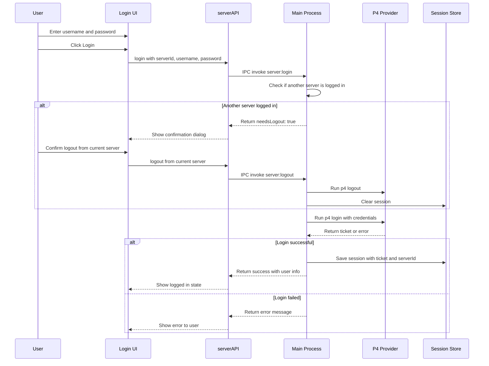
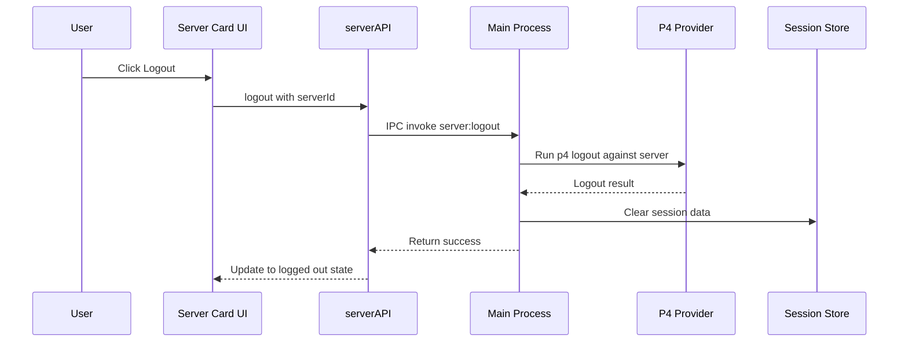
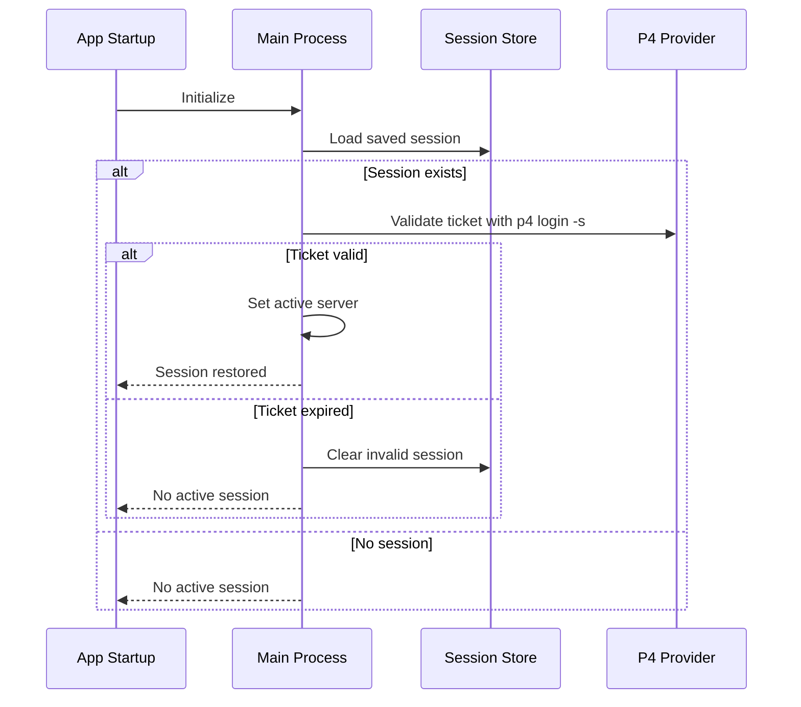
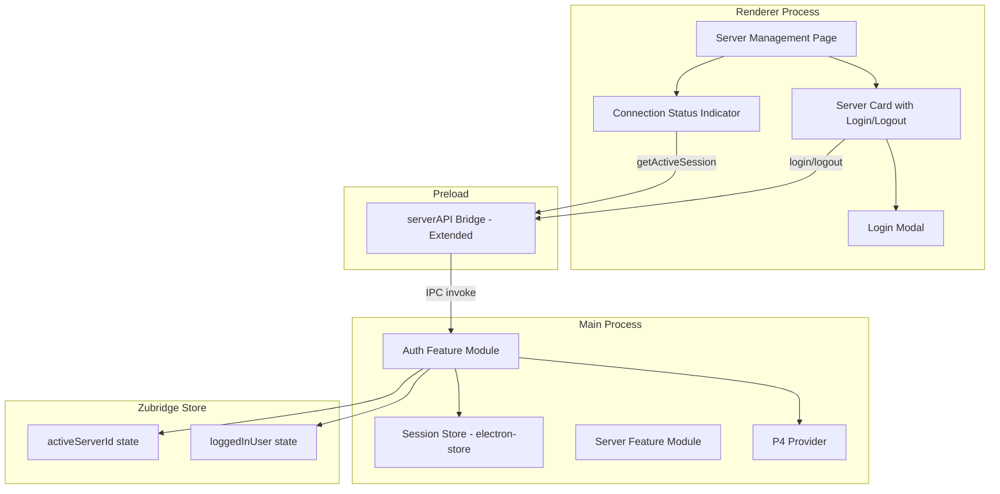

# Server Login/Logout Feature Plan

## Overview

This document outlines the plan for extending the server management screen to allow users to login and logout of Perforce servers. The system will enforce a **single logged-in server at a time** constraint, with automatic logout confirmation when switching servers.

## Requirements Summary

| Requirement         | Description                                                                     |
| ------------------- | ------------------------------------------------------------------------------- |
| Login               | Users can authenticate to a server using username + password via `p4 login`     |
| Logout              | Users can logout from a server, which runs `p4 logout` to invalidate the ticket |
| Session Persistence | Login sessions persist across app restarts using stored P4 tickets              |
| Single Server       | Only one server can be logged in at a time                                      |
| Auto-Logout         | When logging into a new server, prompt to logout from current server first      |
| Connection Status   | Visual indicator showing which server is currently logged in                    |

## Authentication Flow

### Login Flow



### Logout Flow



### Session Restoration on App Start



---

## Architecture Diagram



---

## Data Models

### Session Data Schema

```typescript
/**
 * Stored session data for a logged-in server
 */
interface ServerSession {
  serverId: string; // ID of the logged-in server
  username: string; // P4USER
  ticket: string; // P4 ticket from login
  loginTime: string; // ISO timestamp of login
  expiresAt?: string; // Optional ticket expiration time
}

/**
 * Session store schema
 */
interface SessionStoreSchema {
  activeSession: ServerSession | null;
}
```

### Extended Server Types

```typescript
/**
 * Login input
 */
interface LoginInput {
  serverId: string;
  username: string;
  password: string;
}

/**
 * Login result
 */
interface LoginResult {
  success: boolean;
  needsLogout?: boolean; // True if another server is logged in
  currentServerId?: string; // ID of currently logged-in server
  user?: string; // Logged in username
  error?: string;
}

/**
 * Logout result
 */
interface LogoutResult {
  success: boolean;
  error?: string;
}

/**
 * Session status
 */
interface SessionStatus {
  isLoggedIn: boolean;
  serverId?: string;
  serverName?: string;
  username?: string;
  loginTime?: string;
}
```

### Extended ServerAPI Interface

```typescript
interface ServerAPI {
  // Existing methods...
  getServers: () => Promise<ServerConfig[]>;
  getServer: (id: string) => Promise<ServerConfig | null>;
  addServer: (input: CreateServerInput) => Promise<ServerConfig>;
  updateServer: (input: UpdateServerInput) => Promise<ServerConfig>;
  removeServer: (id: string) => Promise<boolean>;
  testConnection: (p4port: string) => Promise<ConnectionTestResult>;

  // New authentication methods
  login: (input: LoginInput) => Promise<LoginResult>;
  logout: (serverId: string) => Promise<LogoutResult>;
  getSessionStatus: () => Promise<SessionStatus>;
  validateSession: () => Promise<boolean>;
}
```

---

## File Structure

New and modified files:

```
src/
├── Main/
│   └── Features/
│       └── Server/
│           ├── index.ts          # Add login/logout exports
│           ├── store.ts          # Existing server store
│           ├── session.ts        # NEW: Session store for auth state
│           └── auth.ts           # NEW: Authentication logic
├── Preload/
│   └── preload.ts               # Extend serverAPI with auth methods
├── Render/
│   ├── Components/
│   │   └── Server/
│   │       ├── ServerCard.tsx           # Add login/logout buttons
│   │       ├── LoginModal.tsx           # NEW: Login form modal
│   │       ├── ConnectionStatus.tsx     # NEW: Shows active connection
│   │       └── LogoutConfirmDialog.tsx  # NEW: Confirm server switch
│   └── Hooks/
│       └── useServers.ts                # Extend with auth methods
└── shared/
    └── types/
        └── server.ts                    # Add auth-related types
```

---

## Implementation Details

### Step 1: Create Session Store

Create [`src/Main/Features/Server/session.ts`](src/Main/Features/Server/session.ts):

```typescript
import Store from "electron-store";

interface ServerSession {
  serverId: string;
  username: string;
  ticket: string;
  loginTime: string;
  expiresAt?: string;
}

interface SessionStoreSchema {
  activeSession: ServerSession | null;
}

const sessionStore = new Store<SessionStoreSchema>({
  name: "session",
  defaults: {
    activeSession: null,
  },
  encryptionKey: "p4client-session-key", // Encrypt sensitive data
});

export function getActiveSession(): ServerSession | null {
  return sessionStore.get("activeSession");
}

export function saveSession(session: ServerSession): void {
  sessionStore.set("activeSession", session);
}

export function clearSession(): void {
  sessionStore.set("activeSession", null);
}

export function isServerLoggedIn(serverId: string): boolean {
  const session = getActiveSession();
  return session?.serverId === serverId;
}
```

### Step 2: Create Auth Module

Create [`src/Main/Features/Server/auth.ts`](src/Main/Features/Server/auth.ts):

```typescript
import { getProvider } from "../P4/factory";
import { getServerById } from "./store";
import { getActiveSession, saveSession, clearSession } from "./session";
import type {
  LoginInput,
  LoginResult,
  LogoutResult,
  SessionStatus,
} from "../../../shared/types/server";

/**
 * Login to a Perforce server
 */
export async function login(input: LoginInput): Promise<LoginResult> {
  const { serverId, username, password } = input;

  // Check if another server is logged in
  const currentSession = getActiveSession();
  if (currentSession && currentSession.serverId !== serverId) {
    return {
      success: false,
      needsLogout: true,
      currentServerId: currentSession.serverId,
    };
  }

  // Get server config
  const server = getServerById(serverId);
  if (!server) {
    return { success: false, error: "Server not found" };
  }

  try {
    const provider = getProvider();

    // Run p4 login
    const result = await provider.login(server.p4port, username, password);

    if (result.success && result.ticket) {
      // Save session
      saveSession({
        serverId,
        username,
        ticket: result.ticket,
        loginTime: new Date().toISOString(),
        expiresAt: result.expiresAt,
      });

      return {
        success: true,
        user: username,
      };
    }

    return {
      success: false,
      error: result.error || "Login failed",
    };
  } catch (error) {
    return {
      success: false,
      error: error instanceof Error ? error.message : "Login failed",
    };
  }
}

/**
 * Logout from a Perforce server
 */
export async function logout(serverId: string): Promise<LogoutResult> {
  const session = getActiveSession();

  if (!session || session.serverId !== serverId) {
    return { success: true }; // Already logged out
  }

  const server = getServerById(serverId);
  if (!server) {
    clearSession();
    return { success: true };
  }

  try {
    const provider = getProvider();

    // Run p4 logout
    await provider.logout(server.p4port, session.username);

    // Clear session
    clearSession();

    return { success: true };
  } catch (error) {
    // Clear session even if logout command fails
    clearSession();
    return {
      success: true, // Consider it successful since session is cleared
    };
  }
}

/**
 * Get current session status
 */
export function getSessionStatus(): SessionStatus {
  const session = getActiveSession();

  if (!session) {
    return { isLoggedIn: false };
  }

  const server = getServerById(session.serverId);

  return {
    isLoggedIn: true,
    serverId: session.serverId,
    serverName: server?.name,
    username: session.username,
    loginTime: session.loginTime,
  };
}

/**
 * Validate current session by checking ticket
 */
export async function validateSession(): Promise<boolean> {
  const session = getActiveSession();

  if (!session) {
    return false;
  }

  const server = getServerById(session.serverId);
  if (!server) {
    clearSession();
    return false;
  }

  try {
    const provider = getProvider();
    const isValid = await provider.validateTicket(
      server.p4port,
      session.username,
      session.ticket
    );

    if (!isValid) {
      clearSession();
    }

    return isValid;
  } catch {
    clearSession();
    return false;
  }
}
```

### Step 3: Extend P4 Provider Interface

Update [`src/Main/Features/P4/types.ts`](src/Main/Features/P4/types.ts):

```typescript
export interface P4Provider {
  // Existing methods...

  /**
   * Login to a Perforce server
   */
  login(
    p4port: string,
    username: string,
    password: string
  ): Promise<P4Result<{ ticket: string; expiresAt?: string }>>;

  /**
   * Logout from a Perforce server
   */
  logout(p4port: string, username: string): Promise<P4Result<void>>;

  /**
   * Validate an existing ticket
   */
  validateTicket(
    p4port: string,
    username: string,
    ticket: string
  ): Promise<boolean>;
}
```

### Step 4: Implement Login/Logout in CLI Provider

Update [`src/Main/Features/P4/providers/cli/index.ts`](src/Main/Features/P4/providers/cli/index.ts):

```typescript
async login(
  p4port: string,
  username: string,
  password: string
): Promise<P4Result<{ ticket: string; expiresAt?: string }>> {
  try {
    // p4 login reads password from stdin
    const { stdout } = await executeP4Command("login", {
      P4PORT: p4port,
      P4USER: username,
    }, {
      input: password,
      args: ["-p"], // Print ticket
    });

    const ticket = stdout.trim();

    return {
      success: true,
      data: { ticket },
    };
  } catch (error) {
    return {
      success: false,
      error: error instanceof Error ? error.message : "Login failed",
    };
  }
}

async logout(p4port: string, username: string): Promise<P4Result<void>> {
  try {
    await executeP4Command("logout", {
      P4PORT: p4port,
      P4USER: username,
    });

    return { success: true };
  } catch (error) {
    return {
      success: false,
      error: error instanceof Error ? error.message : "Logout failed",
    };
  }
}

async validateTicket(
  p4port: string,
  username: string,
  ticket: string
): Promise<boolean> {
  try {
    // p4 login -s checks ticket status without prompting
    await executeP4Command("login", {
      P4PORT: p4port,
      P4USER: username,
      P4TICKET: ticket,
    }, {
      args: ["-s"],
    });

    return true;
  } catch {
    return false;
  }
}
```

### Step 5: Register IPC Handlers

Update [`src/Main/main.ts`](src/Main/main.ts):

```typescript
import {
  login,
  logout,
  getSessionStatus,
  validateSession,
} from "./Features/Server/auth";

// In app.whenReady():

// Authentication handlers
ipcMain.handle("server:login", async (_event, input) => {
  return login(input);
});

ipcMain.handle("server:logout", async (_event, serverId: string) => {
  return logout(serverId);
});

ipcMain.handle("server:getSessionStatus", async () => {
  return getSessionStatus();
});

ipcMain.handle("server:validateSession", async () => {
  return validateSession();
});
```

### Step 6: Update Preload Script

Update [`src/Preload/preload.ts`](src/Preload/preload.ts):

```typescript
// Extend serverAPI with auth methods
const serverAPI: ServerAPI = {
  // Existing methods...

  // Auth methods
  login: (input: LoginInput) => ipcRenderer.invoke("server:login", input),
  logout: (serverId: string) => ipcRenderer.invoke("server:logout", serverId),
  getSessionStatus: () => ipcRenderer.invoke("server:getSessionStatus"),
  validateSession: () => ipcRenderer.invoke("server:validateSession"),
};
```

### Step 7: Create Login Modal Component

Create [`src/Render/Components/Server/LoginModal.tsx`](src/Render/Components/Server/LoginModal.tsx):

```typescript
import React, { useState } from "react";
import { Button } from "../button";
import type { ServerConfig } from "../../../shared/types/server";

interface LoginModalProps {
  server: ServerConfig;
  onLogin: (username: string, password: string) => Promise<void>;
  onClose: () => void;
}

export const LoginModal: React.FC<LoginModalProps> = ({
  server,
  onLogin,
  onClose,
}) => {
  const [username, setUsername] = useState("");
  const [password, setPassword] = useState("");
  const [loading, setLoading] = useState(false);
  const [error, setError] = useState<string | null>(null);

  const handleSubmit = async (e: React.FormEvent) => {
    e.preventDefault();
    setError(null);

    if (!username.trim()) {
      setError("Username is required");
      return;
    }

    if (!password) {
      setError("Password is required");
      return;
    }

    setLoading(true);
    try {
      await onLogin(username.trim(), password);
    } catch (err) {
      setError(err instanceof Error ? err.message : "Login failed");
    } finally {
      setLoading(false);
    }
  };

  return (
    <div className="fixed inset-0 bg-black/50 flex items-center justify-center z-50">
      <div className="bg-[var(--color-bg-secondary)] rounded-lg p-6 w-full max-w-md border border-[var(--color-border)]">
        <h2 className="text-xl font-bold text-[var(--color-text-primary)] mb-2">
          Login to Server
        </h2>
        <p className="text-sm text-[var(--color-text-secondary)] mb-4">
          {server.name} ({server.p4port})
        </p>

        <form onSubmit={handleSubmit}>
          <div className="space-y-4">
            <div>
              <label className="block text-sm font-medium text-[var(--color-text-secondary)] mb-1">
                Username
              </label>
              <input
                type="text"
                value={username}
                onChange={(e) => setUsername(e.target.value)}
                placeholder="P4USER"
                className="input"
                autoFocus
              />
            </div>

            <div>
              <label className="block text-sm font-medium text-[var(--color-text-secondary)] mb-1">
                Password
              </label>
              <input
                type="password"
                value={password}
                onChange={(e) => setPassword(e.target.value)}
                placeholder="Password"
                className="input"
              />
            </div>

            {error && (
              <p className="text-sm text-[var(--color-error)]">{error}</p>
            )}
          </div>

          <div className="flex justify-end gap-3 mt-6">
            <Button type="button" variant="ghost" onClick={onClose}>
              Cancel
            </Button>
            <Button type="submit" variant="primary" loading={loading}>
              Login
            </Button>
          </div>
        </form>
      </div>
    </div>
  );
};
```

### Step 8: Create Connection Status Component

Create [`src/Render/Components/Server/ConnectionStatus.tsx`](src/Render/Components/Server/ConnectionStatus.tsx):

```typescript
import React from "react";
import type { SessionStatus } from "../../../shared/types/server";

interface ConnectionStatusProps {
  status: SessionStatus;
  onLogout?: () => void;
}

export const ConnectionStatus: React.FC<ConnectionStatusProps> = ({
  status,
  onLogout,
}) => {
  if (!status.isLoggedIn) {
    return (
      <div className="flex items-center gap-2 px-3 py-2 rounded-lg bg-[var(--color-bg-tertiary)] border border-[var(--color-border)]">
        <span className="w-2 h-2 rounded-full bg-[var(--color-text-muted)]" />
        <span className="text-sm text-[var(--color-text-muted)]">
          Not connected
        </span>
      </div>
    );
  }

  return (
    <div className="flex items-center gap-3 px-3 py-2 rounded-lg bg-[var(--color-success)]/10 border border-[var(--color-success)]/30">
      <span className="w-2 h-2 rounded-full bg-[var(--color-success)] animate-pulse" />
      <div className="flex-1">
        <p className="text-sm font-medium text-[var(--color-text-primary)]">
          {status.serverName}
        </p>
        <p className="text-xs text-[var(--color-text-secondary)]">
          {status.username}
        </p>
      </div>
      {onLogout && (
        <button
          onClick={onLogout}
          className="text-xs text-[var(--color-text-muted)] hover:text-[var(--color-text-primary)]"
        >
          Logout
        </button>
      )}
    </div>
  );
};
```

### Step 9: Create Logout Confirmation Dialog

Create [`src/Render/Components/Server/LogoutConfirmDialog.tsx`](src/Render/Components/Server/LogoutConfirmDialog.tsx):

```typescript
import React from "react";
import { Button } from "../button";

interface LogoutConfirmDialogProps {
  currentServerName: string;
  newServerName: string;
  onConfirm: () => void;
  onCancel: () => void;
}

export const LogoutConfirmDialog: React.FC<LogoutConfirmDialogProps> = ({
  currentServerName,
  newServerName,
  onConfirm,
  onCancel,
}) => {
  return (
    <div className="fixed inset-0 bg-black/50 flex items-center justify-center z-50">
      <div className="bg-[var(--color-bg-secondary)] rounded-lg p-6 w-full max-w-md border border-[var(--color-border)]">
        <h2 className="text-xl font-bold text-[var(--color-text-primary)] mb-4">
          Switch Server?
        </h2>
        <p className="text-[var(--color-text-secondary)] mb-4">
          You are currently logged into <strong>{currentServerName}</strong>.
          To login to <strong>{newServerName}</strong>, you must first logout
          from the current server.
        </p>
        <p className="text-sm text-[var(--color-warning)] mb-6">
          Only one server can be logged in at a time.
        </p>

        <div className="flex justify-end gap-3">
          <Button variant="ghost" onClick={onCancel}>
            Cancel
          </Button>
          <Button variant="primary" onClick={onConfirm}>
            Logout & Switch
          </Button>
        </div>
      </div>
    </div>
  );
};
```

### Step 10: Update ServerCard Component

Update [`src/Render/Components/Server/ServerCard.tsx`](src/Render/Components/Server/ServerCard.tsx) to include login/logout buttons:

```typescript
// Add to existing ServerCard component

interface ServerCardProps {
  server: ServerConfig;
  isLoggedIn: boolean;
  isActiveServer: boolean;
  onEdit: () => void;
  onRemove: () => Promise<boolean>;
  onTestConnection: () => Promise<TestResult>;
  onLogin: () => void;
  onLogout: () => Promise<void>;
}

// In the component JSX, add login/logout section:
<div className="mt-4 pt-4 border-t border-[var(--color-border)] flex items-center justify-between">
  <div className="flex gap-2">
    <Button
      variant="secondary"
      size="sm"
      onClick={handleTest}
      loading={testing}
      disabled={testing}
    >
      Test Connection
    </Button>
  </div>

  <div>
    {isLoggedIn ? (
      <Button
        variant="danger"
        size="sm"
        onClick={onLogout}
      >
        Logout
      </Button>
    ) : (
      <Button
        variant="primary"
        size="sm"
        onClick={onLogin}
      >
        Login
      </Button>
    )}
  </div>
</div>

{/* Show logged in indicator */}
{isActiveServer && (
  <div className="absolute top-2 right-2">
    <span className="flex items-center gap-1 px-2 py-1 text-xs rounded-full bg-[var(--color-success)]/20 text-[var(--color-success)]">
      <span className="w-1.5 h-1.5 rounded-full bg-[var(--color-success)]" />
      Connected
    </span>
  </div>
)}
```

### Step 11: Update useServers Hook

Update [`src/Render/Hooks/useServers.ts`](src/Render/Hooks/useServers.ts):

```typescript
interface UseServersReturn {
  // Existing...

  // Auth methods
  sessionStatus: SessionStatus;
  login: (
    serverId: string,
    username: string,
    password: string
  ) => Promise<LoginResult>;
  logout: (serverId: string) => Promise<LogoutResult>;
  refreshSession: () => Promise<void>;
}

export function useServers(): UseServersReturn {
  // Existing state...
  const [sessionStatus, setSessionStatus] = useState<SessionStatus>({
    isLoggedIn: false,
  });

  // Fetch session status on mount
  useEffect(() => {
    refreshSession();
  }, []);

  const refreshSession = useCallback(async () => {
    const status = await window.serverAPI.getSessionStatus();
    setSessionStatus(status);
  }, []);

  const login = useCallback(
    async (serverId: string, username: string, password: string) => {
      const result = await window.serverAPI.login({
        serverId,
        username,
        password,
      });

      if (result.success) {
        await refreshSession();
      }

      return result;
    },
    [refreshSession]
  );

  const logout = useCallback(
    async (serverId: string) => {
      const result = await window.serverAPI.logout(serverId);

      if (result.success) {
        await refreshSession();
      }

      return result;
    },
    [refreshSession]
  );

  return {
    // Existing...
    sessionStatus,
    login,
    logout,
    refreshSession,
  };
}
```

---

## UI Mockup

### Server Card - Logged Out State

```
┌────────────────────────────────────────────────────────────────┐
│  Production Server                          [ Edit ] [ Remove ] │
│  ssl:perforce.prod.com:1666                                     │
│  Main production Perforce server                                │
│  ────────────────────────────────────────────────────────────── │
│  [ Test Connection ]                                  [ Login ] │
└────────────────────────────────────────────────────────────────┘
```

### Server Card - Logged In State

```
┌────────────────────────────────────────────────────────────────┐
│  Production Server                    ● Connected               │
│  ssl:perforce.prod.com:1666           [ Edit ] [ Remove ]       │
│  Main production Perforce server                                │
│  ────────────────────────────────────────────────────────────── │
│  Logged in as: jsmith                                           │
│  [ Test Connection ]                                 [ Logout ] │
└────────────────────────────────────────────────────────────────┘
```

### Connection Status in Header

```
┌─────────────────────────────────────────────────────────────────┐
│  P4Client    [ Servers ] [ Changes ]                            │
│                                                                  │
│  ┌─────────────────────────────────┐                    🌙      │
│  │ ● Production Server             │                            │
│  │   jsmith                [Logout]│                            │
│  └─────────────────────────────────┘                            │
└─────────────────────────────────────────────────────────────────┘
```

### Login Modal

```
┌────────────────────────────────────────────────────────────────┐
│                     Login to Server                             │
│  Production Server (ssl:perforce.prod.com:1666)                 │
│                                                                  │
│  Username                                                        │
│  ┌──────────────────────────────────────────────────────────┐  │
│  │ jsmith                                                    │  │
│  └──────────────────────────────────────────────────────────┘  │
│                                                                  │
│  Password                                                        │
│  ┌──────────────────────────────────────────────────────────┐  │
│  │ ••••••••                                                  │  │
│  └──────────────────────────────────────────────────────────┘  │
│                                                                  │
│                                    [ Cancel ]  [ Login ]        │
└────────────────────────────────────────────────────────────────┘
```

### Switch Server Confirmation

```
┌────────────────────────────────────────────────────────────────┐
│                     Switch Server?                              │
│                                                                  │
│  You are currently logged into Production Server.               │
│  To login to Development Server, you must first logout          │
│  from the current server.                                       │
│                                                                  │
│  ⚠ Only one server can be logged in at a time.                 │
│                                                                  │
│                              [ Cancel ]  [ Logout & Switch ]    │
└────────────────────────────────────────────────────────────────┘
```

---

## Implementation Checklist

### Phase 1: Backend Infrastructure

- [ ] Create session store module (`src/Main/Features/Server/session.ts`)
- [ ] Create auth module (`src/Main/Features/Server/auth.ts`)
- [ ] Extend P4Provider interface with login/logout/validateTicket methods
- [ ] Implement login command in CLI provider
- [ ] Implement logout command in CLI provider
- [ ] Implement validateTicket in CLI provider
- [ ] Implement login/logout in API provider (if applicable)

### Phase 2: IPC Layer

- [ ] Register `server:login` IPC handler
- [ ] Register `server:logout` IPC handler
- [ ] Register `server:getSessionStatus` IPC handler
- [ ] Register `server:validateSession` IPC handler
- [ ] Update preload script with new serverAPI methods

### Phase 3: Shared Types

- [ ] Add `LoginInput` type
- [ ] Add `LoginResult` type
- [ ] Add `LogoutResult` type
- [ ] Add `SessionStatus` type
- [ ] Add `ServerSession` type
- [ ] Extend `ServerAPI` interface

### Phase 4: Frontend Components

- [ ] Create `LoginModal` component
- [ ] Create `ConnectionStatus` component
- [ ] Create `LogoutConfirmDialog` component
- [ ] Update `ServerCard` with login/logout buttons
- [ ] Update `ServerManagementPage` to handle auth flow
- [ ] Update `useServers` hook with auth methods

### Phase 5: App Integration

- [ ] Add `ConnectionStatus` to app header/navigation
- [ ] Implement session restoration on app startup
- [ ] Handle session expiration gracefully

### Phase 6: Testing

- [ ] Unit tests for session store
- [ ] Unit tests for auth module
- [ ] Unit tests for P4 provider login/logout
- [ ] Component tests for LoginModal
- [ ] Component tests for ConnectionStatus
- [ ] Integration tests for full login/logout flow

---

## Security Considerations

1. **Password Handling**: Passwords are never stored; only the resulting ticket is persisted
2. **Ticket Storage**: Session data is encrypted using electron-store's encryption feature
3. **Ticket Validation**: Sessions are validated on app startup to detect expired tickets
4. **Logout Cleanup**: `p4 logout` is called to invalidate server-side tickets

---

## Future Enhancements

1. **Remember Username**: Option to remember last used username per server
2. **SSO Support**: Integration with SAML/SSO authentication
3. **Multi-Server Sessions**: Allow multiple logged-in servers (future requirement change)
4. **Session Timeout Warning**: Notify user before ticket expires
5. **Auto-Reconnect**: Automatically re-authenticate if ticket expires during use
6. **Credential Manager Integration**: Use OS credential manager for secure storage

---

## Summary

This plan extends the existing server management feature to support:

1. **Login/Logout**: Full authentication flow using `p4 login` and `p4 logout`
2. **Session Persistence**: Tickets stored securely and validated on app restart
3. **Single Server Constraint**: Only one server logged in at a time with confirmation dialog
4. **Visual Feedback**: Clear indication of connection status throughout the UI
5. **Graceful Handling**: Proper error handling and session cleanup
