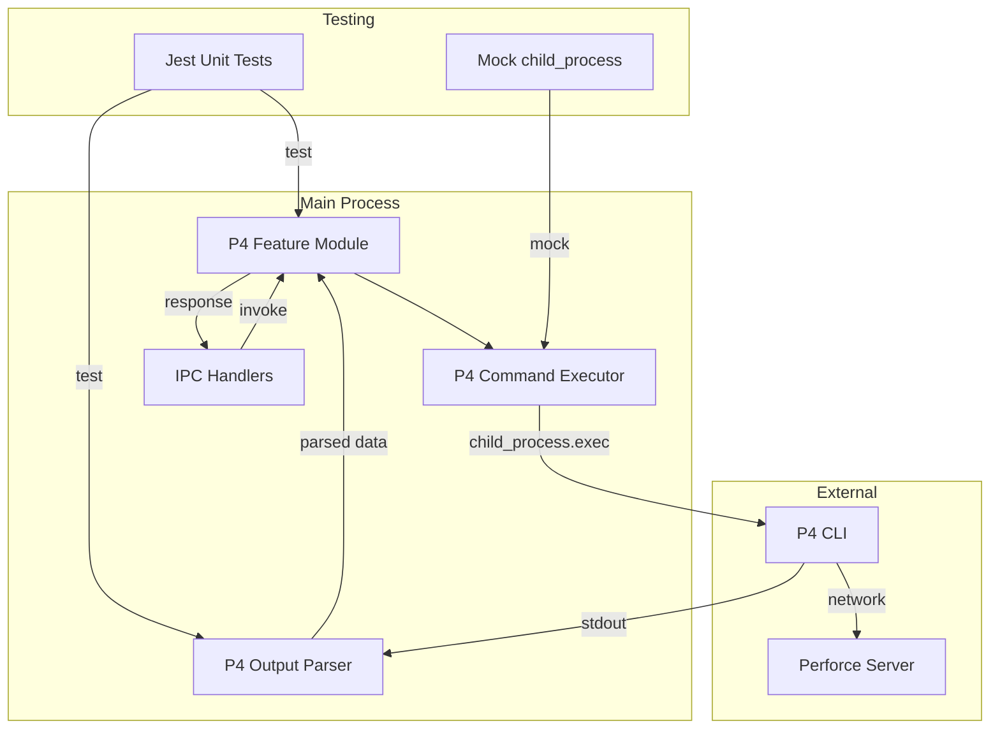
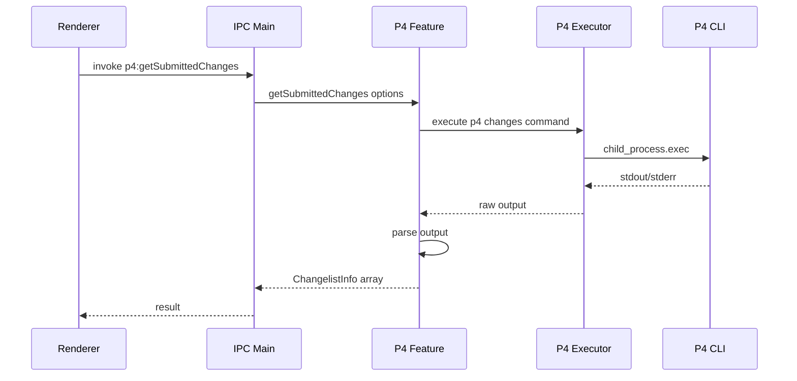

# P4 Changes API Implementation Plan

This document outlines the plan for implementing an API to execute Perforce `p4 changes` commands from the Electron main process, with support for both submitted and pending changelists.

## Overview

The P4Client application needs to interact with the Perforce version control system. This feature adds an API layer that:

1. Executes `p4 changes` commands via Node.js `child_process`
2. Provides an API for fetching submitted changes with filtering options
3. Provides a separate API for fetching local pending changes
4. Includes comprehensive unit tests using Jest

---

## Requirements Summary

| Requirement           | Description                                                                            |
| --------------------- | -------------------------------------------------------------------------------------- |
| Submitted Changes API | Fetch submitted changelists with max count and depot path filtering                    |
| Pending Changes API   | Fetch pending changelists for the current user using `p4 changes -s pending -u <user>` |
| Command Execution     | Use Node.js `child_process` to execute p4 commands                                     |
| Testing Framework     | Jest for unit testing                                                                  |
| No Frontend           | Backend API only - no UI components required                                           |

---

## Architecture Diagram



## Data Flow Diagram



---

## API Design

### Types and Interfaces

```typescript
// src/Main/Features/P4/types.ts

/**
 * Represents a single Perforce changelist
 */
export interface ChangelistInfo {
  id: number;
  user: string;
  client: string;
  date: Date;
  description: string;
  status: "submitted" | "pending";
}

/**
 * Options for fetching submitted changes
 */
export interface GetSubmittedChangesOptions {
  maxCount?: number; // -m flag: limit number of results
  depotPath?: string; // Filter by depot path, e.g. //depot/...
}

/**
 * Options for fetching pending changes
 */
export interface GetPendingChangesOptions {
  user?: string; // -u flag: filter by user, defaults to current user
}

/**
 * Result wrapper for P4 operations
 */
export interface P4Result<T> {
  success: boolean;
  data?: T;
  error?: string;
}
```

### API Methods

| Method                         | Description                        | P4 Command                              |
| ------------------------------ | ---------------------------------- | --------------------------------------- |
| `getSubmittedChanges(options)` | Fetch submitted changelists        | `p4 changes -s submitted [-m N] [path]` |
| `getPendingChanges(options)`   | Fetch pending changelists for user | `p4 changes -s pending -u <user>`       |
| `getCurrentUser()`             | Get the current P4 user            | `p4 user -o`                            |

---

## File Structure

```
src/
├── Main/
│   ├── Features/
│   │   ├── P4/
│   │   │   ├── index.ts           # Feature entry point and handlers
│   │   │   ├── types.ts           # TypeScript interfaces
│   │   │   ├── executor.ts        # P4 command execution wrapper
│   │   │   └── parser.ts          # P4 output parsing utilities
│   │   └── index.ts               # Update to include P4 state
│   ├── main.ts                    # Register IPC handlers
│   └── store.ts                   # Register P4 handlers
├── Preload/
│   └── preload.ts                 # Expose P4 API to renderer

test/
├── Main/
│   └── Features/
│       └── P4/
│           ├── executor.test.ts   # Jest test for executor
│           ├── parser.test.ts     # Jest test for parser
│           └── index.test.ts      # Jest test for feature module
```

---

## Implementation Steps

### Step 1: Set Up Jest Testing Framework

Install Jest and required dependencies:

```bash
npm install -D jest @types/jest ts-jest
```

Create Jest configuration file `jest.config.js`:

```javascript
module.exports = {
  preset: "ts-jest",
  testEnvironment: "node",
  roots: ["<rootDir>/test"],
  testMatch: ["**/*.test.ts"],
  moduleFileExtensions: ["ts", "tsx", "js", "jsx", "json"],
  moduleNameMapper: {
    "^@/(.*)$": "<rootDir>/src/$1",
  },
  collectCoverageFrom: [
    "src/Main/Features/P4/**/*.ts",
    "!src/Main/Features/P4/types.ts",
  ],
  coverageDirectory: "coverage",
  coverageReporters: ["text", "lcov", "html"],
};
```

Add test scripts to `package.json`:

```json
{
  "scripts": {
    "test": "jest",
    "test:watch": "jest --watch",
    "test:coverage": "jest --coverage"
  }
}
```

### Step 2: Create P4 Types

Create `src/Main/Features/P4/types.ts` with the interfaces defined in the API Design section above.

### Step 3: Create P4 Command Executor

Create `src/Main/Features/P4/executor.ts`:

```typescript
import { exec } from "child_process";
import { promisify } from "util";

const execAsync = promisify(exec);

export interface ExecResult {
  stdout: string;
  stderr: string;
}

/**
 * Executes a P4 command and returns the output
 * @param command - The p4 command arguments, e.g. 'changes -s submitted -m 10'
 * @returns Promise with stdout and stderr
 */
export async function executeP4Command(command: string): Promise<ExecResult> {
  const fullCommand = `p4 ${command}`;

  try {
    const { stdout, stderr } = await execAsync(fullCommand);
    return { stdout, stderr };
  } catch (error) {
    // exec throws on non-zero exit codes
    const execError = error as {
      stdout?: string;
      stderr?: string;
      message: string;
    };
    throw new Error(execError.stderr || execError.message);
  }
}
```

### Step 4: Create P4 Output Parser

Create `src/Main/Features/P4/parser.ts`:

```typescript
import type { ChangelistInfo } from "./types";

/**
 * Parses the output of 'p4 changes' command
 * Format: Change <num> on <date> by <user>@<client> *<status>* '<description>'
 * Example: Change 12345 on 2024/01/15 by jsmith@workspace *submitted* 'Fixed bug in login'
 */
export function parseChangesOutput(
  output: string,
  status: "submitted" | "pending"
): ChangelistInfo[] {
  const lines = output
    .trim()
    .split("\n")
    .filter((line) => line.trim());
  const changes: ChangelistInfo[] = [];

  const changeRegex =
    /^Change (\d+) on (\d{4}\/\d{2}\/\d{2}) by ([^@]+)@(\S+) \*(\w+)\* '(.*)'/;

  for (const line of lines) {
    const match = line.match(changeRegex);
    if (match) {
      const [, id, dateStr, user, client, , description] = match;
      changes.push({
        id: parseInt(id, 10),
        user,
        client,
        date: parseP4Date(dateStr),
        description: description.replace(/'$/, ""), // Remove trailing quote if present
        status,
      });
    }
  }

  return changes;
}

/**
 * Parses P4 date format (YYYY/MM/DD) to JavaScript Date
 */
export function parseP4Date(dateStr: string): Date {
  const [year, month, day] = dateStr.split("/").map(Number);
  return new Date(year, month - 1, day);
}

/**
 * Parses the output of 'p4 user -o' to extract the username
 */
export function parseUserOutput(output: string): string | null {
  const match = output.match(/^User:\s+(\S+)/m);
  return match ? match[1] : null;
}
```

### Step 5: Create P4 Feature Module

Create `src/Main/Features/P4/index.ts`:

```typescript
import type { StoreApi } from "zustand";
import type { AppState } from "../index";
import { executeP4Command } from "./executor";
import { parseChangesOutput, parseUserOutput } from "./parser";
import type {
  ChangelistInfo,
  GetSubmittedChangesOptions,
  GetPendingChangesOptions,
  P4Result,
} from "./types";

// Re-export types for external use
export * from "./types";

/**
 * Fetches submitted changelists from Perforce
 */
export async function getSubmittedChanges(
  options: GetSubmittedChangesOptions = {}
): Promise<P4Result<ChangelistInfo[]>> {
  try {
    let command = "changes -s submitted";

    if (options.maxCount) {
      command += ` -m ${options.maxCount}`;
    }

    if (options.depotPath) {
      command += ` ${options.depotPath}`;
    }

    const { stdout } = await executeP4Command(command);
    const changes = parseChangesOutput(stdout, "submitted");

    return { success: true, data: changes };
  } catch (error) {
    return {
      success: false,
      error: error instanceof Error ? error.message : "Unknown error",
    };
  }
}

/**
 * Fetches pending changelists for a user
 */
export async function getPendingChanges(
  options: GetPendingChangesOptions = {}
): Promise<P4Result<ChangelistInfo[]>> {
  try {
    let user = options.user;

    // If no user specified, get current user
    if (!user) {
      const currentUser = await getCurrentUser();
      if (!currentUser.success || !currentUser.data) {
        return { success: false, error: "Could not determine current user" };
      }
      user = currentUser.data;
    }

    const command = `changes -s pending -u ${user}`;
    const { stdout } = await executeP4Command(command);
    const changes = parseChangesOutput(stdout, "pending");

    return { success: true, data: changes };
  } catch (error) {
    return {
      success: false,
      error: error instanceof Error ? error.message : "Unknown error",
    };
  }
}

/**
 * Gets the current Perforce user
 */
export async function getCurrentUser(): Promise<P4Result<string>> {
  try {
    const { stdout } = await executeP4Command("user -o");
    const user = parseUserOutput(stdout);

    if (!user) {
      return { success: false, error: "Could not parse user from output" };
    }

    return { success: true, data: user };
  } catch (error) {
    return {
      success: false,
      error: error instanceof Error ? error.message : "Unknown error",
    };
  }
}

/**
 * Creates IPC handlers for P4 operations
 * These will be registered in main.ts
 */
export function createP4Handlers(store: StoreApi<AppState>) {
  return {
    "P4:GET_SUBMITTED_CHANGES": async (
      options?: GetSubmittedChangesOptions
    ) => {
      return getSubmittedChanges(options);
    },
    "P4:GET_PENDING_CHANGES": async (options?: GetPendingChangesOptions) => {
      return getPendingChanges(options);
    },
    "P4:GET_CURRENT_USER": async () => {
      return getCurrentUser();
    },
  };
}
```

### Step 6: Register IPC Handlers in Main Process

Update `src/Main/main.ts` to register P4 IPC handlers:

```typescript
// Add import at top
import {
  getSubmittedChanges,
  getPendingChanges,
  getCurrentUser,
} from "./Features/P4";

// Inside app.whenReady().then(() => { ... })
// Add after existing ipcMain.handle calls:

// P4 API handlers
ipcMain.handle("p4:getSubmittedChanges", async (event, options) => {
  return getSubmittedChanges(options);
});

ipcMain.handle("p4:getPendingChanges", async (event, options) => {
  return getPendingChanges(options);
});

ipcMain.handle("p4:getCurrentUser", async () => {
  return getCurrentUser();
});
```

### Step 7: Expose P4 API in Preload Script

Update `src/Preload/preload.ts` to expose P4 API:

```typescript
// Add to existing electronAPI or create new p4API
contextBridge.exposeInMainWorld("p4API", {
  getSubmittedChanges: (options?: {
    maxCount?: number;
    depotPath?: string;
  }) => {
    return ipcRenderer.invoke("p4:getSubmittedChanges", options);
  },
  getPendingChanges: (options?: { user?: string }) => {
    return ipcRenderer.invoke("p4:getPendingChanges", options);
  },
  getCurrentUser: () => {
    return ipcRenderer.invoke("p4:getCurrentUser");
  },
});
```

### Step 8: Write Unit Tests

Create `test/Main/Features/P4/parser.test.ts`:

```typescript
import {
  parseChangesOutput,
  parseP4Date,
  parseUserOutput,
} from "../../../../src/Main/Features/P4/parser";

describe("P4 Parser", () => {
  describe("parseChangesOutput", () => {
    it("should parse submitted changes correctly", () => {
      const output = `Change 12345 on 2024/01/15 by jsmith@workspace *submitted* 'Fixed login bug'
Change 12344 on 2024/01/14 by jdoe@workspace *submitted* 'Added new feature'`;

      const result = parseChangesOutput(output, "submitted");

      expect(result).toHaveLength(2);
      expect(result[0]).toEqual({
        id: 12345,
        user: "jsmith",
        client: "workspace",
        date: new Date(2024, 0, 15),
        description: "Fixed login bug",
        status: "submitted",
      });
    });

    it("should handle empty output", () => {
      const result = parseChangesOutput("", "submitted");
      expect(result).toHaveLength(0);
    });

    it("should parse pending changes correctly", () => {
      const output = `Change 12346 on 2024/01/16 by jsmith@workspace *pending* 'Work in progress'`;

      const result = parseChangesOutput(output, "pending");

      expect(result).toHaveLength(1);
      expect(result[0].status).toBe("pending");
    });
  });

  describe("parseP4Date", () => {
    it("should parse P4 date format correctly", () => {
      const result = parseP4Date("2024/01/15");
      expect(result.getFullYear()).toBe(2024);
      expect(result.getMonth()).toBe(0); // January is 0
      expect(result.getDate()).toBe(15);
    });
  });

  describe("parseUserOutput", () => {
    it("should extract username from p4 user -o output", () => {
      const output = `User:   jsmith

Email:  jsmith@example.com

FullName:       John Smith`;

      const result = parseUserOutput(output);
      expect(result).toBe("jsmith");
    });

    it("should return null for invalid output", () => {
      const result = parseUserOutput("invalid output");
      expect(result).toBeNull();
    });
  });
});
```

Create `test/Main/Features/P4/executor.test.ts`:

```typescript
import { executeP4Command } from "../../../../src/Main/Features/P4/executor";
import { exec } from "child_process";

// Mock child_process
jest.mock("child_process", () => ({
  exec: jest.fn(),
}));

const mockExec = exec as jest.MockedFunction<typeof exec>;

describe("P4 Executor", () => {
  beforeEach(() => {
    jest.clearAllMocks();
  });

  it("should execute p4 command and return output", async () => {
    const mockOutput =
      "Change 12345 on 2024/01/15 by jsmith@ws *submitted* 'Test'";

    mockExec.mockImplementation((cmd, callback: any) => {
      callback(null, { stdout: mockOutput, stderr: "" });
      return {} as any;
    });

    const result = await executeP4Command("changes -s submitted -m 1");

    expect(mockExec).toHaveBeenCalledWith(
      "p4 changes -s submitted -m 1",
      expect.any(Function)
    );
    expect(result.stdout).toBe(mockOutput);
  });

  it("should throw error on command failure", async () => {
    mockExec.mockImplementation((cmd, callback: any) => {
      callback(new Error("Command failed"), { stdout: "", stderr: "P4 error" });
      return {} as any;
    });

    await expect(executeP4Command("invalid")).rejects.toThrow();
  });
});
```

Create `test/Main/Features/P4/index.test.ts`:

```typescript
import {
  getSubmittedChanges,
  getPendingChanges,
  getCurrentUser,
} from "../../../../src/Main/Features/P4/index";
import * as executor from "../../../../src/Main/Features/P4/executor";

// Mock the executor module
jest.mock("../../../../src/Main/Features/P4/executor");

const mockExecuteP4Command = executor.executeP4Command as jest.MockedFunction<
  typeof executor.executeP4Command
>;

describe("P4 Feature", () => {
  beforeEach(() => {
    jest.clearAllMocks();
  });

  describe("getSubmittedChanges", () => {
    it("should fetch submitted changes with default options", async () => {
      mockExecuteP4Command.mockResolvedValue({
        stdout: `Change 12345 on 2024/01/15 by jsmith@ws *submitted* 'Test change'`,
        stderr: "",
      });

      const result = await getSubmittedChanges();

      expect(result.success).toBe(true);
      expect(result.data).toHaveLength(1);
      expect(mockExecuteP4Command).toHaveBeenCalledWith("changes -s submitted");
    });

    it("should apply maxCount option", async () => {
      mockExecuteP4Command.mockResolvedValue({ stdout: "", stderr: "" });

      await getSubmittedChanges({ maxCount: 10 });

      expect(mockExecuteP4Command).toHaveBeenCalledWith(
        "changes -s submitted -m 10"
      );
    });

    it("should apply depotPath option", async () => {
      mockExecuteP4Command.mockResolvedValue({ stdout: "", stderr: "" });

      await getSubmittedChanges({ depotPath: "//depot/main/..." });

      expect(mockExecuteP4Command).toHaveBeenCalledWith(
        "changes -s submitted //depot/main/..."
      );
    });

    it("should handle errors gracefully", async () => {
      mockExecuteP4Command.mockRejectedValue(new Error("P4 not found"));

      const result = await getSubmittedChanges();

      expect(result.success).toBe(false);
      expect(result.error).toBe("P4 not found");
    });
  });

  describe("getPendingChanges", () => {
    it("should fetch pending changes for specified user", async () => {
      mockExecuteP4Command.mockResolvedValue({
        stdout: `Change 12346 on 2024/01/16 by jsmith@ws *pending* 'WIP'`,
        stderr: "",
      });

      const result = await getPendingChanges({ user: "jsmith" });

      expect(result.success).toBe(true);
      expect(mockExecuteP4Command).toHaveBeenCalledWith(
        "changes -s pending -u jsmith"
      );
    });

    it("should get current user if not specified", async () => {
      // First call for user -o, second for changes
      mockExecuteP4Command
        .mockResolvedValueOnce({ stdout: "User:   jsmith\n", stderr: "" })
        .mockResolvedValueOnce({ stdout: "", stderr: "" });

      await getPendingChanges();

      expect(mockExecuteP4Command).toHaveBeenCalledWith("user -o");
      expect(mockExecuteP4Command).toHaveBeenCalledWith(
        "changes -s pending -u jsmith"
      );
    });
  });

  describe("getCurrentUser", () => {
    it("should return current user", async () => {
      mockExecuteP4Command.mockResolvedValue({
        stdout: "User:   jsmith\nEmail:  jsmith@example.com",
        stderr: "",
      });

      const result = await getCurrentUser();

      expect(result.success).toBe(true);
      expect(result.data).toBe("jsmith");
    });
  });
});
```

### Step 9: Update AppState Types (Optional)

If you want to track P4 state in the store, update `src/Main/Features/index.ts`:

```typescript
// Add to AppState interface
export interface AppState {
  // ... existing state

  // P4 feature state (optional - for caching results)
  p4LastSubmittedChanges?: ChangelistInfo[];
  p4LastPendingChanges?: ChangelistInfo[];
  p4CurrentUser?: string;
}
```

---

## Testing Strategy

### Unit Tests

| Test File          | Coverage                                    |
| ------------------ | ------------------------------------------- |
| `parser.test.ts`   | P4 output parsing logic                     |
| `executor.test.ts` | Command execution with mocked child_process |
| `index.test.ts`    | Feature functions with mocked executor      |

### Test Commands

```bash
# Run all tests
npm test

# Run tests in watch mode during development
npm run test:watch

# Generate coverage report
npm run test:coverage
```

### Mocking Strategy

- **child_process.exec**: Mocked to avoid actual P4 command execution
- **executor module**: Mocked in feature tests to isolate parsing logic
- **Test data**: Use realistic P4 output samples for parser tests

---

## Error Handling

| Error Scenario     | Handling                                     |
| ------------------ | -------------------------------------------- |
| P4 not installed   | Return error result with descriptive message |
| P4 not logged in   | Return error from P4 stderr                  |
| Network timeout    | Return error from exec timeout               |
| Invalid depot path | Return P4 error message                      |
| No pending changes | Return empty array, success: true            |

---

## Future Enhancements

1. **Caching**: Cache P4 results in the store to reduce command executions
2. **Streaming**: Use spawn instead of exec for large result sets
3. **Additional Commands**: Add support for `p4 describe`, `p4 opened`, `p4 sync`
4. **Connection Status**: Add API to check P4 connection status
5. **Configuration**: Support custom P4 port, user, client settings

---

## Summary

This implementation plan provides a complete solution for adding P4 changes API to the P4Client application:

1. **Clean Architecture**: Separates concerns into executor, parser, and feature modules
2. **Type Safety**: Full TypeScript interfaces for all data structures
3. **Testability**: Comprehensive Jest tests with proper mocking
4. **Error Handling**: Graceful error handling with descriptive messages
5. **Extensibility**: Easy to add more P4 commands following the same pattern

Follow the implementation steps in order, ensuring tests pass at each stage before proceeding to the next step.
