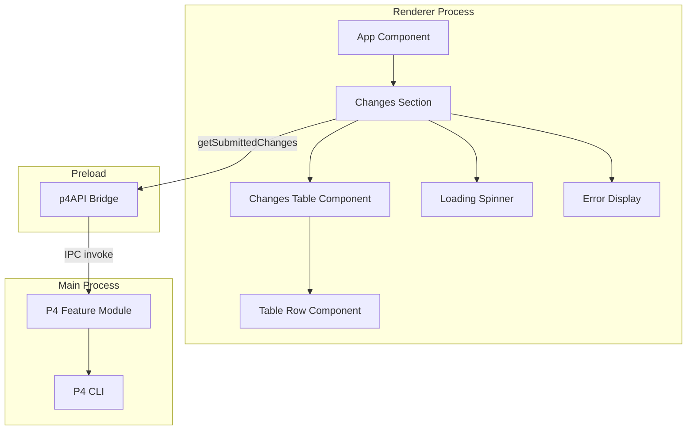
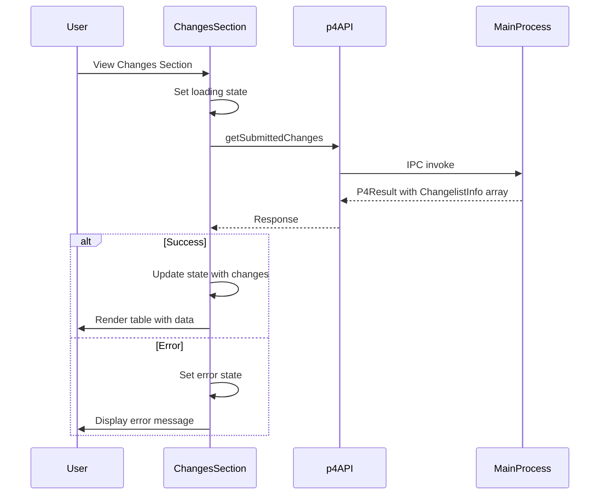
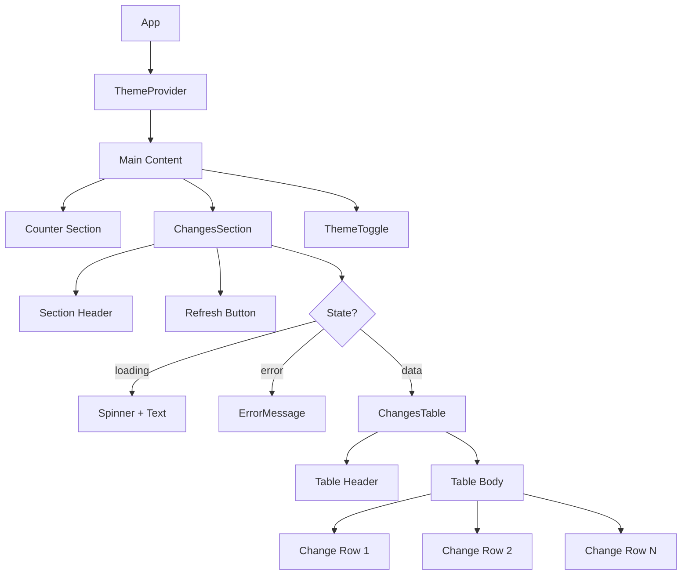

# P4 Changes Frontend Implementation Plan

This document outlines the plan for implementing a frontend UI to display historical Perforce changes using the P4 changes API implemented previously.

## Overview

The P4Client application has a backend API for fetching Perforce changelists. This feature adds a frontend UI section that:

1. Displays historical submitted changes in a table format
2. Shows CL number, description, and date for each change
3. Provides filtering and pagination controls
4. Follows existing UI patterns and theming

---

## Requirements Summary

| Requirement        | Description                                                      |
| ------------------ | ---------------------------------------------------------------- |
| Changes Table      | Display changelists in a sortable, styled table                  |
| CL Number Column   | Show the changelist ID with visual emphasis                      |
| Description Column | Display the changelist description with truncation for long text |
| Date Column        | Show the date of the change in a user-friendly format            |
| Loading State      | Show loading indicator while fetching data                       |
| Error Handling     | Display error messages when API calls fail                       |
| Refresh Action     | Allow users to manually refresh the changes list                 |
| Theme Support      | Support both light and dark themes                               |

---

## Architecture Diagram



## Data Flow Diagram



---

## UI Design

### Layout Structure

The Changes section will be added as a new section in the main App component, below the existing counter section:

```
┌─────────────────────────────────────────────────────────────┐
│                     P4 Client                               │
├─────────────────────────────────────────────────────────────┤
│  ┌─────────────────────────────────────────────────────┐   │
│  │              Counter Section                         │   │
│  │                  Counter: 0                          │   │
│  │              [ - ]    [ + ]                          │   │
│  └─────────────────────────────────────────────────────┘   │
│                                                             │
│  ┌─────────────────────────────────────────────────────┐   │
│  │              Historical Changes                      │   │
│  │  ┌─────────────────────────────────────────────┐    │   │
│  │  │ CL #    │ Description          │ Date       │    │   │
│  │  ├─────────┼──────────────────────┼────────────┤    │   │
│  │  │ 12345   │ Fixed login bug      │ 2024-01-15 │    │   │
│  │  │ 12344   │ Added new feature    │ 2024-01-14 │    │   │
│  │  │ 12343   │ Updated docs         │ 2024-01-13 │    │   │
│  │  └─────────┴──────────────────────┴────────────┘    │   │
│  │                                                      │   │
│  │              [ Refresh Changes ]                     │   │
│  └─────────────────────────────────────────────────────┘   │
│                                                             │
│  ┌─────────────────────────────────────────────────────┐   │
│  │              Theme Toggle                            │   │
│  └─────────────────────────────────────────────────────┘   │
└─────────────────────────────────────────────────────────────┘
```

### Table Design

| Column      | Width    | Alignment | Notes                                 |
| ----------- | -------- | --------- | ------------------------------------- |
| CL #        | 100px    | Right     | Monospace font, clickable for details |
| Description | Flexible | Left      | Truncate with ellipsis if too long    |
| Date        | 120px    | Center    | Format: YYYY-MM-DD or relative time   |

### States

1. **Loading State**: Show a spinner with "Loading changes..." text
2. **Empty State**: Show "No changes found" message
3. **Error State**: Show error message with retry button
4. **Data State**: Show the table with changelist data

---

## File Structure

```
src/
├── Render/
│   ├── Components/
│   │   ├── P4/
│   │   │   ├── ChangesSection.tsx    # Main section container
│   │   │   ├── ChangesTable.tsx      # Table component
│   │   │   └── ChangeRow.tsx         # Individual row component
│   │   └── common/
│   │       ├── Table.tsx             # Reusable table component
│   │       ├── Spinner.tsx           # Loading spinner
│   │       └── ErrorMessage.tsx      # Error display component
│   ├── Hooks/
│   │   └── useP4Changes.ts           # Custom hook for P4 API calls
│   └── types/
│       └── p4.ts                     # Frontend P4 type definitions
```

---

## Implementation Steps

### Step 1: Create TypeScript Types for Frontend

Create `src/Render/types/p4.ts`:

```typescript
// Mirror the backend types for frontend use
export interface ChangelistInfo {
  id: number;
  user: string;
  client: string;
  date: string; // Serialized as ISO string over IPC
  description: string;
  status: "submitted" | "pending";
}

export interface P4Result<T> {
  success: boolean;
  data?: T;
  error?: string;
}

// Extend Window interface for p4API
declare global {
  interface Window {
    p4API: {
      getSubmittedChanges: (options?: {
        maxCount?: number;
        depotPath?: string;
      }) => Promise<P4Result<ChangelistInfo[]>>;
      getPendingChanges: (options?: {
        user?: string;
      }) => Promise<P4Result<ChangelistInfo[]>>;
      getCurrentUser: () => Promise<P4Result<string>>;
    };
  }
}
```

### Step 2: Create Custom Hook for P4 Changes

Create `src/Render/Hooks/useP4Changes.ts`:

```typescript
import { useState, useEffect, useCallback } from "react";
import type { ChangelistInfo, P4Result } from "../types/p4";

interface UseP4ChangesOptions {
  maxCount?: number;
  depotPath?: string;
  autoFetch?: boolean;
}

interface UseP4ChangesReturn {
  changes: ChangelistInfo[];
  loading: boolean;
  error: string | null;
  refresh: () => Promise<void>;
}

export function useP4Changes(
  options: UseP4ChangesOptions = {}
): UseP4ChangesReturn {
  const { maxCount = 50, depotPath, autoFetch = true } = options;

  const [changes, setChanges] = useState<ChangelistInfo[]>([]);
  const [loading, setLoading] = useState(false);
  const [error, setError] = useState<string | null>(null);

  const fetchChanges = useCallback(async () => {
    setLoading(true);
    setError(null);

    try {
      const result = await window.p4API.getSubmittedChanges({
        maxCount,
        depotPath,
      });

      if (result.success && result.data) {
        setChanges(result.data);
      } else {
        setError(result.error || "Failed to fetch changes");
      }
    } catch (err) {
      setError(err instanceof Error ? err.message : "Unknown error");
    } finally {
      setLoading(false);
    }
  }, [maxCount, depotPath]);

  useEffect(() => {
    if (autoFetch) {
      fetchChanges();
    }
  }, [autoFetch, fetchChanges]);

  return {
    changes,
    loading,
    error,
    refresh: fetchChanges,
  };
}
```

### Step 3: Create Reusable UI Components

#### Spinner Component

Create `src/Render/Components/common/Spinner.tsx`:

```typescript
import clsx from 'clsx';
import type React from 'react';

interface SpinnerProps {
  size?: 'sm' | 'md' | 'lg';
  className?: string;
}

export const Spinner: React.FC<SpinnerProps> = ({
  size = 'md',
  className = ''
}) => {
  const sizeClasses = {
    sm: 'h-4 w-4',
    md: 'h-6 w-6',
    lg: 'h-8 w-8',
  };

  return (
    <svg
      className={clsx('animate-spin', sizeClasses[size], className)}
      fill="none"
      viewBox="0 0 24 24"
    >
      <circle
        className="opacity-25"
        cx="12"
        cy="12"
        r="10"
        stroke="currentColor"
        strokeWidth="4"
      />
      <path
        className="opacity-75"
        fill="currentColor"
        d="M4 12a8 8 0 018-8V0C5.373 0 0 5.373 0 12h4z"
      />
    </svg>
  );
};
```

#### Error Message Component

Create `src/Render/Components/common/ErrorMessage.tsx`:

```typescript
import type React from 'react';
import { Button } from '../button';

interface ErrorMessageProps {
  message: string;
  onRetry?: () => void;
}

export const ErrorMessage: React.FC<ErrorMessageProps> = ({
  message,
  onRetry
}) => {
  return (
    <div className="flex flex-col items-center gap-4 py-8">
      <div className="text-[var(--color-error)] text-center">
        <span className="text-2xl mb-2 block">⚠️</span>
        <p>{message}</p>
      </div>
      {onRetry && (
        <Button variant="secondary" size="sm" onClick={onRetry}>
          Try Again
        </Button>
      )}
    </div>
  );
};
```

### Step 4: Create Changes Table Component

Create `src/Render/Components/P4/ChangesTable.tsx`:

```typescript
import clsx from 'clsx';
import type React from 'react';
import type { ChangelistInfo } from '../../types/p4';

interface ChangesTableProps {
  changes: ChangelistInfo[];
  className?: string;
}

export const ChangesTable: React.FC<ChangesTableProps> = ({
  changes,
  className = ''
}) => {
  const formatDate = (dateStr: string): string => {
    const date = new Date(dateStr);
    return date.toLocaleDateString('en-US', {
      year: 'numeric',
      month: 'short',
      day: 'numeric',
    });
  };

  if (changes.length === 0) {
    return (
      <div className="text-center py-8 text-[var(--color-text-muted)]">
        No changes found
      </div>
    );
  }

  return (
    <div className={clsx('overflow-x-auto', className)}>
      <table className="w-full border-collapse">
        <thead>
          <tr className="border-b border-[var(--color-border)]">
            <th className="px-4 py-3 text-right text-sm font-semibold text-[var(--color-text-secondary)] w-24">
              CL #
            </th>
            <th className="px-4 py-3 text-left text-sm font-semibold text-[var(--color-text-secondary)]">
              Description
            </th>
            <th className="px-4 py-3 text-center text-sm font-semibold text-[var(--color-text-secondary)] w-32">
              Date
            </th>
          </tr>
        </thead>
        <tbody>
          {changes.map((change) => (
            <tr
              key={change.id}
              className="border-b border-[var(--color-border)] hover:bg-[var(--color-bg-tertiary)] transition-colors"
            >
              <td className="px-4 py-3 text-right font-mono text-[var(--color-accent)]">
                {change.id}
              </td>
              <td className="px-4 py-3 text-[var(--color-text-primary)] truncate max-w-xs">
                {change.description}
              </td>
              <td className="px-4 py-3 text-center text-[var(--color-text-secondary)] text-sm">
                {formatDate(change.date)}
              </td>
            </tr>
          ))}
        </tbody>
      </table>
    </div>
  );
};
```

### Step 5: Create Changes Section Component

Create `src/Render/Components/P4/ChangesSection.tsx`:

```typescript
import type React from 'react';
import { useP4Changes } from '../../Hooks/useP4Changes';
import { Button } from '../button';
import { Spinner } from '../common/Spinner';
import { ErrorMessage } from '../common/ErrorMessage';
import { ChangesTable } from './ChangesTable';

interface ChangesSectionProps {
  maxCount?: number;
  depotPath?: string;
}

export const ChangesSection: React.FC<ChangesSectionProps> = ({
  maxCount = 25,
  depotPath,
}) => {
  const { changes, loading, error, refresh } = useP4Changes({
    maxCount,
    depotPath,
  });

  return (
    <div className="card">
      <div className="flex items-center justify-between mb-4">
        <h2 className="text-xl font-bold text-[var(--color-text-primary)]">
          Historical Changes
        </h2>
        <Button
          variant="secondary"
          size="sm"
          onClick={refresh}
          disabled={loading}
          loading={loading}
        >
          Refresh
        </Button>
      </div>

      {loading && !changes.length ? (
        <div className="flex flex-col items-center gap-2 py-8">
          <Spinner size="lg" className="text-[var(--color-accent)]" />
          <p className="text-[var(--color-text-muted)]">Loading changes...</p>
        </div>
      ) : error ? (
        <ErrorMessage message={error} onRetry={refresh} />
      ) : (
        <ChangesTable changes={changes} />
      )}
    </div>
  );
};
```

### Step 6: Update Main App Component

Update `src/Render/app.tsx` to include the Changes section:

```typescript
import { createUseStore, useDispatch } from '@zubridge/electron';
import React from 'react';
import { createRoot } from 'react-dom/client';
import './index.css';

// UI components
import { Button } from './Components/button';
import { ThemeToggle } from './Components/themeToggle';
import { ThemeProvider } from './Components/ThemeProvider';
import { ChangesSection } from './Components/P4/ChangesSection';

// Create the store hook
const useStore = createUseStore();

function App() {
  const store = useStore();
  const dispatch = useDispatch();

  // Get state values
  const counter = (store?.counter || 0) as number;
  const theme = (store?.theme || 'dark') as 'dark' | 'light';

  // Action handlers
  const handleIncrement = async () => {
    await dispatch('COUNTER:INCREMENT');
  };

  const handleDecrement = async () => {
    await dispatch('COUNTER:DECREMENT');
  };

  const handleThemeToggle = async () => {
    await dispatch('THEME:TOGGLE');
  };

  return (
    <ThemeProvider theme={theme}>
      <div className="min-h-screen bg-[var(--color-bg-primary)] transition-colors duration-200">
        <div className="max-w-[var(--container-width)] mx-auto py-16 px-4">
          {/* Counter Display */}
          <div className="card mb-8">
            <h2 className="text-2xl font-bold text-center text-[var(--color-text-primary)]">
              Counter: {counter}
            </h2>
          </div>

          {/* Counter Actions */}
          <div className="flex gap-4 mb-8">
            <Button onClick={handleDecrement} className="flex-1">
              -
            </Button>
            <Button onClick={handleIncrement} className="flex-1">
              +
            </Button>
          </div>

          {/* P4 Changes Section */}
          <div className="mb-8">
            <ChangesSection maxCount={25} />
          </div>

          <ThemeToggle theme={theme} onToggle={handleThemeToggle} />
        </div>
      </div>
    </ThemeProvider>
  );
}

// Get the DOM container element
const container = document.getElementById('root');
if (!container) throw new Error('Root container not found');
const root = createRoot(container);

root.render(
  <React.StrictMode>
    <App />
  </React.StrictMode>
);
```

### Step 7: Add Table Styles to CSS

Update `src/Render/index.css` to add table-specific styles:

```css
/* Add to existing CSS */

/* Table styles */
.table-container {
  overflow-x: auto;
  border-radius: 0.5rem;
  border: 1px solid var(--color-border);
}

table {
  width: 100%;
  border-collapse: collapse;
}

th {
  background-color: var(--color-bg-tertiary);
  font-weight: 600;
}

td,
th {
  padding: 0.75rem 1rem;
  text-align: left;
}

tbody tr {
  border-top: 1px solid var(--color-border);
}

tbody tr:hover {
  background-color: var(--color-bg-tertiary);
}

/* Monospace for CL numbers */
.font-mono {
  font-family: ui-monospace, SFMono-Regular, Menlo, Monaco, Consolas, monospace;
}

/* Truncate long text */
.truncate {
  overflow: hidden;
  text-overflow: ellipsis;
  white-space: nowrap;
}
```

---

## Component Hierarchy



---

## Testing Strategy

### Unit Tests

| Test File                 | Coverage                                    |
| ------------------------- | ------------------------------------------- |
| `useP4Changes.test.ts`    | Custom hook logic and state management      |
| `ChangesTable.test.tsx`   | Table rendering and formatting              |
| `ChangesSection.test.tsx` | Section component with loading/error states |
| `Spinner.test.tsx`        | Spinner component rendering                 |
| `ErrorMessage.test.tsx`   | Error display and retry functionality       |

### Test Scenarios

1. **Loading State**: Verify spinner displays while fetching
2. **Success State**: Verify table renders with correct data
3. **Empty State**: Verify empty message when no changes
4. **Error State**: Verify error message and retry button
5. **Refresh Action**: Verify refresh button triggers new fetch
6. **Date Formatting**: Verify dates display correctly
7. **Theme Support**: Verify components work in both themes

---

## Accessibility Considerations

| Feature               | Implementation                                 |
| --------------------- | ---------------------------------------------- |
| Keyboard Navigation   | Table rows focusable, buttons accessible       |
| Screen Readers        | Proper table semantics, aria-labels on buttons |
| Color Contrast        | Use theme variables that meet WCAG guidelines  |
| Loading Announcements | aria-live region for loading state changes     |
| Error Announcements   | aria-live region for error messages            |

---

## Future Enhancements

1. **Sorting**: Add column sorting by CL number or date
2. **Filtering**: Add search/filter by description or user
3. **Pagination**: Add pagination for large result sets
4. **Details View**: Click on a row to see full changelist details
5. **Pending Changes Tab**: Add tab to switch between submitted and pending
6. **User Filter**: Filter changes by specific user
7. **Depot Path Filter**: Add input to filter by depot path
8. **Export**: Export changes list to CSV or clipboard

---

## Summary

This implementation plan provides a complete solution for adding a P4 changes frontend to the P4Client application:

1. **Consistent UI**: Follows existing component patterns and theming
2. **Type Safety**: Full TypeScript types for all components
3. **Reusable Components**: Creates reusable table, spinner, and error components
4. **Custom Hook**: Encapsulates API logic in a reusable hook
5. **Error Handling**: Graceful error handling with retry capability
6. **Accessibility**: Considers keyboard navigation and screen readers
7. **Extensibility**: Easy to add sorting, filtering, and pagination

Follow the implementation steps in order, ensuring each component works correctly before proceeding to the next step.
