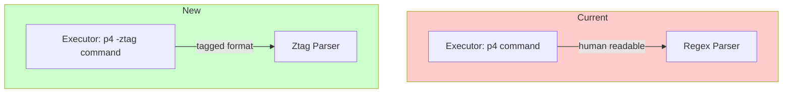

# P4 -ztag Option Implementation Plan

This document outlines the plan for adding the `-ztag` option to P4 command execution, replacing the current regex-based parser with a more reliable tagged output parser.

## Overview

The Perforce `-ztag` global option outputs data in a tagged format (key: value pairs) instead of the default human-readable format. This format is:

- **More reliable**: No need for complex regex patterns that can break with edge cases
- **Easier to parse**: Simple key-value pairs, one per line
- **More complete**: Often includes additional fields not shown in default output
- **Consistent**: Same format across different P4 commands

---

## Current Implementation Analysis

### Current Parser ([`parser.ts`](src/Main/Features/P4/parser.ts:1))

The current implementation uses regex to parse the standard P4 output:

```typescript
// Current regex pattern for p4 changes output
const changeRegex =
  /^Change (\d+) on (\d{4}\/\d{2}\/\d{2}) by ([^@]+)@(\S+) \*(\w+)\* '(.*)'/;
```

**Limitations:**

- Descriptions with special characters can break parsing
- Truncated descriptions in default output
- Different commands have different output formats requiring separate regex patterns
- Edge cases with usernames or client names containing special characters

### Current Executor ([`executor.ts`](src/Main/Features/P4/executor.ts:1))

The executor builds commands without the `-ztag` flag:

```typescript
const fullCommand = `p4 ${command}`;
```

---

## -ztag Output Format

### Example: p4 -ztag changes -s submitted -m 2

```
... change 12345
... time 1705334400
... user jsmith
... client workspace
... status submitted
... changeType public
... desc Fixed login bug with special characters: quotes and apostrophes

... change 12344
... time 1705248000
... user jdoe
... client workspace
... status submitted
... changeType public
... desc Added new feature
```

### Key Characteristics

- Each field starts with `... ` prefix
- Field name followed by space and value
- Records are separated by blank lines or new `... change` entries
- Multi-line descriptions are on a single line
- Time is Unix timestamp instead of formatted date

---

## Architecture Changes



---

## Implementation Steps

### Step 1: Update Executor to Add -ztag Flag

Modify [`executor.ts`](src/Main/Features/P4/executor.ts:16) to include the `-ztag` global option:

**File:** `src/Main/Features/P4/executor.ts`

```typescript
export async function executeP4Command(command: string): Promise<ExecResult> {
  // Add -ztag as a global option before the command
  const fullCommand = `p4 -ztag ${command}`;
  // ... rest of implementation
}
```

### Step 2: Create Ztag Parser Module

Create a new parser that handles the tagged output format.

**File:** `src/Main/Features/P4/parser.ts` (replace existing functions)

```typescript
/**
 * Represents a parsed ztag record as key-value pairs
 */
export interface ZtagRecord {
  [key: string]: string;
}

/**
 * Parses P4 -ztag output into an array of records
 * Each record is a dictionary of field names to values
 */
export function parseZtagOutput(output: string): ZtagRecord[] {
  const records: ZtagRecord[] = [];
  let currentRecord: ZtagRecord | null = null;

  const lines = output.split("\n");

  for (const line of lines) {
    // Ztag lines start with "... "
    if (line.startsWith("... ")) {
      const content = line.substring(4); // Remove "... " prefix
      const spaceIndex = content.indexOf(" ");

      if (spaceIndex === -1) {
        // Field with no value
        continue;
      }

      const fieldName = content.substring(0, spaceIndex);
      const fieldValue = content.substring(spaceIndex + 1);

      // "change" field indicates start of new record
      if (fieldName === "change") {
        if (currentRecord) {
          records.push(currentRecord);
        }
        currentRecord = {};
      }

      if (currentRecord) {
        currentRecord[fieldName] = fieldValue;
      }
    }
  }

  // Push the last record
  if (currentRecord && Object.keys(currentRecord).length > 0) {
    records.push(currentRecord);
  }

  return records;
}

/**
 * Converts ztag records to ChangelistInfo objects
 */
export function ztagToChangelistInfo(
  records: ZtagRecord[],
  status: "submitted" | "pending"
): ChangelistInfo[] {
  return records.map((record) => ({
    id: parseInt(record.change, 10),
    user: record.user,
    client: record.client,
    date: new Date(parseInt(record.time, 10) * 1000), // Unix timestamp to Date
    description: record.desc || "",
    status,
  }));
}

/**
 * Parses p4 -ztag changes output directly to ChangelistInfo
 */
export function parseChangesOutput(
  output: string,
  status: "submitted" | "pending"
): ChangelistInfo[] {
  const records = parseZtagOutput(output);
  return ztagToChangelistInfo(records, status);
}

/**
 * Parses p4 -ztag user -o output to extract username
 */
export function parseUserOutput(output: string): string | null {
  const records = parseZtagOutput(output);
  if (records.length > 0 && records[0].User) {
    return records[0].User;
  }
  return null;
}

/**
 * Parses Unix timestamp to Date
 * Kept for backward compatibility if needed
 */
export function parseP4Date(dateStr: string): Date {
  // If it's a Unix timestamp
  if (/^\d+$/.test(dateStr)) {
    return new Date(parseInt(dateStr, 10) * 1000);
  }
  // Fallback for YYYY/MM/DD format
  const [year, month, day] = dateStr.split("/").map(Number);
  return new Date(year, month - 1, day);
}
```

### Step 3: Update Feature Module

The feature module ([`index.ts`](src/Main/Features/P4/index.ts:1)) should work without changes since it calls the parser functions which maintain the same interface.

### Step 4: Update Tests

#### Update Parser Tests

**File:** `test/Main/Features/P4/parser.test.ts`

```typescript
import {
  parseZtagOutput,
  ztagToChangelistInfo,
  parseChangesOutput,
  parseP4Date,
  parseUserOutput,
} from "../../../../src/Main/Features/P4/parser";

describe("P4 Ztag Parser", () => {
  describe("parseZtagOutput", () => {
    it("should parse single ztag record", () => {
      const output = `... change 12345
... time 1705334400
... user jsmith
... client workspace
... status submitted
... desc Fixed login bug`;

      const result = parseZtagOutput(output);

      expect(result).toHaveLength(1);
      expect(result[0]).toEqual({
        change: "12345",
        time: "1705334400",
        user: "jsmith",
        client: "workspace",
        status: "submitted",
        desc: "Fixed login bug",
      });
    });

    it("should parse multiple ztag records", () => {
      const output = `... change 12345
... time 1705334400
... user jsmith
... client workspace
... status submitted
... desc First change

... change 12344
... time 1705248000
... user jdoe
... client workspace
... status submitted
... desc Second change`;

      const result = parseZtagOutput(output);

      expect(result).toHaveLength(2);
      expect(result[0].change).toBe("12345");
      expect(result[1].change).toBe("12344");
    });

    it("should handle empty output", () => {
      const result = parseZtagOutput("");
      expect(result).toHaveLength(0);
    });

    it("should handle descriptions with special characters", () => {
      const output = `... change 12345
... time 1705334400
... user jsmith
... client workspace
... status submitted
... desc Fixed bug #123 - user's data with "quotes"`;

      const result = parseZtagOutput(output);

      expect(result[0].desc).toBe(
        'Fixed bug #123 - user\'s data with "quotes"'
      );
    });
  });

  describe("ztagToChangelistInfo", () => {
    it("should convert ztag records to ChangelistInfo", () => {
      const records = [
        {
          change: "12345",
          time: "1705334400",
          user: "jsmith",
          client: "workspace",
          desc: "Test change",
        },
      ];

      const result = ztagToChangelistInfo(records, "submitted");

      expect(result).toHaveLength(1);
      expect(result[0]).toEqual({
        id: 12345,
        user: "jsmith",
        client: "workspace",
        date: new Date(1705334400 * 1000),
        description: "Test change",
        status: "submitted",
      });
    });
  });

  describe("parseChangesOutput", () => {
    it("should parse ztag changes output correctly", () => {
      const output = `... change 12345
... time 1705334400
... user jsmith
... client workspace
... status submitted
... desc Fixed login bug`;

      const result = parseChangesOutput(output, "submitted");

      expect(result).toHaveLength(1);
      expect(result[0].id).toBe(12345);
      expect(result[0].user).toBe("jsmith");
      expect(result[0].status).toBe("submitted");
    });

    it("should handle pending changes", () => {
      const output = `... change 12346
... time 1705420800
... user jsmith
... client workspace
... status pending
... desc Work in progress`;

      const result = parseChangesOutput(output, "pending");

      expect(result).toHaveLength(1);
      expect(result[0].status).toBe("pending");
    });
  });

  describe("parseUserOutput", () => {
    it("should extract username from ztag user output", () => {
      const output = `... User jsmith
... Email jsmith@example.com
... FullName John Smith`;

      const result = parseUserOutput(output);
      expect(result).toBe("jsmith");
    });

    it("should return null for invalid output", () => {
      const result = parseUserOutput("invalid output");
      expect(result).toBeNull();
    });
  });

  describe("parseP4Date", () => {
    it("should parse Unix timestamp", () => {
      const result = parseP4Date("1705334400");
      expect(result.getTime()).toBe(1705334400 * 1000);
    });

    it("should parse YYYY/MM/DD format for backward compatibility", () => {
      const result = parseP4Date("2024/01/15");
      expect(result.getFullYear()).toBe(2024);
      expect(result.getMonth()).toBe(0);
      expect(result.getDate()).toBe(15);
    });
  });
});
```

#### Update Executor Tests

**File:** `test/Main/Features/P4/executor.test.ts`

Update the test to verify `-ztag` is included:

```typescript
it("should execute p4 command with -ztag flag", async () => {
  const mockOutput = "... change 12345\n... user jsmith";

  mockExec.mockImplementation((cmd, callback: any) => {
    callback(null, { stdout: mockOutput, stderr: "" });
    return {} as any;
  });

  const result = await executeP4Command("changes -s submitted -m 1");

  expect(mockExec).toHaveBeenCalledWith(
    "p4 -ztag changes -s submitted -m 1",
    expect.any(Function)
  );
  expect(result.stdout).toBe(mockOutput);
});
```

#### Update Index Tests

**File:** `test/Main/Features/P4/index.test.ts`

Update mock responses to use ztag format:

```typescript
describe("getSubmittedChanges", () => {
  it("should fetch submitted changes with default options", async () => {
    mockExecuteP4Command.mockResolvedValue({
      stdout: `... change 12345
... time 1705334400
... user jsmith
... client ws
... status submitted
... desc Test change`,
      stderr: "",
    });

    const result = await getSubmittedChanges();

    expect(result.success).toBe(true);
    expect(result.data).toHaveLength(1);
    expect(result.data![0].id).toBe(12345);
    expect(mockExecuteP4Command).toHaveBeenCalledWith("changes -s submitted");
  });
  // ... update other tests similarly
});
```

---

## Files to Modify

| File                                                                                 | Change Type | Description                           |
| ------------------------------------------------------------------------------------ | ----------- | ------------------------------------- |
| [`src/Main/Features/P4/executor.ts`](src/Main/Features/P4/executor.ts:16)            | Modify      | Add `-ztag` flag to command execution |
| [`src/Main/Features/P4/parser.ts`](src/Main/Features/P4/parser.ts:1)                 | Replace     | New ztag parsing implementation       |
| [`test/Main/Features/P4/parser.test.ts`](test/Main/Features/P4/parser.test.ts:1)     | Replace     | New tests for ztag parser             |
| [`test/Main/Features/P4/executor.test.ts`](test/Main/Features/P4/executor.test.ts:1) | Modify      | Update to verify `-ztag` flag         |
| [`test/Main/Features/P4/index.test.ts`](test/Main/Features/P4/index.test.ts:1)       | Modify      | Update mock data to ztag format       |

---

## Migration Strategy

Since this is a parser replacement, the migration is straightforward:

1. **Update executor first** - Add `-ztag` flag
2. **Replace parser** - New ztag parsing functions with same interface
3. **Update all tests** - Use ztag format in test data
4. **Run tests** - Verify all tests pass
5. **Manual testing** - Test against real P4 server

---

## Backward Compatibility

The public API remains unchanged:

- [`getSubmittedChanges()`](src/Main/Features/P4/index.ts:16) - Same signature and return type
- [`getPendingChanges()`](src/Main/Features/P4/index.ts:45) - Same signature and return type
- [`getCurrentUser()`](src/Main/Features/P4/index.ts:76) - Same signature and return type
- [`ChangelistInfo`](src/shared/types/p4.ts:10) - Same interface

No changes required to:

- Frontend components
- IPC handlers
- Preload scripts
- Type definitions

---

## Testing Checklist

- [ ] `parseZtagOutput` correctly parses single records
- [ ] `parseZtagOutput` correctly parses multiple records
- [ ] `parseZtagOutput` handles empty output
- [ ] `parseZtagOutput` handles special characters in descriptions
- [ ] `ztagToChangelistInfo` converts records correctly
- [ ] `parseChangesOutput` works for submitted changes
- [ ] `parseChangesOutput` works for pending changes
- [ ] `parseUserOutput` extracts username from ztag output
- [ ] `parseP4Date` handles Unix timestamps
- [ ] `parseP4Date` handles legacy date format
- [ ] Executor includes `-ztag` flag in commands
- [ ] Integration with feature module works correctly
- [ ] All existing index.test.ts tests pass with updated mock data

---

## Benefits of -ztag

1. **Reliability**: No regex edge cases to handle
2. **Completeness**: Access to all fields P4 provides
3. **Consistency**: Same parsing logic for all P4 commands
4. **Maintainability**: Simpler parser code
5. **Extensibility**: Easy to add new P4 commands using same parser

---

## Future Considerations

With ztag parsing in place, adding new P4 commands becomes simpler:

```typescript
// Example: Adding p4 describe support
export async function getChangeDescription(
  changeId: number
): Promise<P4Result<ChangeDetail>> {
  const { stdout } = await executeP4Command(`describe ${changeId}`);
  const records = parseZtagOutput(stdout);
  // Convert to ChangeDetail type
}
```

---

## Summary

This plan replaces the fragile regex-based parser with a robust ztag parser while maintaining full backward compatibility with the existing API. The changes are isolated to the executor and parser modules, with corresponding test updates.
