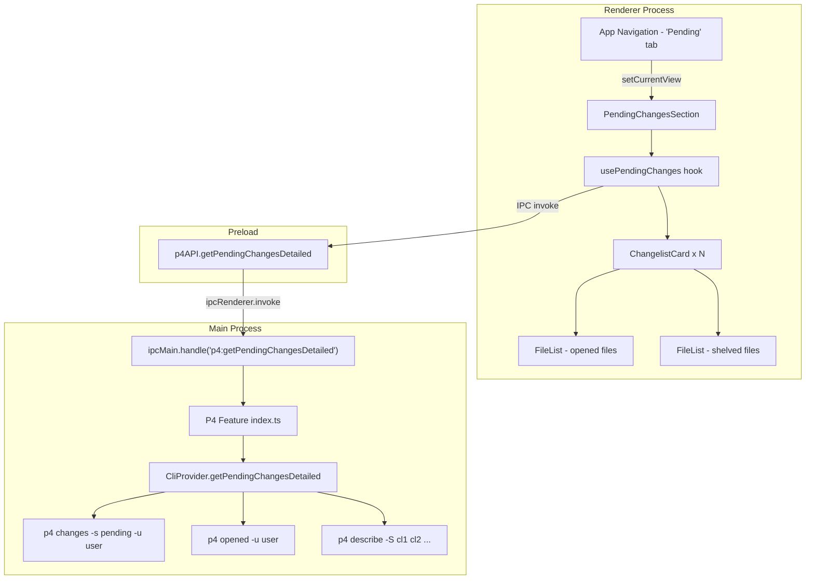
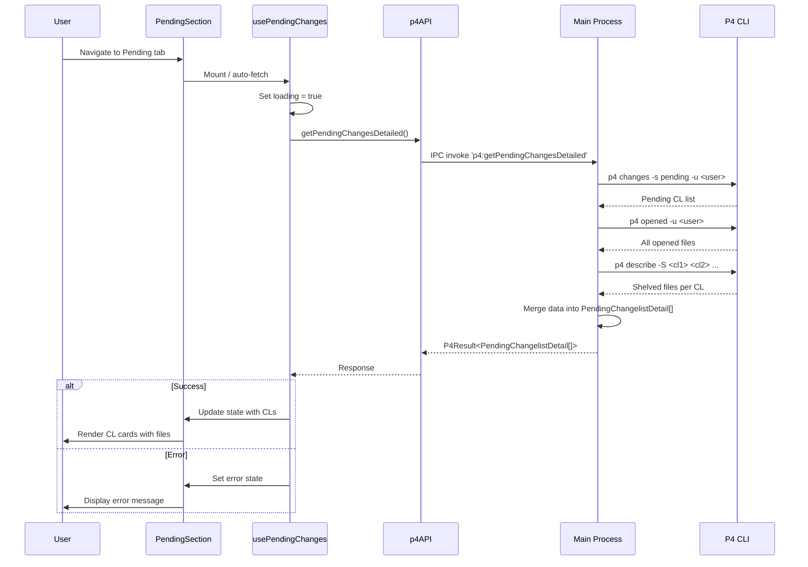
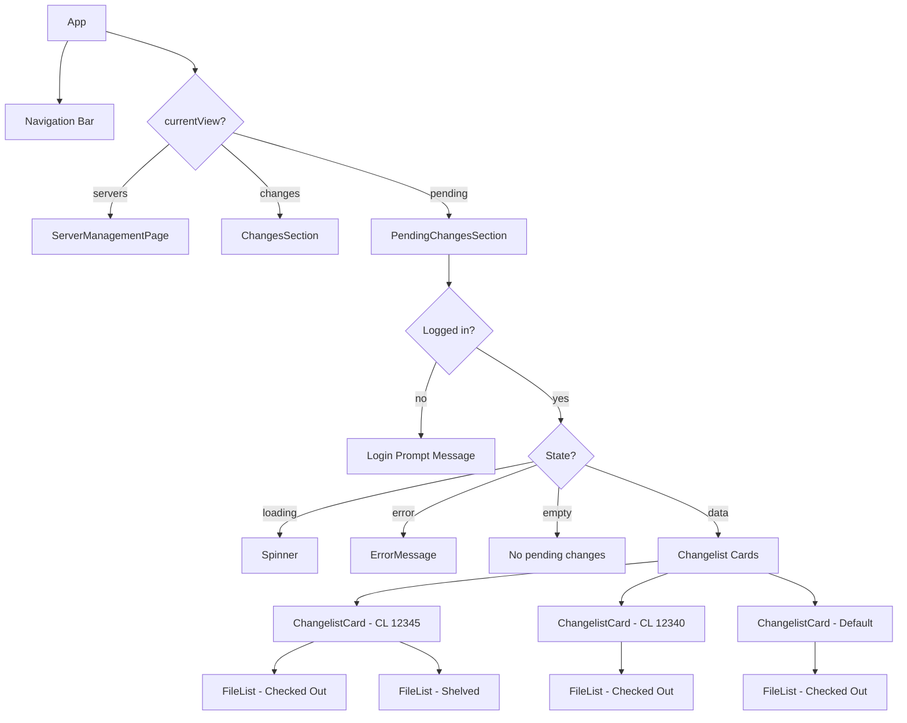

# Pending Changes View — Feature Plan

This document outlines the plan for implementing a "Pending Changes" view within the P4Client application. This view will display all of the current user's pending changelists (including shelved and the default changelist) with their files listed under each CL.

## Overview

The user needs a way to see their current work-in-progress at a glance: which changelists they have pending, what files are checked out in each, and which changelists have shelved files. This is scoped to the currently logged-in user on the active server.

Key behaviors:

1. Show all numbered pending changelists for the current user
2. Show the default changelist (CL 0) if it has any open files
3. For each CL, show the depot paths of open (checked-out) files
4. For each CL, show shelved files in a visually separate section from opened files
5. Only show data when the user is logged into a server (reuse session-aware pattern)

---

## Requirements Summary

| Requirement             | Description                                                                 |
| ----------------------- | --------------------------------------------------------------------------- |
| Pending CLs List        | Display all numbered pending changelists belonging to the current user       |
| Default Changelist      | Include the default CL (id 0) when it has open files                        |
| Opened Files per CL     | Show files checked out in each CL using shortened display paths             |
| Shelved Files per CL    | Show shelved files in each CL using shortened display paths, in a separate section |
| Smart Path Shortening   | Show filename only by default; include enough parent path to disambiguate duplicates |
| Session Awareness       | Only fetch/display when logged in; show login prompt otherwise              |
| New Navigation Tab      | Add a "Pending" tab to the main app nav alongside "Servers" and "Changes"   |
| Loading & Error States  | Show loading spinner and error messages with retry, same as existing views   |
| Refresh Action          | Manual refresh button to re-fetch data                                      |
| Theme Support           | Light and dark theme support using existing CSS custom properties            |

---

## Feature Questions (from `agent/addFeature.md`)

### 1. What state needs to be tracked?

| State                 | Type                           | Location         |
| --------------------- | ------------------------------ | ---------------- |
| Pending CL details    | `PendingChangelistDetail[]`    | React hook state |
| Loading flag          | `boolean`                      | React hook state |
| Error message         | `string \| null`               | React hook state |
| Session status        | `SessionStatus`                | Zubridge store   |
| Current view          | `AppView` (add `"pending"`)    | React state      |

### 2. Where will that state come from?

- **Pending CL details**: Fetched from the main process via new IPC channel `p4:getPendingChangesDetailed`, which internally calls multiple P4 CLI commands
- **Session status**: Already exists in the Zubridge cross-process store
- **Current view**: Already exists as local React state in `app.tsx`

### 3. What user interactions will be needed?

| Interaction              | Action                                              |
| ------------------------ | --------------------------------------------------- |
| Click "Pending" nav tab  | Switch view to pending changes                      |
| Click "Refresh" button   | Re-fetch all pending CL data                        |
| Expand/collapse CL       | Toggle visibility of file list under a CL (stretch) |

### 4. How will user interactions change the state?

| Interaction         | State Change                                              |
| ------------------- | --------------------------------------------------------- |
| Navigate to Pending | Sets `currentView` to `"pending"`, triggers auto-fetch    |
| Refresh             | Sets `loading=true`, re-fetches data, updates CL list     |
| Expand/collapse CL  | Toggles local expanded state for that CL (stretch goal)   |

---

## P4 CLI Commands Required

### Existing (already implemented)

| Command                                | Purpose                         | Provider Method       |
| -------------------------------------- | ------------------------------- | --------------------- |
| `p4 -ztag changes -s pending -u <user>` | List user's pending changelists | `getPendingChanges()` |
| `p4 -ztag user -o`                      | Get current username            | `getCurrentUser()`    |

### New (need implementation)

| Command                                       | Purpose                                         | Ztag Record Delimiter |
| --------------------------------------------- | ------------------------------------------------ | --------------------- |
| `p4 -ztag opened -u <user>`                   | Get all files opened by the user across all CLs  | `depotFile`           |
| `p4 -ztag describe -S <cl1> [<cl2> ...]`      | Get shelved files for one or more changelists    | `change` (indexed file fields within record) |

### Command Output Formats

**`p4 -ztag opened -u <user>`** — one record per file, delimited by `depotFile`:
```
... depotFile //depot/main/src/app.ts
... clientFile //workspace/src/app.ts
... rev 5
... haveRev 5
... action edit
... change 12345
... type text
... user jsmith

... depotFile //depot/main/src/index.ts
... clientFile //workspace/src/index.ts
... rev 1
... haveRev none
... action add
... change default
... type text
... user jsmith
```

Note: `change` field is `"default"` for files in the default changelist.

**`p4 -ztag describe -S <cl#>`** — single record per CL with indexed file fields:
```
... change 12345
... user jsmith
... client workspace
... time 1705334400
... desc My pending work
... status pending
... shelved
... depotFile0 //depot/main/src/shelved_file.ts
... action0 edit
... type0 text
... rev0 3
... depotFile1 //depot/main/src/another_shelved.ts
... action1 add
... type1 text
... rev1 1
```

Note: The `shelved` field has no value (the current parser skips these — this won't affect us since we only need the indexed `depotFileN` fields). If the CL has no shelved files, these indexed fields won't appear.

---

## New Types

Add to `src/shared/types/p4.ts`:

```typescript
/**
 * Extended changelist info with file details for pending changes view.
 * Includes both opened (checked-out) files and shelved files.
 */
export interface PendingChangelistDetail {
  id: number;                // CL number (0 for default changelist)
  description: string;
  date?: Date | string;      // undefined for default CL; Date in Main, ISO string after IPC
  status: "pending";
  openedFiles: string[];     // Depot paths of checked-out files
  shelvedFiles: string[];    // Depot paths of shelved files
}
```

Update `P4API` interface and `P4Provider` interface to include new method:

```typescript
// In P4API (shared/types/p4.ts) — exposed to renderer
getPendingChangesDetailed: () => Promise<P4Result<PendingChangelistDetail[]>>;

// In P4Provider (Main/Features/P4/types.ts) — internal contract
getPendingChangesDetailed(): Promise<P4Result<PendingChangelistDetail[]>>;
```

---

## Architecture Diagram



## Data Flow Diagram



---

## UI Design

### Layout Structure

The Pending Changes view is a new tab in the main app navigation, presented as a vertical list of changelist cards:

```
┌─────────────────────────────────────────────────────────────┐
│  P4Client           [Servers] [Changes] [Pending]    [☀/🌙] │
├─────────────────────────────────────────────────────────────┤
│                                                             │
│  ┌─────────────────────────────────────────────────────┐   │
│  │  Pending Changes                        [ Refresh ]  │   │
│  │                                                      │   │
│  │  ┌──────────────────────────────────────────────┐   │   │
│  │  │  CL 12345 — Fix login validation             │   │   │
│  │  │                                              │   │   │
│  │  │  Checked Out:                                │   │   │
│  │  │    login.ts                                  │   │   │
│  │  │    validate.ts                               │   │   │
│  │  │                                              │   │   │
│  │  │  Shelved:                                    │   │   │
│  │  │    auth/session.ts                           │   │   │
│  │  │    user/session.ts                           │   │   │
│  │  └──────────────────────────────────────────────┘   │   │
│  │                                                      │   │
│  │  ┌──────────────────────────────────────────────┐   │   │
│  │  │  CL 12340 — Refactor user module             │   │   │
│  │  │                                              │   │   │
│  │  │  Checked Out:                                │   │   │
│  │  │    auth/index.ts                             │   │   │
│  │  │    user/index.ts                             │   │   │
│  │  │    types.ts                                  │   │   │
│  │  └──────────────────────────────────────────────┘   │   │
│  │                                                      │   │
│  │  ┌──────────────────────────────────────────────┐   │   │
│  │  │  Default Changelist                          │   │   │
│  │  │                                              │   │   │
│  │  │  Checked Out:                                │   │   │
│  │  │    README.md                                 │   │   │
│  │  └──────────────────────────────────────────────┘   │   │
│  │                                                      │   │
│  └─────────────────────────────────────────────────────┘   │
│                                                             │
└─────────────────────────────────────────────────────────────┘
```

Note how file paths are shortened: `types.ts` and `README.md` appear as just filenames (unique within their CL), while `auth/index.ts` and `user/index.ts` include one parent directory to disambiguate the two `index.ts` files. Similarly `auth/session.ts` and `user/session.ts` are disambiguated in the shelved section.

### File Path Display Logic

Files are stored as full depot paths (e.g., `//depot/main/src/auth/login.ts`) but displayed using **smart path shortening** to reduce visual noise:

1. **Default**: Show only the filename (e.g., `login.ts`)
2. **Disambiguation**: When two or more files in the same CL share the same filename, include enough parent directory segments to make each entry unique

Disambiguation is computed across **all files in a CL** (both opened and shelved combined) to avoid confusion between sections.

**Algorithm** — `shortenPaths(paths: string[]): string[]`:

```
Input:  ["//depot/main/src/auth/index.ts", "//depot/main/src/user/index.ts", "//depot/main/README.md"]
Output: ["auth/index.ts", "user/index.ts", "README.md"]
```

Steps:
1. Extract the filename from each path
2. Group paths by filename
3. For groups with a single entry: use the filename alone
4. For groups with duplicates: incrementally add trailing parent directory segments until all entries in the group are distinct
   - Start with 1 parent segment (e.g., `auth/index.ts` vs `user/index.ts`)
   - If still ambiguous, add 2 parent segments (e.g., `src/auth/index.ts` vs `lib/auth/index.ts`)
   - Continue until unique or the full path is reached

This function lives in `src/Render/utils/shortenPaths.ts` and is consumed by the `FileList` component.

### Changelist Card Design

Each CL is displayed as a card. Numbered CLs show their ID and description. The default CL shows "Default Changelist" as its title.

| Element            | Styling                                                    |
| ------------------ | ---------------------------------------------------------- |
| CL header          | CL number in monospace accent color, description in primary text |
| "Checked Out" label | Secondary text, small font-semibold                       |
| File paths         | Monospace font, muted text, indented under label (shortened display paths) |
| "Shelved" label    | Secondary text with a warning/info color indicator         |
| Shelved file paths | Monospace font, muted text, indented under label (shortened display paths) |
| Card container     | Uses existing `.card` class with border                    |

### States

| State       | Display                                                              |
| ----------- | -------------------------------------------------------------------- |
| Loading     | Spinner + "Loading pending changes..." text                          |
| Not logged in | "No active session. Please go to the Servers tab..." (existing pattern) |
| Error       | Error message with "Try Again" button (reuse `ErrorMessage`)        |
| Empty       | "No pending changes." message                                       |
| Data        | List of changelist cards with files                                  |

---

## File Structure

```
src/
├── shared/types/
│   └── p4.ts                              # Add PendingChangelistDetail type, update P4API
├── Main/Features/P4/
│   ├── types.ts                           # Add getPendingChangesDetailed to P4Provider
│   ├── index.ts                           # Add getPendingChangesDetailed public function
│   └── providers/cli/
│       ├── index.ts                       # Implement getPendingChangesDetailed in CliProvider
│       └── parser.ts                      # Add parseOpenedOutput, parseShelvedFiles
├── Main/
│   └── main.ts                            # Register p4:getPendingChangesDetailed IPC handler
├── Preload/
│   └── preload.ts                         # Expose getPendingChangesDetailed on p4API
├── Render/
│   ├── app.tsx                            # Add "Pending" to AppView and navigation
│   ├── utils/
│   │   └── shortenPaths.ts               # Smart path shortening utility for file display
│   ├── Hooks/
│   │   └── usePendingChanges.ts           # New hook for fetching pending CL details
│   └── Components/P4/
│       ├── PendingChangesSection.tsx       # Container component (session checks, loading, etc.)
│       ├── ChangelistCard.tsx             # Card for a single CL with its files
│       └── FileList.tsx                   # Renders a list of file paths (uses shortenPaths)
```

---

## Implementation Steps

### Step 1: Add New Types

**`src/shared/types/p4.ts`** — Add `PendingChangelistDetail` interface and update `P4API`:

```typescript
export interface PendingChangelistDetail {
  id: number;
  description: string;
  date?: Date | string;
  status: "pending";
  openedFiles: string[];
  shelvedFiles: string[];
}

// Add to P4API interface:
getPendingChangesDetailed: () => Promise<P4Result<PendingChangelistDetail[]>>;
```

### Step 2: Add New Parser Functions

**`src/Main/Features/P4/providers/cli/parser.ts`** — Add two new parsers:

#### `parseOpenedOutput(output: string): OpenedFileRecord[]`

Parses `p4 -ztag opened` output. Each record is delimited by the `depotFile` field (not `change`). Returns an array of `{ depotFile, action, change }` where `change` is a string (`"default"` or a CL number).

The current `parseZtagOutput` uses `change` as its record delimiter. This parser needs to detect records by the `depotFile` field instead. Two approaches:

- **Option A**: Make `parseZtagOutput` accept a configurable delimiter field name
- **Option B**: Create a standalone `parseOpenedOutput` function

Recommended: **Option A** — add an optional `recordDelimiter` parameter to `parseZtagOutput`:

```typescript
export function parseZtagOutput(
  output: string,
  recordDelimiter: string = "change"
): ZtagRecord[] { ... }
```

#### `parseShelvedFiles(record: ZtagRecord): string[]`

Extracts indexed `depotFileN` fields from a ztag record (from `p4 describe -S` output). Iterates `depotFile0`, `depotFile1`, ... until no more found.

```typescript
export function parseShelvedFiles(record: ZtagRecord): string[] {
  const files: string[] = [];
  let i = 0;
  while (record[`depotFile${i}`]) {
    files.push(record[`depotFile${i}`]);
    i++;
  }
  return files;
}
```

### Step 3: Update P4Provider Interface

**`src/Main/Features/P4/types.ts`** — Add method to `P4Provider`:

```typescript
getPendingChangesDetailed(): Promise<P4Result<PendingChangelistDetail[]>>;
```

### Step 4: Implement in CliProvider

**`src/Main/Features/P4/providers/cli/index.ts`** — Add `getPendingChangesDetailed()`:

This method orchestrates three P4 CLI calls and merges the results:

```typescript
async getPendingChangesDetailed(): Promise<P4Result<PendingChangelistDetail[]>> {
  // 1. Get current user
  const userResult = await this.getCurrentUser();
  if (!userResult.success || !userResult.data) {
    return { success: false, error: "Could not determine current user" };
  }
  const user = userResult.data;

  // 2. Get pending CLs (numbered)
  const { stdout: changesOut } = await executeP4Command(
    `changes -s pending -u ${user}`
  );
  const pendingCLs = parseChangesOutput(changesOut, "pending");

  // 3. Get all opened files for this user
  const { stdout: openedOut } = await executeP4Command(`opened -u ${user}`);
  const openedFiles = parseOpenedOutput(openedOut);
  // Group opened files by CL: Map<string, string[]>  (key is CL id or "default")

  // 4. Get shelved files for numbered CLs (if any exist)
  let shelvedMap: Map<number, string[]> = new Map();
  if (pendingCLs.length > 0) {
    const clIds = pendingCLs.map(cl => cl.id).join(" ");
    const { stdout: describeOut } = await executeP4Command(
      `describe -S ${clIds}`
    );
    // Parse and extract shelved files per CL
  }

  // 5. Merge into PendingChangelistDetail[]
  // - Map numbered CLs with their opened + shelved files
  // - Add default CL if it has opened files
  // - Sort: numbered CLs first (by id desc), default CL last

  return { success: true, data: result };
}
```

### Step 5: Add Public API Function

**`src/Main/Features/P4/index.ts`** — Add export:

```typescript
export async function getPendingChangesDetailed(): Promise<P4Result<PendingChangelistDetail[]>> {
  return getProvider().getPendingChangesDetailed();
}
```

### Step 6: Register IPC Handler

**`src/Main/main.ts`** — Add alongside existing p4 handlers:

```typescript
ipcMain.handle("p4:getPendingChangesDetailed", async () =>
  getPendingChangesDetailed()
);
```

### Step 7: Expose in Preload

**`src/Preload/preload.ts`** — Add to `p4API` object:

```typescript
getPendingChangesDetailed: () =>
  ipcRenderer.invoke("p4:getPendingChangesDetailed"),
```

### Step 8: Create `usePendingChanges` Hook

**`src/Render/Hooks/usePendingChanges.ts`** — Same pattern as `useP4Changes`:

```typescript
import { useState, useEffect, useCallback } from "react";
import type { PendingChangelistDetail } from "../../shared/types/p4";

interface UsePendingChangesReturn {
  changelists: PendingChangelistDetail[];
  loading: boolean;
  error: string | null;
  refresh: () => Promise<void>;
}

export function usePendingChanges(autoFetch = true): UsePendingChangesReturn {
  const [changelists, setChangelists] = useState<PendingChangelistDetail[]>([]);
  const [loading, setLoading] = useState(false);
  const [error, setError] = useState<string | null>(null);

  const fetchPending = useCallback(async () => {
    setLoading(true);
    setError(null);
    try {
      const result = await window.p4API.getPendingChangesDetailed();
      if (result.success && result.data) {
        setChangelists(result.data);
      } else {
        setError(result.error || "Failed to fetch pending changes");
      }
    } catch (err) {
      setError(err instanceof Error ? err.message : "Unknown error");
    } finally {
      setLoading(false);
    }
  }, []);

  useEffect(() => {
    if (autoFetch) fetchPending();
  }, [autoFetch, fetchPending]);

  return { changelists, loading, error, refresh: fetchPending };
}
```

### Step 9: Create Renderer Components

#### `FileList.tsx`

Renders a list of file paths in monospace, using pre-shortened display names:

```typescript
interface FileListProps {
  files: string[];       // Already-shortened display paths
  label: string;
  labelClassName?: string;
}
```

Renders the label as a small heading, then each file path on its own line. This component receives already-shortened paths — the shortening is done by the parent `ChangelistCard`.

#### `ChangelistCard.tsx`

Card component for a single pending changelist. Handles smart path shortening across both file sections:

```typescript
interface ChangelistCardProps {
  changelist: PendingChangelistDetail;
}
```

- Shows CL number + description (or "Default Changelist" for id 0)
- Calls `shortenPaths([...changelist.openedFiles, ...changelist.shelvedFiles])` to compute display names for all files in the CL together, ensuring cross-section disambiguation
- Splits the shortened names back into opened and shelved groups
- Renders `<FileList label="Checked Out" files={shortenedOpenedFiles} />` if openedFiles is non-empty
- Renders `<FileList label="Shelved" files={shortenedShelvedFiles} />` if shelvedFiles is non-empty
- Uses existing `.card` class styling

#### `PendingChangesSection.tsx`

Container component following the `ChangesSection` pattern:

```typescript
interface PendingChangesSectionProps {}
```

- Uses `useServers()` for session status (existing hook)
- Uses `usePendingChanges()` for data
- Shows login prompt when not logged in
- Shows loading spinner, error state, or list of `ChangelistCard` components
- Has a "Refresh" button in the header

### Step 10: Add Navigation Tab

**`src/Render/app.tsx`**:

- Extend `AppView` type: `type AppView = "servers" | "changes" | "pending";`
- Add "Pending" button to navigation bar
- Render `PendingChangesSection` when `currentView === "pending"`

---

## Component Hierarchy



---

## Testing Strategy

### Unit Tests

| Test File                                  | Coverage                                                  |
| ------------------------------------------ | --------------------------------------------------------- |
| `test/Main/Features/P4/parser.test.ts`     | New `parseOpenedOutput` and `parseShelvedFiles` functions  |
| `test/Main/Features/P4/cli.test.ts`        | `getPendingChangesDetailed` method orchestration and merging |
| `test/Render/utils/shortenPaths.test.ts`   | Smart path shortening utility                             |

### Test Scenarios — `shortenPaths`

1. **All unique filenames**: Each path shortened to just the filename
   - Input: `["//depot/src/app.ts", "//depot/src/main.ts"]`
   - Output: `["app.ts", "main.ts"]`
2. **Duplicate filenames, 1 parent disambiguates**: Include one parent segment
   - Input: `["//depot/src/auth/index.ts", "//depot/src/user/index.ts"]`
   - Output: `["auth/index.ts", "user/index.ts"]`
3. **Duplicate filenames, 2 parents needed**: When 1 parent is still ambiguous
   - Input: `["//depot/a/sub/config.ts", "//depot/b/sub/config.ts"]`
   - Output: `["a/sub/config.ts", "b/sub/config.ts"]`
4. **Mix of unique and duplicate filenames**: Only duplicates get parent segments
   - Input: `["//depot/src/auth/index.ts", "//depot/src/user/index.ts", "//depot/README.md"]`
   - Output: `["auth/index.ts", "user/index.ts", "README.md"]`
5. **Single file**: Just the filename
   - Input: `["//depot/src/app.ts"]`
   - Output: `["app.ts"]`
6. **Empty array**: Returns empty array
7. **Full path fallback**: When paths are identical up to the root, use as much of the path as available

### Test Scenarios — Parser

1. **parseOpenedOutput**: Multiple files across different CLs
2. **parseOpenedOutput**: Files in the default changelist (`change` field = `"default"`)
3. **parseOpenedOutput**: Empty output (no opened files)
4. **parseShelvedFiles**: Multiple indexed shelved files
5. **parseShelvedFiles**: No shelved files in record
6. **parseZtagOutput with custom delimiter**: Record splitting on `depotFile` instead of `change`

### Test Scenarios — Provider

1. **No pending CLs, no open files**: Returns empty array
2. **Numbered CLs with opened files only**: Returns CLs with populated `openedFiles`, empty `shelvedFiles`
3. **Numbered CLs with shelved files**: Returns CLs with populated `shelvedFiles`
4. **Default CL with files**: Includes default CL (id 0) in results
5. **Mixed**: Multiple numbered CLs + default, some with shelved files
6. **Error from P4 CLI**: Returns `{ success: false, error: "..." }`

---

## Edge Cases & Considerations

| Scenario                            | Handling                                                   |
| ----------------------------------- | ---------------------------------------------------------- |
| Default CL has no files             | Omit it from results entirely                              |
| CL with shelved files but no opened | Show the CL with empty "Checked Out" section, populated "Shelved" section |
| User not logged in                  | Show login prompt (same as ChangesSection pattern)         |
| `p4 describe -S` fails for a CL    | Still show the CL, just with empty shelved files; log warning |
| No pending CLs and no default files | Show "No pending changes." empty state                     |
| Large number of files in a CL       | Render all files (no pagination for v1); consider virtual scrolling later |
| CL description is multi-line        | Truncate to first line in the card header                  |

---

## Summary

This feature adds a Pending Changes view as a new tab in the main navigation. It requires:

1. **2 new parser functions** in `parser.ts` (+ one small enhancement to `parseZtagOutput`)
2. **1 new provider method** (`getPendingChangesDetailed`) that orchestrates 3 P4 CLI calls
3. **1 new IPC channel** (`p4:getPendingChangesDetailed`)
4. **1 new preload exposure** on `p4API`
5. **1 new hook** (`usePendingChanges`)
6. **3 new components** (`PendingChangesSection`, `ChangelistCard`, `FileList`)
7. **1 utility function** (`shortenPaths`) for smart file path display
8. **1 type addition** (`PendingChangelistDetail`) and updates to `P4API` + `P4Provider`
9. **Navigation update** in `app.tsx`

The implementation follows established patterns throughout — same error handling, same session awareness, same styling approach, same IPC architecture.
