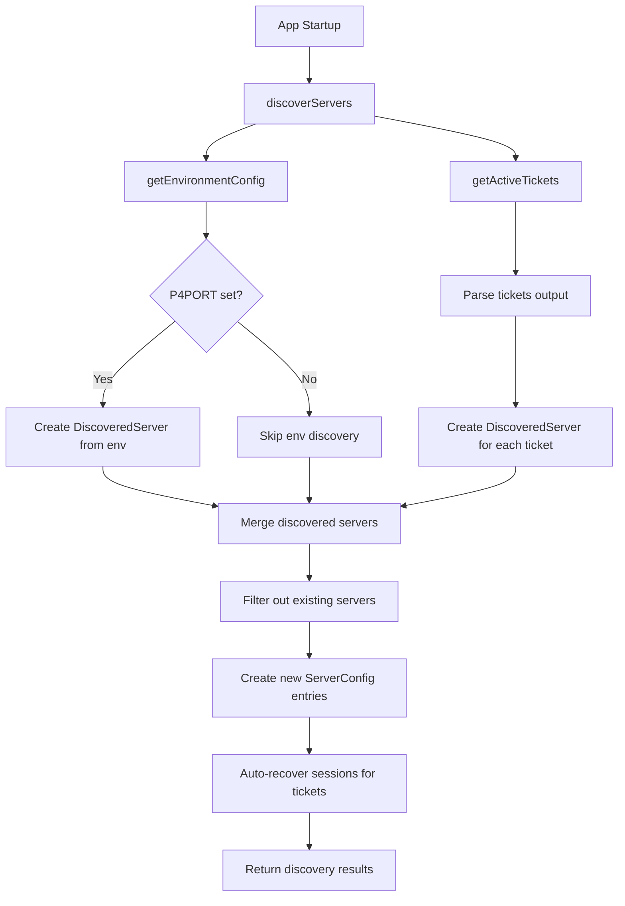
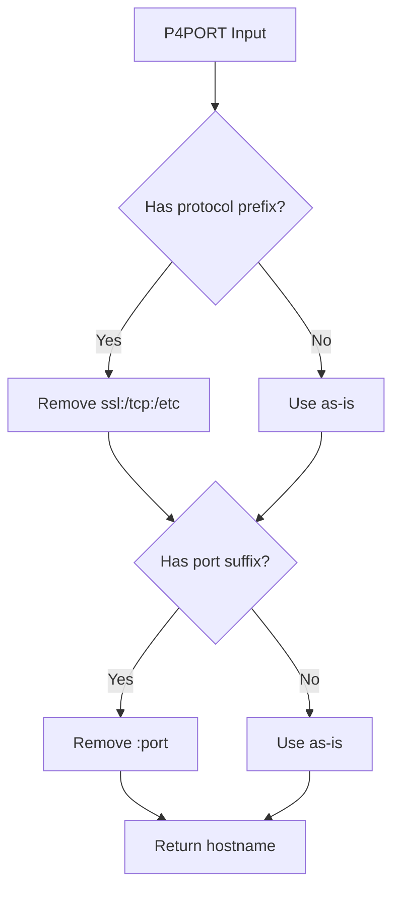
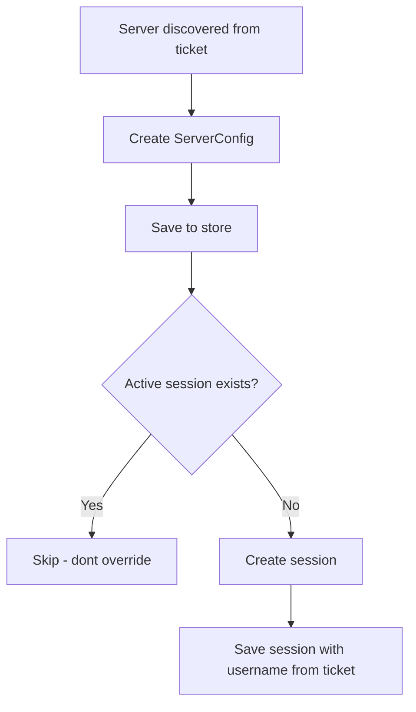

# Server Auto-Discovery Plan

## Overview

This plan outlines the implementation of automatic server discovery at application startup. The feature will detect Perforce servers from:

1. **Environment variables** (P4PORT, P4USER, P4CLIENT)
2. **Active tickets** from the p4 tickets file

Discovered servers that don't already exist in the store will be automatically created with reasonable defaults. Sessions will be auto-recovered for servers with active tickets.

## Architecture



## File Structure

### New Files

| File                                                                             | Purpose                                        |
| -------------------------------------------------------------------------------- | ---------------------------------------------- |
| [`src/Main/Features/Server/discovery.ts`](src/Main/Features/Server/discovery.ts) | Main discovery module with all discovery logic |

### Modified Files

| File                                                                                         | Changes                       |
| -------------------------------------------------------------------------------------------- | ----------------------------- |
| [`src/Main/Features/Server/index.ts`](src/Main/Features/Server/index.ts)                     | Export discovery functions    |
| [`src/Main/main.ts`](src/Main/main.ts:89)                                                    | Call discovery on app startup |
| [`test/Main/Features/Server/discovery.test.ts`](test/Main/Features/Server/discovery.test.ts) | Unit tests for discovery      |

## Implementation Details

### 1. Discovery Module - [`discovery.ts`](src/Main/Features/Server/discovery.ts)

#### Types

```typescript
/**
 * Represents a server discovered from environment or tickets
 */
interface DiscoveredServer {
  p4port: string;
  name: string;
  source: "environment" | "ticket";
  username?: string; // Only set if discovered from ticket
}

/**
 * Result of the discovery process
 */
interface DiscoveryResult {
  serversCreated: ServerConfig[];
  sessionsRecovered: number;
  errors: string[];
}
```

#### Functions

##### `extractServerName`

Extracts a human-readable name from a P4PORT string.

```typescript
/**
 * Extracts server name from P4PORT
 * Examples:
 *   "ssl:perforce.example.com:1666" -> "perforce.example.com"
 *   "perforce.example.com:1666" -> "perforce.example.com"
 *   "localhost:1666" -> "localhost"
 *   "192.168.1.100:1666" -> "192.168.1.100"
 */
function extractServerName(p4port: string): string;
```

**Logic:**

1. Remove protocol prefix if present (ssl:, tcp:, etc.)
2. Remove port suffix
3. Return the hostname/IP portion

##### `getEnvironmentConfig`

Reads Perforce environment variables.

```typescript
/**
 * Reads P4 environment variables
 * Returns null if P4PORT is not set
 */
function getEnvironmentConfig(): DiscoveredServer | null;
```

**Environment Variables:**

- `P4PORT` - Required for discovery
- `P4USER` - Optional, used for session context
- `P4CLIENT` - Optional, stored for reference

##### `discoverFromTickets`

Discovers servers from active tickets.

```typescript
/**
 * Discovers servers from active p4 tickets
 * Uses the P4 provider to get tickets
 */
async function discoverFromTickets(): Promise<DiscoveredServer[]>;
```

**Logic:**

1. Call `provider.getTickets()` to get all active tickets
2. Map each ticket to a DiscoveredServer with:
   - `p4port` from ticket.host
   - `name` extracted from host
   - `source: 'ticket'`
   - `username` from ticket.user

##### `serverExists`

Checks if a server with the given p4port already exists.

```typescript
/**
 * Checks if a server with the given p4port exists in store
 */
function serverExists(p4port: string): boolean;
```

##### `createServerFromDiscovery`

Creates a ServerConfig from a DiscoveredServer.

```typescript
/**
 * Creates a ServerConfig with reasonable defaults
 */
function createServerFromDiscovery(discovered: DiscoveredServer): ServerConfig;
```

**Default Values:**
| Field | Value |
|-------|-------|
| `id` | `randomUUID()` |
| `name` | Extracted from p4port |
| `p4port` | From discovered server |
| `description` | `"Auto-discovered from {source}"` |
| `createdAt` | Current ISO timestamp |
| `updatedAt` | Current ISO timestamp |

##### `recoverSessionForTicket`

Recovers a session for a server discovered from a ticket.

```typescript
/**
 * Creates a session for a server with an active ticket
 */
function recoverSessionForTicket(serverId: string, username: string): void;
```

##### `discoverServers` (Main Entry Point)

Orchestrates the entire discovery process.

```typescript
/**
 * Main discovery function - called at app startup
 *
 * 1. Discovers servers from environment and tickets
 * 2. Filters out servers that already exist
 * 3. Creates new server entries
 * 4. Recovers sessions for ticket-based discoveries
 */
async function discoverServers(): Promise<DiscoveryResult>;
```

### 2. Integration with Startup - [`main.ts`](src/Main/main.ts:89)

The discovery should be called during app initialization, after the store is created but before windows are created. The error handling is wrapped in a dedicated function for cleaner code organization:

```typescript
/**
 * Runs server discovery and logs results
 * Wrapped in its own function to keep app.whenReady() clean
 */
async function runServerDiscovery(): Promise<void> {
  try {
    const discoveryResult = await discoverServers();

    if (discoveryResult.serversCreated.length > 0) {
      console.log(
        `Discovered ${discoveryResult.serversCreated.length} new server(s)`,
      );
    }
    if (discoveryResult.sessionsRecovered > 0) {
      console.log(`Recovered ${discoveryResult.sessionsRecovered} session(s)`);
    }
    if (discoveryResult.errors.length > 0) {
      console.warn("Discovery errors:", discoveryResult.errors);
    }
  } catch (error) {
    console.error("Server discovery failed:", error);
    // Continue startup even if discovery fails
  }
}

// In main.ts
app.whenReady().then(async () => {
  const store = createStore();
  const bridge = createBridge(store);

  // Discover servers from environment and tickets
  await runServerDiscovery();

  // ... rest of initialization
});
```

### 3. Server Name Extraction Logic

The `extractServerName` function handles various P4PORT formats:



**Examples:**
| Input | Output |
|-------|--------|
| `ssl:perforce.example.com:1666` | `perforce.example.com` |
| `perforce.example.com:1666` | `perforce.example.com` |
| `localhost:1666` | `localhost` |
| `192.168.1.100:1666` | `192.168.1.100` |
| `ssl:p4.company.io:1667` | `p4.company.io` |

### 4. Duplicate Detection Strategy

Servers are matched by `p4port` only (case-insensitive comparison):

```typescript
function serverExists(p4port: string): boolean {
  const servers = getAllServers();
  const normalizedPort = p4port.toLowerCase();
  return servers.some((s) => s.p4port.toLowerCase() === normalizedPort);
}
```

### 5. Session Recovery Logic

When a server is discovered from an active ticket:



**Important:** Only recover session if no active session exists. This prevents overwriting a user's intentional session state.

## Unit Tests

### Test File: [`test/Main/Features/Server/discovery.test.ts`](test/Main/Features/Server/discovery.test.ts)

```typescript
describe("Server Discovery", () => {
  describe("extractServerName", () => {
    it("should extract hostname from ssl:host:port format");
    it("should extract hostname from host:port format");
    it("should handle IP addresses");
    it("should handle hostnames without port");
    it("should handle various protocol prefixes");
  });

  describe("getEnvironmentConfig", () => {
    it("should return null when P4PORT is not set");
    it("should return DiscoveredServer when P4PORT is set");
    it("should include P4USER when available");
  });

  describe("discoverFromTickets", () => {
    it("should return empty array when no tickets exist");
    it("should return DiscoveredServer for each ticket");
    it("should handle ticket parsing errors gracefully");
  });

  describe("serverExists", () => {
    it("should return true for existing server");
    it("should return false for non-existing server");
    it("should be case-insensitive");
  });

  describe("discoverServers", () => {
    it("should create servers from environment when not existing");
    it("should create servers from tickets when not existing");
    it("should not create duplicate servers");
    it("should recover sessions for ticket-based discoveries");
    it("should not override existing sessions");
    it("should return discovery results");
    it("should handle errors gracefully");
  });
});
```

## Error Handling

The discovery process should be resilient to failures:

1. **Environment variable errors**: If reading env vars fails, log and continue
2. **Ticket retrieval errors**: If `p4 tickets` fails, log and continue with env-only discovery
3. **Server creation errors**: If creating a server fails, log error and continue with others
4. **Session recovery errors**: If session recovery fails, log and continue

```typescript
async function discoverServers(): Promise<DiscoveryResult> {
  const result: DiscoveryResult = {
    serversCreated: [],
    sessionsRecovered: 0,
    errors: [],
  };

  // Discover from environment
  try {
    const envServer = getEnvironmentConfig();
    if (envServer) {
      // ... process
    }
  } catch (error) {
    result.errors.push(`Environment discovery failed: ${error}`);
  }

  // Discover from tickets
  try {
    const ticketServers = await discoverFromTickets();
    // ... process
  } catch (error) {
    result.errors.push(`Ticket discovery failed: ${error}`);
  }

  return result;
}
```

## Summary of Changes

### New Code

1. **[`src/Main/Features/Server/discovery.ts`](src/Main/Features/Server/discovery.ts)** - New module with:
   - `extractServerName()` - Parse hostname from P4PORT
   - `getEnvironmentConfig()` - Read P4 environment variables
   - `discoverFromTickets()` - Get servers from active tickets
   - `serverExists()` - Check for duplicate servers
   - `createServerFromDiscovery()` - Create ServerConfig with defaults
   - `recoverSessionForTicket()` - Create session for ticket-based discovery
   - `discoverServers()` - Main orchestration function

### Modified Code

2. **[`src/Main/Features/Server/index.ts`](src/Main/Features/Server/index.ts)** - Add export:

   ```typescript
   export { discoverServers } from "./discovery";
   ```

3. **[`src/Main/main.ts`](src/Main/main.ts:89)** - Call discovery at startup:
   ```typescript
   // In app.whenReady() callback, after store/bridge creation
   const discoveryResult = await discoverServers();
   ```

### New Tests

4. **[`test/Main/Features/Server/discovery.test.ts`](test/Main/Features/Server/discovery.test.ts)** - Comprehensive unit tests

## Acceptance Criteria

- [ ] Servers are discovered from P4PORT environment variable at startup
- [ ] Servers are discovered from active p4 tickets at startup
- [ ] Server names are extracted from P4PORT hostname
- [ ] Duplicate servers are not created (matched by p4port)
- [ ] Sessions are auto-recovered for ticket-based discoveries
- [ ] Existing sessions are not overwritten
- [ ] Discovery errors are logged but don't crash the app
- [ ] Unit tests cover all discovery scenarios
