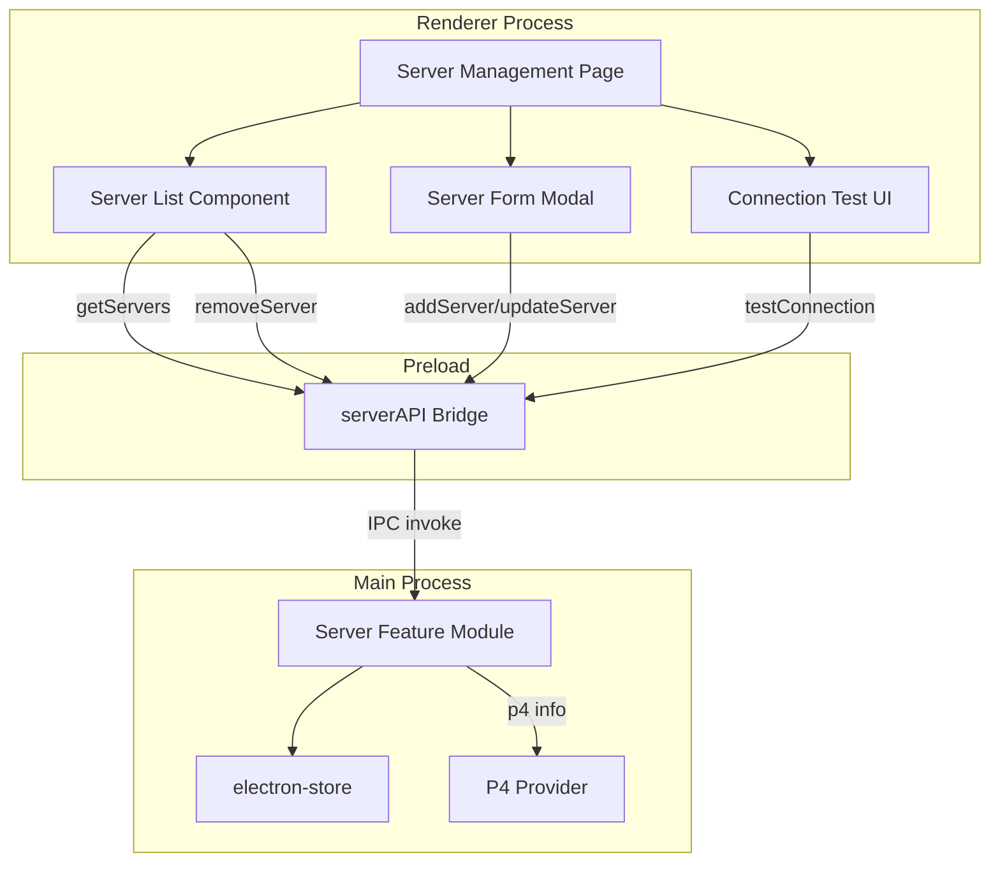
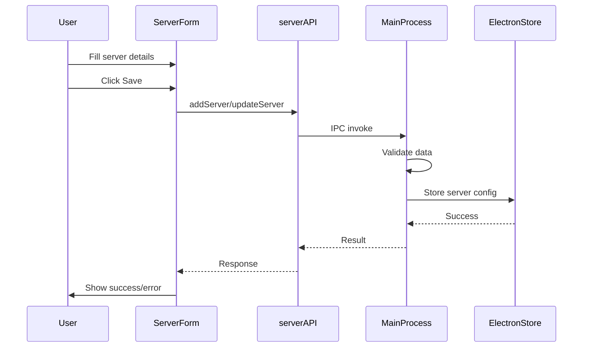
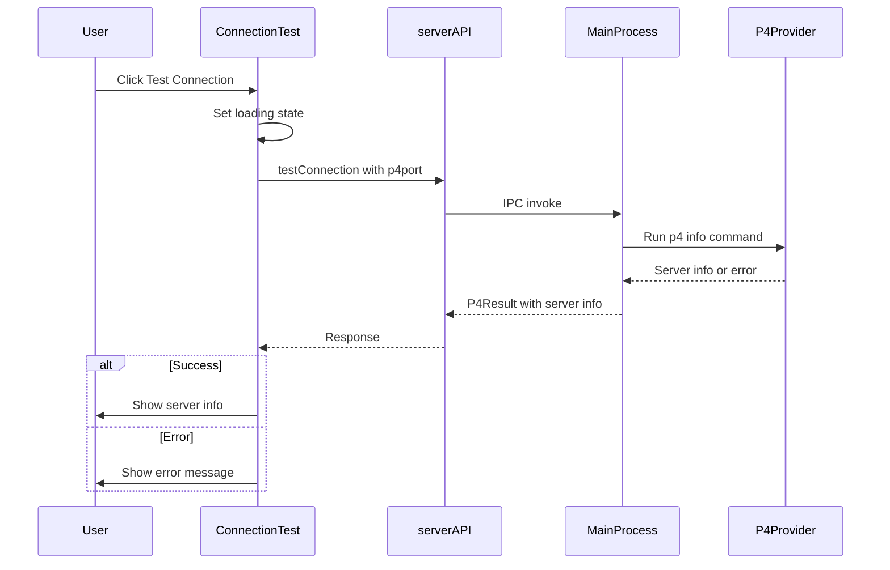

# Server Management Plan

## Overview

This document outlines the plan for implementing a server management page in the P4Client application. Users will be able to add, remove, and edit Perforce server configurations, as well as test their connection to each server. This feature does not include authentication/login functionality - it focuses solely on server configuration management.

## Requirements Summary

| Requirement        | Description                                             |
| ------------------ | ------------------------------------------------------- |
| Add Server         | Users can add new server configurations                 |
| Edit Server        | Users can modify existing server configurations         |
| Remove Server      | Users can delete server configurations                  |
| Test Connection    | Users can test connectivity to a server using `p4 info` |
| Persistent Storage | Server configurations stored using electron-store       |
| No Authentication  | No login/password management at this time               |

## Server Configuration Schema

Each server configuration will include:

| Field       | Type   | Required | Description                                            |
| ----------- | ------ | -------- | ------------------------------------------------------ |
| id          | string | Yes      | Unique identifier (UUID)                               |
| name        | string | Yes      | Friendly display name (e.g., "Production Server")      |
| p4port      | string | Yes      | Server address (e.g., `ssl:perforce.example.com:1666`) |
| description | string | No       | Optional description of the server                     |
| createdAt   | string | Yes      | ISO timestamp when server was added                    |
| updatedAt   | string | Yes      | ISO timestamp when server was last modified            |

---

## Architecture Diagram



## Data Flow Diagrams

### Add/Edit Server Flow



### Test Connection Flow



---

## File Structure

```
src/
├── Main/
│   └── Features/
│       └── Server/
│           ├── index.ts          # Public API for server operations
│           ├── store.ts          # electron-store configuration
│           └── types.ts          # Server type definitions
├── Preload/
│   └── preload.ts               # Add serverAPI to context bridge
├── Render/
│   ├── Components/
│   │   └── Server/
│   │       ├── ServerManagementPage.tsx  # Main page component
│   │       ├── ServerList.tsx            # List of servers
│   │       ├── ServerCard.tsx            # Individual server card
│   │       ├── ServerFormModal.tsx       # Add/Edit form modal
│   │       └── ConnectionTestResult.tsx  # Connection test display
│   └── Hooks/
│       └── useServers.ts                 # Custom hook for server operations
└── shared/
    └── types/
        └── server.ts                     # Shared server types
```

---

## Implementation Details

### Step 1: Install electron-store

```bash
npm install electron-store
```

### Step 2: Create Shared Types

Create [`src/shared/types/server.ts`](src/shared/types/server.ts):

```typescript
/**
 * Server configuration stored in electron-store
 */
export interface ServerConfig {
  id: string;
  name: string;
  p4port: string;
  description?: string;
  createdAt: string;
  updatedAt: string;
}

/**
 * Input for creating a new server
 */
export interface CreateServerInput {
  name: string;
  p4port: string;
  description?: string;
}

/**
 * Input for updating an existing server
 */
export interface UpdateServerInput {
  id: string;
  name?: string;
  p4port?: string;
  description?: string;
}

/**
 * Result of a connection test
 */
export interface ConnectionTestResult {
  success: boolean;
  serverInfo?: {
    serverVersion: string;
    serverAddress: string;
    serverRoot?: string;
    serverDate?: string;
    serverUptime?: string;
    serverLicense?: string;
  };
  error?: string;
  responseTime?: number;
}

/**
 * Server API interface exposed to renderer
 */
export interface ServerAPI {
  getServers: () => Promise<ServerConfig[]>;
  getServer: (id: string) => Promise<ServerConfig | null>;
  addServer: (input: CreateServerInput) => Promise<ServerConfig>;
  updateServer: (input: UpdateServerInput) => Promise<ServerConfig>;
  removeServer: (id: string) => Promise<boolean>;
  testConnection: (p4port: string) => Promise<ConnectionTestResult>;
}

declare global {
  interface Window {
    serverAPI: ServerAPI;
  }
}

export {};
```

### Step 3: Create Server Store Module

Create [`src/Main/Features/Server/store.ts`](src/Main/Features/Server/store.ts):

```typescript
import Store from "electron-store";
import type { ServerConfig } from "../../../shared/types/server";

interface ServerStoreSchema {
  servers: ServerConfig[];
}

const serverStore = new Store<ServerStoreSchema>({
  name: "servers",
  defaults: {
    servers: [],
  },
  schema: {
    servers: {
      type: "array",
      items: {
        type: "object",
        properties: {
          id: { type: "string" },
          name: { type: "string" },
          p4port: { type: "string" },
          description: { type: "string" },
          createdAt: { type: "string" },
          updatedAt: { type: "string" },
        },
        required: ["id", "name", "p4port", "createdAt", "updatedAt"],
      },
    },
  },
});

export function getAllServers(): ServerConfig[] {
  return serverStore.get("servers");
}

export function getServerById(id: string): ServerConfig | null {
  const servers = serverStore.get("servers");
  return servers.find((s) => s.id === id) || null;
}

export function saveServer(server: ServerConfig): void {
  const servers = serverStore.get("servers");
  const existingIndex = servers.findIndex((s) => s.id === server.id);

  if (existingIndex >= 0) {
    servers[existingIndex] = server;
  } else {
    servers.push(server);
  }

  serverStore.set("servers", servers);
}

export function deleteServer(id: string): boolean {
  const servers = serverStore.get("servers");
  const filteredServers = servers.filter((s) => s.id !== id);

  if (filteredServers.length === servers.length) {
    return false; // Server not found
  }

  serverStore.set("servers", filteredServers);
  return true;
}
```

### Step 4: Create Server Feature Module

Create [`src/Main/Features/Server/index.ts`](src/Main/Features/Server/index.ts):

```typescript
import { randomUUID } from "crypto";
import type {
  ServerConfig,
  CreateServerInput,
  UpdateServerInput,
  ConnectionTestResult,
} from "../../../shared/types/server";
import {
  getAllServers,
  getServerById,
  saveServer,
  deleteServer,
} from "./store";
import { getProvider } from "../P4/factory";

export { getAllServers, getServerById };

/**
 * Add a new server configuration
 */
export function addServer(input: CreateServerInput): ServerConfig {
  const now = new Date().toISOString();
  const server: ServerConfig = {
    id: randomUUID(),
    name: input.name.trim(),
    p4port: input.p4port.trim(),
    description: input.description?.trim(),
    createdAt: now,
    updatedAt: now,
  };

  saveServer(server);
  return server;
}

/**
 * Update an existing server configuration
 */
export function updateServer(input: UpdateServerInput): ServerConfig {
  const existing = getServerById(input.id);
  if (!existing) {
    throw new Error(`Server with id ${input.id} not found`);
  }

  const updated: ServerConfig = {
    ...existing,
    name: input.name?.trim() ?? existing.name,
    p4port: input.p4port?.trim() ?? existing.p4port,
    description: input.description?.trim() ?? existing.description,
    updatedAt: new Date().toISOString(),
  };

  saveServer(updated);
  return updated;
}

/**
 * Remove a server configuration
 */
export function removeServer(id: string): boolean {
  return deleteServer(id);
}

/**
 * Test connection to a Perforce server using p4 info
 */
export async function testConnection(
  p4port: string
): Promise<ConnectionTestResult> {
  const startTime = Date.now();

  try {
    const provider = getProvider();

    // Temporarily set the P4PORT for this connection test
    // We need to run p4 info against the specified server
    const result = await provider.runInfoCommand(p4port);

    const responseTime = Date.now() - startTime;

    if (result.success && result.data) {
      return {
        success: true,
        serverInfo: result.data,
        responseTime,
      };
    }

    return {
      success: false,
      error: result.error || "Unknown error occurred",
      responseTime,
    };
  } catch (error) {
    return {
      success: false,
      error: error instanceof Error ? error.message : "Connection failed",
      responseTime: Date.now() - startTime,
    };
  }
}
```

### Step 5: Extend P4 Provider Interface

Update [`src/Main/Features/P4/types.ts`](src/Main/Features/P4/types.ts) to add the info command:

```typescript
// Add to existing P4Provider interface
export interface P4Provider {
  // ... existing methods ...

  /**
   * Run p4 info command against a specific server
   * Used for connection testing
   */
  runInfoCommand(p4port: string): Promise<P4Result<ServerInfo>>;
}

export interface ServerInfo {
  serverVersion: string;
  serverAddress: string;
  serverRoot?: string;
  serverDate?: string;
  serverUptime?: string;
  serverLicense?: string;
}
```

### Step 6: Implement Info Command in Providers

Add to CLI provider [`src/Main/Features/P4/providers/cli/index.ts`](src/Main/Features/P4/providers/cli/index.ts):

```typescript
async runInfoCommand(p4port: string): Promise<P4Result<ServerInfo>> {
  try {
    const { stdout } = await executeP4Command('info', { P4PORT: p4port });
    const serverInfo = parseInfoOutput(stdout);
    return { success: true, data: serverInfo };
  } catch (error) {
    return {
      success: false,
      error: error instanceof Error ? error.message : 'Failed to get server info'
    };
  }
}
```

Add to API provider [`src/Main/Features/P4/providers/api/index.ts`](src/Main/Features/P4/providers/api/index.ts):

```typescript
async runInfoCommand(p4port: string): Promise<P4Result<ServerInfo>> {
  try {
    // Create a temporary client with the specified P4PORT
    const tempClient = new P4Client({ P4PORT: p4port });
    const result = await tempClient.runCommand('info');
    const serverInfo = mapInfoRecord(result.stat?.[0]);
    return { success: true, data: serverInfo };
  } catch (error) {
    return {
      success: false,
      error: error instanceof Error ? error.message : 'Failed to get server info'
    };
  }
}
```

### Step 7: Register IPC Handlers

Update [`src/Main/main.ts`](src/Main/main.ts) to add server management handlers:

```typescript
import {
  getAllServers,
  getServerById,
  addServer,
  updateServer,
  removeServer,
  testConnection,
} from "./Features/Server";

// In app.whenReady():

// Server management handlers
ipcMain.handle("server:getAll", async () => {
  return getAllServers();
});

ipcMain.handle("server:getById", async (_event, id: string) => {
  return getServerById(id);
});

ipcMain.handle("server:add", async (_event, input) => {
  return addServer(input);
});

ipcMain.handle("server:update", async (_event, input) => {
  return updateServer(input);
});

ipcMain.handle("server:remove", async (_event, id: string) => {
  return removeServer(id);
});

ipcMain.handle("server:testConnection", async (_event, p4port: string) => {
  return testConnection(p4port);
});
```

### Step 8: Update Preload Script

Update [`src/Preload/preload.ts`](src/Preload/preload.ts):

```typescript
import type {
  ServerAPI,
  CreateServerInput,
  UpdateServerInput,
} from "../shared/types/server";

// Expose Server API
const serverAPI: ServerAPI = {
  getServers: () => ipcRenderer.invoke("server:getAll"),
  getServer: (id: string) => ipcRenderer.invoke("server:getById", id),
  addServer: (input: CreateServerInput) =>
    ipcRenderer.invoke("server:add", input),
  updateServer: (input: UpdateServerInput) =>
    ipcRenderer.invoke("server:update", input),
  removeServer: (id: string) => ipcRenderer.invoke("server:remove", id),
  testConnection: (p4port: string) =>
    ipcRenderer.invoke("server:testConnection", p4port),
};
contextBridge.exposeInMainWorld("serverAPI", serverAPI);
```

### Step 9: Create React Hook

Create [`src/Render/Hooks/useServers.ts`](src/Render/Hooks/useServers.ts):

```typescript
import { useState, useEffect, useCallback } from "react";
import type {
  ServerConfig,
  CreateServerInput,
  UpdateServerInput,
  ConnectionTestResult,
} from "../../shared/types/server";

interface UseServersReturn {
  servers: ServerConfig[];
  loading: boolean;
  error: string | null;
  refresh: () => Promise<void>;
  addServer: (input: CreateServerInput) => Promise<ServerConfig>;
  updateServer: (input: UpdateServerInput) => Promise<ServerConfig>;
  removeServer: (id: string) => Promise<boolean>;
  testConnection: (p4port: string) => Promise<ConnectionTestResult>;
}

export function useServers(): UseServersReturn {
  const [servers, setServers] = useState<ServerConfig[]>([]);
  const [loading, setLoading] = useState(true);
  const [error, setError] = useState<string | null>(null);

  const fetchServers = useCallback(async () => {
    setLoading(true);
    setError(null);
    try {
      const result = await window.serverAPI.getServers();
      setServers(result);
    } catch (err) {
      setError(err instanceof Error ? err.message : "Failed to fetch servers");
    } finally {
      setLoading(false);
    }
  }, []);

  useEffect(() => {
    fetchServers();
  }, [fetchServers]);

  const addServer = useCallback(async (input: CreateServerInput) => {
    const newServer = await window.serverAPI.addServer(input);
    setServers((prev) => [...prev, newServer]);
    return newServer;
  }, []);

  const updateServer = useCallback(async (input: UpdateServerInput) => {
    const updated = await window.serverAPI.updateServer(input);
    setServers((prev) => prev.map((s) => (s.id === updated.id ? updated : s)));
    return updated;
  }, []);

  const removeServer = useCallback(async (id: string) => {
    const success = await window.serverAPI.removeServer(id);
    if (success) {
      setServers((prev) => prev.filter((s) => s.id !== id));
    }
    return success;
  }, []);

  const testConnection = useCallback(async (p4port: string) => {
    return window.serverAPI.testConnection(p4port);
  }, []);

  return {
    servers,
    loading,
    error,
    refresh: fetchServers,
    addServer,
    updateServer,
    removeServer,
    testConnection,
  };
}
```

### Step 10: Create UI Components

#### Server Management Page

Create [`src/Render/Components/Server/ServerManagementPage.tsx`](src/Render/Components/Server/ServerManagementPage.tsx):

```typescript
import React, { useState } from 'react';
import { useServers } from '../../Hooks/useServers';
import { ServerList } from './ServerList';
import { ServerFormModal } from './ServerFormModal';
import { Button } from '../button';
import { Spinner } from '../common/Spinner';
import { ErrorMessage } from '../common/ErrorMessage';
import type { ServerConfig } from '../../../shared/types/server';

export const ServerManagementPage: React.FC = () => {
  const { servers, loading, error, refresh, addServer, updateServer, removeServer, testConnection } = useServers();
  const [isModalOpen, setIsModalOpen] = useState(false);
  const [editingServer, setEditingServer] = useState<ServerConfig | null>(null);

  const handleAddClick = () => {
    setEditingServer(null);
    setIsModalOpen(true);
  };

  const handleEditClick = (server: ServerConfig) => {
    setEditingServer(server);
    setIsModalOpen(true);
  };

  const handleModalClose = () => {
    setIsModalOpen(false);
    setEditingServer(null);
  };

  const handleSave = async (data: { name: string; p4port: string; description?: string }) => {
    if (editingServer) {
      await updateServer({ id: editingServer.id, ...data });
    } else {
      await addServer(data);
    }
    handleModalClose();
  };

  if (loading) {
    return (
      <div className="flex flex-col items-center gap-2 py-8">
        <Spinner size="lg" className="text-[var(--color-accent)]" />
        <p className="text-[var(--color-text-muted)]">Loading servers...</p>
      </div>
    );
  }

  if (error) {
    return <ErrorMessage message={error} onRetry={refresh} />;
  }

  return (
    <div className="card">
      <div className="flex items-center justify-between mb-6">
        <h2 className="text-xl font-bold text-[var(--color-text-primary)]">
          Server Management
        </h2>
        <Button variant="primary" size="sm" onClick={handleAddClick}>
          Add Server
        </Button>
      </div>

      <ServerList
        servers={servers}
        onEdit={handleEditClick}
        onRemove={removeServer}
        onTestConnection={testConnection}
      />

      {isModalOpen && (
        <ServerFormModal
          server={editingServer}
          onSave={handleSave}
          onClose={handleModalClose}
        />
      )}
    </div>
  );
};
```

#### Server List Component

Create [`src/Render/Components/Server/ServerList.tsx`](src/Render/Components/Server/ServerList.tsx):

```typescript
import React from 'react';
import { ServerCard } from './ServerCard';
import type { ServerConfig, ConnectionTestResult } from '../../../shared/types/server';

interface ServerListProps {
  servers: ServerConfig[];
  onEdit: (server: ServerConfig) => void;
  onRemove: (id: string) => Promise<boolean>;
  onTestConnection: (p4port: string) => Promise<ConnectionTestResult>;
}

export const ServerList: React.FC<ServerListProps> = ({
  servers,
  onEdit,
  onRemove,
  onTestConnection
}) => {
  if (servers.length === 0) {
    return (
      <div className="text-center py-8 text-[var(--color-text-muted)]">
        <p className="mb-2">No servers configured</p>
        <p className="text-sm">Click "Add Server" to add your first Perforce server</p>
      </div>
    );
  }

  return (
    <div className="space-y-4">
      {servers.map(server => (
        <ServerCard
          key={server.id}
          server={server}
          onEdit={() => onEdit(server)}
          onRemove={() => onRemove(server.id)}
          onTestConnection={() => onTestConnection(server.p4port)}
        />
      ))}
    </div>
  );
};
```

#### Server Card Component

Create [`src/Render/Components/Server/ServerCard.tsx`](src/Render/Components/Server/ServerCard.tsx):

```typescript
import React, { useState } from 'react';
import { Button } from '../button';
import { ConnectionTestResult } from './ConnectionTestResult';
import type { ServerConfig, ConnectionTestResult as TestResult } from '../../../shared/types/server';

interface ServerCardProps {
  server: ServerConfig;
  onEdit: () => void;
  onRemove: () => Promise<boolean>;
  onTestConnection: () => Promise<TestResult>;
}

export const ServerCard: React.FC<ServerCardProps> = ({
  server,
  onEdit,
  onRemove,
  onTestConnection
}) => {
  const [testing, setTesting] = useState(false);
  const [testResult, setTestResult] = useState<TestResult | null>(null);
  const [removing, setRemoving] = useState(false);

  const handleTest = async () => {
    setTesting(true);
    setTestResult(null);
    try {
      const result = await onTestConnection();
      setTestResult(result);
    } finally {
      setTesting(false);
    }
  };

  const handleRemove = async () => {
    if (window.confirm(`Are you sure you want to remove "${server.name}"?`)) {
      setRemoving(true);
      await onRemove();
      setRemoving(false);
    }
  };

  return (
    <div className="p-4 bg-[var(--color-bg-tertiary)] rounded-lg border border-[var(--color-border)]">
      <div className="flex items-start justify-between mb-2">
        <div>
          <h3 className="font-semibold text-[var(--color-text-primary)]">
            {server.name}
          </h3>
          <p className="text-sm font-mono text-[var(--color-accent)]">
            {server.p4port}
          </p>
          {server.description && (
            <p className="text-sm text-[var(--color-text-secondary)] mt-1">
              {server.description}
            </p>
          )}
        </div>
        <div className="flex gap-2">
          <Button variant="ghost" size="sm" onClick={onEdit}>
            Edit
          </Button>
          <Button
            variant="danger"
            size="sm"
            onClick={handleRemove}
            loading={removing}
            disabled={removing}
          >
            Remove
          </Button>
        </div>
      </div>

      <div className="mt-4 pt-4 border-t border-[var(--color-border)]">
        <Button
          variant="secondary"
          size="sm"
          onClick={handleTest}
          loading={testing}
          disabled={testing}
        >
          Test Connection
        </Button>

        {testResult && (
          <ConnectionTestResult result={testResult} className="mt-3" />
        )}
      </div>
    </div>
  );
};
```

#### Server Form Modal

Create [`src/Render/Components/Server/ServerFormModal.tsx`](src/Render/Components/Server/ServerFormModal.tsx):

```typescript
import React, { useState } from 'react';
import { Button } from '../button';
import type { ServerConfig } from '../../../shared/types/server';

interface ServerFormModalProps {
  server: ServerConfig | null;
  onSave: (data: { name: string; p4port: string; description?: string }) => Promise<void>;
  onClose: () => void;
}

export const ServerFormModal: React.FC<ServerFormModalProps> = ({
  server,
  onSave,
  onClose
}) => {
  const [name, setName] = useState(server?.name || '');
  const [p4port, setP4port] = useState(server?.p4port || '');
  const [description, setDescription] = useState(server?.description || '');
  const [saving, setSaving] = useState(false);
  const [error, setError] = useState<string | null>(null);

  const handleSubmit = async (e: React.FormEvent) => {
    e.preventDefault();
    setError(null);

    if (!name.trim()) {
      setError('Server name is required');
      return;
    }

    if (!p4port.trim()) {
      setError('P4PORT is required');
      return;
    }

    setSaving(true);
    try {
      await onSave({
        name: name.trim(),
        p4port: p4port.trim(),
        description: description.trim() || undefined
      });
    } catch (err) {
      setError(err instanceof Error ? err.message : 'Failed to save server');
    } finally {
      setSaving(false);
    }
  };

  return (
    <div className="fixed inset-0 bg-black/50 flex items-center justify-center z-50">
      <div className="bg-[var(--color-bg-secondary)] rounded-lg p-6 w-full max-w-md border border-[var(--color-border)]">
        <h2 className="text-xl font-bold text-[var(--color-text-primary)] mb-4">
          {server ? 'Edit Server' : 'Add Server'}
        </h2>

        <form onSubmit={handleSubmit}>
          <div className="space-y-4">
            <div>
              <label className="block text-sm font-medium text-[var(--color-text-secondary)] mb-1">
                Server Name *
              </label>
              <input
                type="text"
                value={name}
                onChange={e => setName(e.target.value)}
                placeholder="e.g., Production Server"
                className="input"
              />
            </div>

            <div>
              <label className="block text-sm font-medium text-[var(--color-text-secondary)] mb-1">
                P4PORT *
              </label>
              <input
                type="text"
                value={p4port}
                onChange={e => setP4port(e.target.value)}
                placeholder="e.g., ssl:perforce.example.com:1666"
                className="input font-mono"
              />
            </div>

            <div>
              <label className="block text-sm font-medium text-[var(--color-text-secondary)] mb-1">
                Description
              </label>
              <textarea
                value={description}
                onChange={e => setDescription(e.target.value)}
                placeholder="Optional description..."
                rows={3}
                className="input resize-none"
              />
            </div>

            {error && (
              <p className="text-sm text-[var(--color-error)]">{error}</p>
            )}
          </div>

          <div className="flex justify-end gap-3 mt-6">
            <Button type="button" variant="ghost" onClick={onClose}>
              Cancel
            </Button>
            <Button type="submit" variant="primary" loading={saving}>
              {server ? 'Save Changes' : 'Add Server'}
            </Button>
          </div>
        </form>
      </div>
    </div>
  );
};
```

#### Connection Test Result Component

Create [`src/Render/Components/Server/ConnectionTestResult.tsx`](src/Render/Components/Server/ConnectionTestResult.tsx):

```typescript
import React from 'react';
import clsx from 'clsx';
import type { ConnectionTestResult as TestResult } from '../../../shared/types/server';

interface ConnectionTestResultProps {
  result: TestResult;
  className?: string;
}

export const ConnectionTestResult: React.FC<ConnectionTestResultProps> = ({
  result,
  className
}) => {
  if (result.success && result.serverInfo) {
    return (
      <div className={clsx('p-3 rounded-lg bg-[var(--color-success)]/10 border border-[var(--color-success)]/30', className)}>
        <div className="flex items-center gap-2 mb-2">
          <span className="text-[var(--color-success)]">✓</span>
          <span className="font-medium text-[var(--color-success)]">Connection Successful</span>
          {result.responseTime && (
            <span className="text-sm text-[var(--color-text-muted)]">
              ({result.responseTime}ms)
            </span>
          )}
        </div>
        <div className="text-sm space-y-1 text-[var(--color-text-secondary)]">
          <p><strong>Server Version:</strong> {result.serverInfo.serverVersion}</p>
          <p><strong>Server Address:</strong> {result.serverInfo.serverAddress}</p>
          {result.serverInfo.serverUptime && (
            <p><strong>Uptime:</strong> {result.serverInfo.serverUptime}</p>
          )}
        </div>
      </div>
    );
  }

  return (
    <div className={clsx('p-3 rounded-lg bg-[var(--color-error)]/10 border border-[var(--color-error)]/30', className)}>
      <div className="flex items-center gap-2 mb-1">
        <span className="text-[var(--color-error)]">✗</span>
        <span className="font-medium text-[var(--color-error)]">Connection Failed</span>
      </div>
      <p className="text-sm text-[var(--color-text-secondary)]">
        {result.error || 'Unable to connect to server'}
      </p>
    </div>
  );
};
```

---

## UI Mockup

```
┌─────────────────────────────────────────────────────────────────┐
│                     Server Management                            │
│                                              [ Add Server ]      │
├─────────────────────────────────────────────────────────────────┤
│                                                                  │
│  ┌────────────────────────────────────────────────────────────┐ │
│  │  Production Server                        [ Edit ] [Remove] │ │
│  │  ssl:perforce.prod.com:1666                                 │ │
│  │  Main production Perforce server                            │ │
│  │  ─────────────────────────────────────────────────────────  │ │
│  │  [ Test Connection ]                                        │ │
│  │                                                              │ │
│  │  ┌──────────────────────────────────────────────────────┐  │ │
│  │  │ ✓ Connection Successful (45ms)                        │  │ │
│  │  │ Server Version: P4D/LINUX26X86_64/2023.1/2468153      │  │ │
│  │  │ Server Address: ssl:perforce.prod.com:1666            │  │ │
│  │  │ Uptime: 45 days 12:34:56                              │  │ │
│  │  └──────────────────────────────────────────────────────┘  │ │
│  └────────────────────────────────────────────────────────────┘ │
│                                                                  │
│  ┌────────────────────────────────────────────────────────────┐ │
│  │  Development Server                       [ Edit ] [Remove] │ │
│  │  perforce.dev.local:1666                                    │ │
│  │  Local development server                                   │ │
│  │  ─────────────────────────────────────────────────────────  │ │
│  │  [ Test Connection ]                                        │ │
│  │                                                              │ │
│  │  ┌──────────────────────────────────────────────────────┐  │ │
│  │  │ ✗ Connection Failed                                   │  │ │
│  │  │ Connect to server failed; check $P4PORT               │  │ │
│  │  └──────────────────────────────────────────────────────┘  │ │
│  └────────────────────────────────────────────────────────────┘ │
│                                                                  │
└─────────────────────────────────────────────────────────────────┘
```

---

## Implementation Checklist

### Phase 1: Backend Infrastructure

- [ ] Install electron-store package
- [ ] Create shared types in `src/shared/types/server.ts`
- [ ] Create server store module with electron-store
- [ ] Create server feature module with CRUD operations
- [ ] Extend P4 provider interface with `runInfoCommand`
- [ ] Implement `runInfoCommand` in CLI provider
- [ ] Implement `runInfoCommand` in API provider
- [ ] Add parser for `p4 info` output

### Phase 2: IPC Layer

- [ ] Register server management IPC handlers in main.ts
- [ ] Update preload script with serverAPI

### Phase 3: Frontend Components

- [ ] Create `useServers` custom hook
- [ ] Create `ServerManagementPage` component
- [ ] Create `ServerList` component
- [ ] Create `ServerCard` component
- [ ] Create `ServerFormModal` component
- [ ] Create `ConnectionTestResult` component

### Phase 4: Integration

- [ ] Add route/navigation to Server Management page
- [ ] Update app.tsx to include server management
- [ ] Add any necessary CSS styles

### Phase 5: Testing

- [ ] Unit tests for server store operations
- [ ] Unit tests for server feature module
- [ ] Unit tests for `runInfoCommand` in providers
- [ ] Component tests for React components
- [ ] Integration tests for full flow

---

## Testing Strategy

### Unit Tests

| Test File             | Coverage                        |
| --------------------- | ------------------------------- |
| `store.test.ts`       | electron-store CRUD operations  |
| `server.test.ts`      | Server feature module functions |
| `info-parser.test.ts` | p4 info output parsing          |
| `useServers.test.ts`  | Custom hook state management    |

### Component Tests

| Component            | Test Scenarios                          |
| -------------------- | --------------------------------------- |
| ServerManagementPage | Loading, error, empty, populated states |
| ServerList           | Empty list, populated list rendering    |
| ServerCard           | Edit, remove, test connection actions   |
| ServerFormModal      | Validation, submit, cancel              |
| ConnectionTestResult | Success and failure states              |

### Integration Tests

1. Add server → verify appears in list
2. Edit server → verify changes persist
3. Remove server → verify removed from list
4. Test connection → verify correct result display

---

## Future Enhancements

1. **Server Selection**: Allow selecting a default/active server
2. **Import/Export**: Export server configurations to JSON
3. **Server Groups**: Organize servers into groups/folders
4. **Connection History**: Track connection test history
5. **Auto-Discovery**: Discover servers on local network
6. **Server Health Monitoring**: Periodic connection checks
7. **Quick Connect**: Connect to server without saving configuration

---

## Summary

This plan provides a complete implementation for server management in P4Client:

1. **Persistent Storage**: Uses electron-store for reliable configuration storage
2. **Clean Architecture**: Follows existing patterns with Main/Preload/Render separation
3. **Type Safety**: Full TypeScript types throughout the stack
4. **Connection Testing**: Uses `p4 info` command to verify server connectivity
5. **User-Friendly UI**: Modal forms, confirmation dialogs, clear feedback
6. **Theme Support**: Integrates with existing light/dark theme system
7. **Extensible**: Easy to add authentication features later
