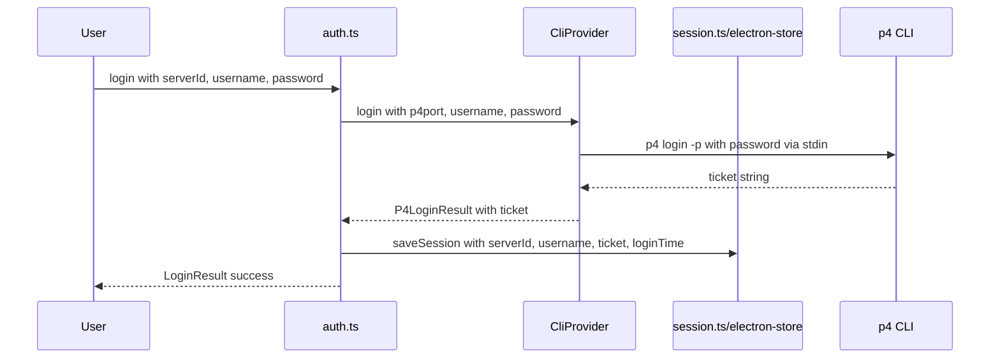
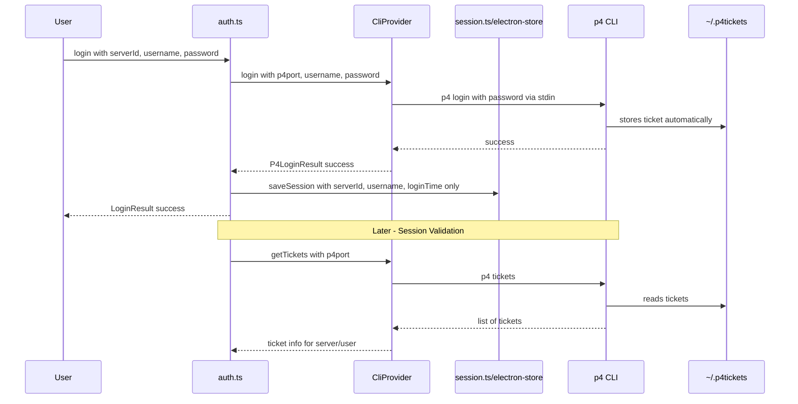

# Plan: Use `p4 tickets` Command for Session Management

## Overview

This plan outlines the changes needed to migrate from storing Perforce tickets in electron-store to using the native `p4 tickets` command to retrieve and validate tickets from the Perforce server's ticket file.

## Current State

### How Login Currently Works



### Current Files Involved

| File                                                                                         | Purpose                                                               |
| -------------------------------------------------------------------------------------------- | --------------------------------------------------------------------- |
| [`src/Main/Features/Server/session.ts`](src/Main/Features/Server/session.ts)                 | Stores session data including ticket in encrypted electron-store      |
| [`src/Main/Features/Server/auth.ts`](src/Main/Features/Server/auth.ts)                       | Orchestrates login/logout/validation using provider and session store |
| [`src/Main/Features/P4/types.ts`](src/Main/Features/P4/types.ts)                             | Defines P4Provider interface including login/validateTicket methods   |
| [`src/Main/Features/P4/providers/cli/index.ts`](src/Main/Features/P4/providers/cli/index.ts) | CLI implementation of P4Provider                                      |
| [`src/shared/types/server.ts`](src/shared/types/server.ts)                                   | Defines ServerSession type with ticket field                          |

### Current Data Stored in electron-store

```typescript
interface ServerSession {
  serverId: string;
  username: string;
  ticket: string; // <-- Will be removed
  loginTime: string;
  expiresAt?: string; // <-- Will be removed
}
```

## Proposed Changes

### New Architecture



### Understanding `p4 tickets` Command

The `p4 tickets` command lists all valid tickets stored in the user's ticket file:

```bash
$ p4 tickets
perforce.example.com:1666 (testuser) ABC123DEF456...
ssl:other-server:1666 (admin) XYZ789...
```

With `-ztag` format:

```
... user testuser
... ticket ABC123DEF456...
... Host perforce.example.com:1666
... user admin
... ticket XYZ789...
... Host ssl:other-server:1666
```

## Detailed Changes

### 1. Update P4Provider Interface

**File:** [`src/Main/Features/P4/types.ts`](src/Main/Features/P4/types.ts)

Add new method and type:

```typescript
/**
 * Ticket information from p4 tickets command
 */
export interface P4TicketInfo {
  host: string; // Server address (p4port)
  user: string; // Username
  ticket: string; // Ticket value
}

export interface P4Provider {
  // ... existing methods ...

  /**
   * Get all valid tickets from the ticket file
   */
  getTickets(): Promise<P4Result<P4TicketInfo[]>>;

  /**
   * Check if a valid ticket exists for a specific server/user
   */
  hasValidTicket(p4port: string, username: string): Promise<boolean>;
}
```

Modify existing `login` method return type:

```typescript
/**
 * Login result from p4 login command
 * Note: ticket is no longer returned since it's stored in the ticket file
 */
export interface P4LoginResult {
  success: boolean;
  expiresAt?: string; // Optional - if we can parse it from output
}
```

### 2. Implement `getTickets` in CLI Provider

**File:** [`src/Main/Features/P4/providers/cli/index.ts`](src/Main/Features/P4/providers/cli/index.ts)

```typescript
async getTickets(): Promise<P4Result<P4TicketInfo[]>> {
  try {
    const { stdout } = await executeP4Command("tickets");
    const tickets = parseTicketsOutput(stdout);
    return { success: true, data: tickets };
  } catch (error) {
    return {
      success: false,
      error: error instanceof Error ? error.message : "Failed to get tickets",
    };
  }
}

async hasValidTicket(p4port: string, username: string): Promise<boolean> {
  const result = await this.getTickets();
  if (!result.success || !result.data) {
    return false;
  }

  return result.data.some(
    ticket => ticket.host === p4port && ticket.user === username
  );
}
```

### 3. Add Parser for `p4 tickets` Output

**File:** [`src/Main/Features/P4/providers/cli/parser.ts`](src/Main/Features/P4/providers/cli/parser.ts)

```typescript
import type { P4TicketInfo } from "../../types";

/**
 * Parses p4 -ztag tickets output
 *
 * Example ztag output:
 * ... user testuser
 * ... ticket ABC123DEF456
 * ... Host perforce.example.com:1666
 * ... user admin
 * ... ticket XYZ789
 * ... Host ssl:other-server:1666
 */
export function parseTicketsOutput(output: string): P4TicketInfo[] {
  const tickets: P4TicketInfo[] = [];
  const records = parseZtagOutput(output);

  for (const record of records) {
    if (record.user && record.ticket && record.Host) {
      tickets.push({
        user: record.user,
        ticket: record.ticket,
        host: record.Host,
      });
    }
  }

  return tickets;
}
```

### 4. Update ServerSession Type

**File:** [`src/shared/types/server.ts`](src/shared/types/server.ts)

```typescript
/**
 * Stored session data for a logged-in server
 * Note: Ticket is NOT stored here - it's managed by the p4 ticket file
 */
export interface ServerSession {
  serverId: string;
  username: string;
  loginTime: string;
  // Removed: ticket, expiresAt
}
```

### 5. Update Session Store

**File:** [`src/Main/Features/Server/session.ts`](src/Main/Features/Server/session.ts)

- Remove encryption key since we're no longer storing sensitive ticket data
- Update schema to match new ServerSession type

```typescript
const sessionStore = new Store<SessionStoreSchema>({
  name: "session",
  defaults: {
    activeSession: null,
  },
  // Removed: encryptionKey - no longer storing sensitive data
});
```

### 6. Update Auth Module

**File:** [`src/Main/Features/Server/auth.ts`](src/Main/Features/Server/auth.ts)

#### Login Function Changes

The login function should **always** call `p4 login` even if a valid ticket already exists. This ensures the ticket lifetime is automatically extended each time the user logs in.

```typescript
export async function login(input: LoginInput): Promise<LoginResult> {
  // ... existing checks ...

  try {
    const provider = getProvider();

    // Always run p4 login - this extends the ticket lifetime if one already exists
    // Remove -p flag - let p4 store ticket in ticket file
    const result = await provider.login(server.p4port, username, password);

    if (result.success) {
      // Save session WITHOUT ticket
      saveSession({
        serverId,
        username,
        loginTime: new Date().toISOString(),
        // No ticket stored here - managed by p4 ticket file
      });

      return {
        success: true,
        user: username,
      };
    }

    return {
      success: false,
      error: result.error || "Login failed",
    };
  } catch (error) {
    // ... error handling ...
  }
}
```

**Important:** The login function does NOT check for an existing valid ticket before calling `p4 login`. This is intentional because:

1. Calling `p4 login` with valid credentials always succeeds
2. If a ticket already exists, `p4 login` extends its lifetime
3. This provides a simple "refresh" mechanism without needing a separate refresh function

#### Validate Session Changes

```typescript
export async function validateSession(): Promise<boolean> {
  const session = getActiveSession();

  if (!session) {
    return false;
  }

  const server = getServerById(session.serverId);
  if (!server) {
    clearSession();
    return false;
  }

  try {
    const provider = getProvider();

    // Use hasValidTicket instead of validateTicket
    const isValid = await provider.hasValidTicket(
      server.p4port,
      session.username
    );

    if (!isValid) {
      clearSession();
    }

    return isValid;
  } catch {
    clearSession();
    return false;
  }
}
```

### 7. Update CLI Provider Login Method

**File:** [`src/Main/Features/P4/providers/cli/index.ts`](src/Main/Features/P4/providers/cli/index.ts)

```typescript
async login(
  p4port: string,
  username: string,
  password: string
): Promise<P4Result<P4LoginResult>> {
  try {
    // Remove -p flag - let p4 store ticket in ticket file
    await executeP4CommandWithInput(
      "login",
      {
        P4PORT: p4port,
        P4USER: username,
      },
      {
        input: password,
      }
    );

    return {
      success: true,
      data: { success: true },
    };
  } catch (error) {
    return {
      success: false,
      error: error instanceof Error ? error.message : "Login failed",
    };
  }
}
```

### 8. Remove/Update validateTicket Method

The `validateTicket` method can be simplified or removed since we now use `hasValidTicket`:

```typescript
// Remove from interface entirely and update all callers
```

## Migration Considerations

### Backward Compatibility

1. **Existing Sessions**: Users with existing sessions in electron-store will need to re-login after the update since the stored ticket will no longer be used.

2. **Session Recovery**: On app startup, we should check if there's a valid ticket in the ticket file for the active session's server/user combination.

### Session Recovery Flow

```typescript
export async function recoverSession(): Promise<boolean> {
  const session = getActiveSession();

  if (!session) {
    return false;
  }

  const server = getServerById(session.serverId);
  if (!server) {
    clearSession();
    return false;
  }

  // Check if there's still a valid ticket in the ticket file
  const provider = getProvider();
  const hasTicket = await provider.hasValidTicket(
    server.p4port,
    session.username
  );

  if (!hasTicket) {
    clearSession();
    return false;
  }

  return true;
}
```

## Test Updates Required

### Files to Update

| Test File                                                                                | Changes Needed                                                  |
| ---------------------------------------------------------------------------------------- | --------------------------------------------------------------- |
| [`test/Main/Features/Server/session.test.ts`](test/Main/Features/Server/session.test.ts) | Update mock session data to remove ticket field                 |
| [`test/Main/Features/Server/auth.test.ts`](test/Main/Features/Server/auth.test.ts)       | Update mocks for new provider methods, remove ticket assertions |
| New: `test/Main/Features/P4/tickets.test.ts`                                             | Add tests for parseTicketsOutput and getTickets                 |

### New Test Cases

1. **Parser Tests**
   - Parse empty tickets output
   - Parse single ticket
   - Parse multiple tickets
   - Handle malformed output

2. **Provider Tests**
   - `getTickets()` returns all tickets
   - `hasValidTicket()` returns true when ticket exists
   - `hasValidTicket()` returns false when no ticket for server/user

3. **Auth Tests**
   - Login saves session without ticket
   - validateSession uses hasValidTicket
   - Session recovery works with valid ticket file

## Implementation Order

1. Add `P4TicketInfo` type and `parseTicketsOutput` parser
2. Add `getTickets` and `hasValidTicket` to P4Provider interface
3. Implement methods in CliProvider
4. Update ServerSession type (remove ticket fields)
5. Update session.ts (remove encryption)
6. Update auth.ts login and validateSession
7. Update CLI provider login method (remove -p flag)
8. Add session recovery function
9. Update all tests
10. Test manually with real Perforce server

## Risks and Mitigations

| Risk                                    | Mitigation                                                |
| --------------------------------------- | --------------------------------------------------------- |
| Ticket file location varies by platform | Use `p4 tickets` command which handles this automatically |
| Multiple users on same machine          | `p4 tickets` returns all tickets; filter by username      |
| Ticket expiration not tracked           | Can optionally run `p4 login -s` to check expiration      |
| API provider doesn't support tickets    | Need to implement equivalent for API provider             |

## Design Decisions

1. **CLI-only implementation**: The API provider does not need to implement ticket management - CLI-only is sufficient for now.

2. **No ticket expiration display**: The UI does not need to display ticket expiration time.

3. **Automatic ticket refresh**: Instead of a separate "refresh ticket" feature, the login function always calls `p4 login` regardless of whether a valid ticket exists. This automatically extends the ticket lifetime whenever the user logs in.

4. **No pre-login ticket check**: The login flow does NOT check for an existing valid ticket before calling `p4 login`. This simplifies the code and ensures tickets are always refreshed on login.
